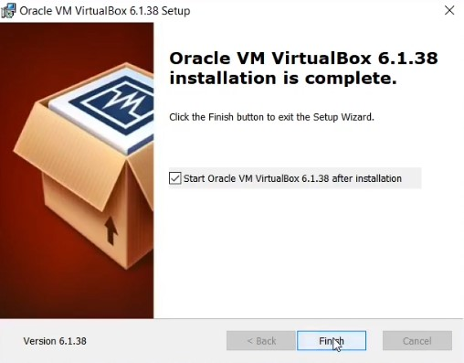
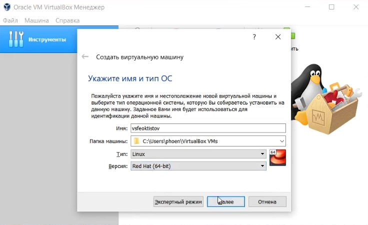
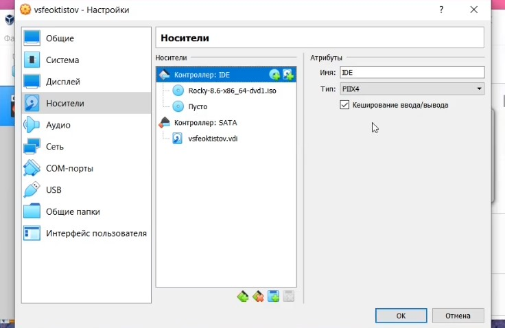
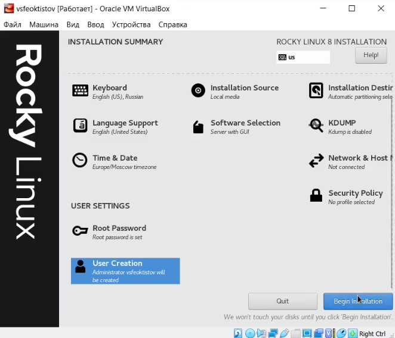
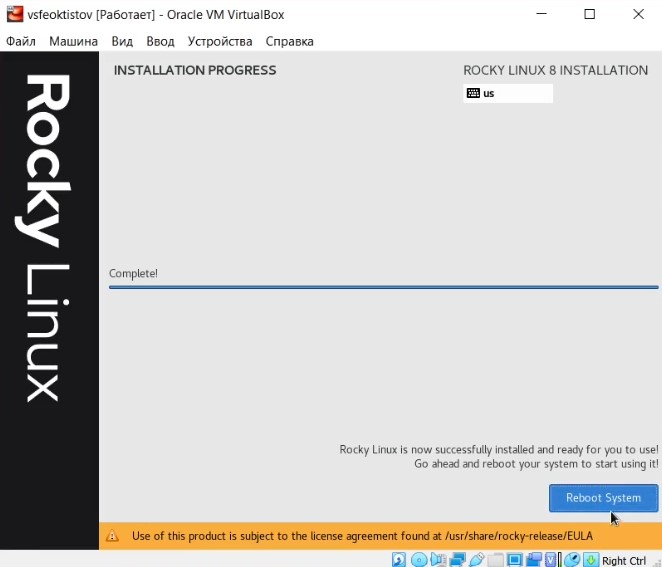
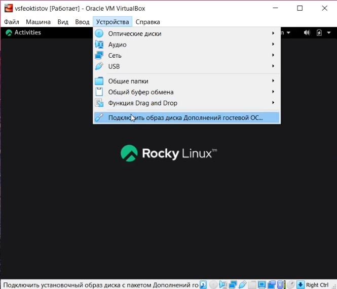

---
## Front matter
lang: ru-RU
title: Лабораторная работа №1
subtitle: Основы информационной безопасности
author:
  - Феоктистов Владислав Сергеевич
institute:
  - Российский университет дружбы народов, Москва, Россия
  - НПМбд-01-19
date: 10 сентября 2022

## i18n babel
babel-lang: russian
babel-otherlangs: english

## Formatting pdf
toc: false
toc-title: Содержание
slide_level: 2
aspectratio: 169
section-titles: true
theme: metropolis
header-includes:
 - \metroset{progressbar=frametitle,sectionpage=progressbar,numbering=fraction}
 - '\makeatletter'
 - '\beamer@ignorenonframefalse'
 - '\makeatother'
---

## Цель лабораторной работы

Целью данной работы является приобретение практических навыков установки операционной системы на виртуальную машину, настройки минимально необходимых для дальнейшей работы сервисов, работы с треминалом: работа с утилитами dmesg, less, grep.

## Задачи лабораторной работы

- Установить программу VirtualBox для запуска операционных систем внутри основной/текущей операционной системы
- Создать виртуальную машину в VirtualBox
- Скачать образ Rocky Linux с официального сайта и установить её на созданную виртуальную машину
- Уствновить Дополнения гостевой ОС
- Выполнить домашнее задание

# Ход выполнения лабораторной работы

## Установка VirtualBox

Скачиваем программу с официального сайта www.virtualbox.org под ОС Windows и запускаем установщик. Во время установки можно ничего не менять, просто нажимать кнопки "Next", "Yes", "Install" и "Finish".

{ #fig:1 width=40% }

После завершения можно будет в настройках поменять путь, где будут хранится виртуальные машины.

## Создание виртуальной машины

Для создания виртуальной машины нужно нажать кнопку "Создать". Нужно будет создать новый виртуальный динамический жесткий диск VDI с определенным размером памяти, например, 40ГБ.

{ #fig:2 width=40% }

После в настройках обязательно нужно указать путь до образа ОС.

{ #fig:3 width=40% }

## Настройка будущей системы

Запускам виртуальную машину и настраиваем её.

{ #fig:4 width=40% }

## Завершение установки

После окончания установки будет доступна кнопка для корректного перезапуска системы. 

{ #fig:5 width=40% }

## Подключение гостевой ОС

После входа в систему рекомендуется поключить гостевую ОС для возможности работать в режиме полного экрана. 

{ #fig:6 width=40% }

## Выводы

- Приобрел практические навыки установки операционной системы на виртуальную машину и настроил минимально необходимые для дальнейшей работы сервисы.
- Узнал необходимую мне информацию о моей виртуальной системе через терминал.
