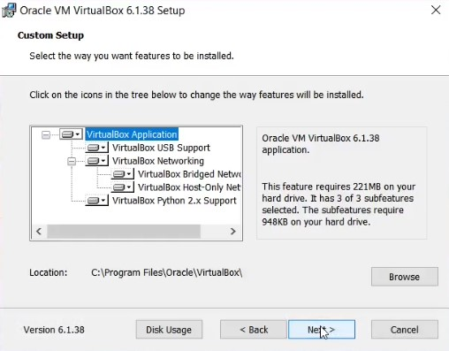

---
## Front matter
title: "Лабораторная работа №1"
subtitle: "Информационная безопасность"
author: "Феоктистов Владислав Сергеевич"

## Generic otions
lang: ru-RU
toc-title: "Содержание"

## Bibliography
bibliography: bib/cite.bib
csl: pandoc/csl/gost-r-7-0-5-2008-numeric.csl

## Pdf output format
toc: true # Table of contents
toc-depth: 2
lof: true # List of figures
lot: true # List of tables
fontsize: 12pt
linestretch: 1.5
papersize: a4
documentclass: scrreprt
## I18n polyglossia
polyglossia-lang:
  name: russian
  options:
	- spelling=modern
	- babelshorthands=true
polyglossia-otherlangs:
  name: english
## I18n babel
babel-lang: russian
babel-otherlangs: english
## Fonts
mainfont: PT Serif
romanfont: PT Serif
sansfont: PT Sans
monofont: PT Mono
mainfontoptions: Ligatures=TeX
romanfontoptions: Ligatures=TeX
sansfontoptions: Ligatures=TeX,Scale=MatchLowercase
monofontoptions: Scale=MatchLowercase,Scale=0.9
## Biblatex
biblatex: true
biblio-style: "gost-numeric"
biblatexoptions:
  - parentracker=true
  - backend=biber
  - hyperref=auto
  - language=auto
  - autolang=other*
  - citestyle=gost-numeric
## Pandoc-crossref LaTeX customization
figureTitle: "Рис."
tableTitle: "Таблица"
listingTitle: "Листинг"
lofTitle: "Список иллюстраций"
lotTitle: "Список таблиц"
lolTitle: "Листинги"
## Misc options
indent: true
header-includes:
  - \usepackage{indentfirst}
  - \usepackage{float} # keep figures where there are in the text
  - \floatplacement{figure}{H} # keep figures where there are in the text
---

# Цель работы

Целью данной работы является приобретение практических навыков установки операционной системы на виртуальную машину, настройки минимально необходимых для дальнейшей работы сервисов, работы с треминалом: работа с утилитами dmesg, less, grep.

# Задание

Установить программу VirtualBox для запуска операционных систем внутри основной/текущей операционной системы, создать виртуальную машину в VirtualBox, скачать образ Rocky Linux с официального сайта и установить её на созданную виртуальную машину, уствновить Дополнения гостевой ОС, выполнить домашнее задание.

# Теоретическое введение

: Описание некоторых каталогов файловой системы GNU Linux {#tbl:std-dir}

| Имя каталога | Описание каталога                                                                                                          |
|--------------|----------------------------------------------------------------------------------------------------------------------------|
| `/`          | Корневая директория, содержащая всю файловую                                                                               |
| `/bin `      | Основные системные утилиты, необходимые как в однопользовательском режиме, так и при обычной работе всем пользователям     |
| `/etc`       | Общесистемные конфигурационные файлы и файлы конфигурации установленных программ                                           |
| `/home`      | Содержит домашние директории пользователей, которые, в свою очередь, содержат персональные настройки и данные пользователя |
| `/media`     | Точки монтирования для сменных носителей                                                                                   |
| `/root`      | Домашняя директория пользователя  `root`                                                                                   |
| `/tmp`       | Временные файлы                                                                                                            |
| `/usr`       | Вторичная иерархия для данных пользователя                                                                                 |

: Описание некоторых, используемых в процессе выполнения лабораторной работы, команд {#tbl:cmds}

| Команда | Описание                                                                                                     |
|--------------|----------------------------------------------------------------------------------------------------------------------------|
| `dmesg`      | Вывод буфера сообщений ядра в стандартный поток вывода (stdout) (по умолчанию на экран)|
| `less `      | Отображает содержимое файла или вывода команды по одной странице за раз |
| `ls`         | Выводит содержимое каталога. Опция -l выводит дополнительную информацию, -a отображает скрытые файлы, в названии которых в самом начале стоит символ '.' | 
| `grep`       | Дает возможность вести поиск строкт. Также можно передать вывод любой команды в grep, что сильно упрощает работу во время поиска | 

Более подробно об Unix см. в [@gnu-doc:bash;@newham:2005:bash;@zarrelli:2017:bash;@robbins:2013:bash;@tannenbaum:arch-pc:ru;@tannenbaum:modern-os:ru].

# Выполнение лабораторной работы

## Установка программы VirtualBox

В первую очередь, я скачал VirtualBox для запуска виртуальных машин с гостевыми операционными системами внутри основной системы. Обычно VM (Virtual Machine) будет отображаться как окно на рабочем столе компьютера, но в зависимости от того, какой из различных интерфейсов VirtualBox используется, она может отображаться в полноэкранном режиме или удаленно на другом компьютере.

Удобнее всего скачивать дистрибутив виртуальной машины с официального сайта «www.virtualbox.org», со странички https://www.virtualbox.org/wiki/Downloads (рис. [-@fig:1] и [-@fig:2]).

{ #fig:1 width=70% }

{ #fig:2 width=70% }

Перейду к установке VirtualBox и его настройке. Нажимаю по установщику в формате .exe для систем на базе Windows и нажимаю каждый раз кнопку «Next» (рис. [-@fig:3] - [-@fig:5]), а на рисунке [-@fig:6] «Yes». 

{ #fig:3 width=70% }

{ #fig:4 width=70% }

{ #fig:5 width=70% }

{ #fig:6 width=70% }

На рисунке [-@fig:7] - кнопку «Install», а на рисунке [-@fig:8] – «Finish».

{ #fig:7 width=70% }

{ #fig:8 width=70% }

После установки, если была установлена галочка перед «Start Oracle VM VirtualBox», откроется окно программы VirtualBox, как на рисунке [-@fig:9] Иначе нужно будет запустить программу из меню «Пуск».

{ #fig:9 width=70% }

После запуска я нажал на кнопку «Настройки». В разделе «Общие» стоит поменять путь для размещения виртуальных ОС, если не устраивает размещение или недостаточно места на текущем диске (рис. [-@fig:10]). Я ничего не менял.

{ #fig:10 width=70% }

На этом установка VirtualBox завершена.

## Создание виртуальной машины

В начале скачиваю образ ОС (операционной системы). В моем случае это будет Rocky Linux 8, поскольку на 9ой версии не получится установить pandoc-crossref (невозможно на момент создания отчета). Скачать образ можно на официальном сайте «www.rockylinux.org» со странички https://www.rockylinux.org/download (рис. [-@fig:11]). 

{ #fig:11 width=70% }

У меня на компьютере установлен 64 битный процессор Intel(R) Core(TM) i7-8550U c частотой 1.8ГГц, а также 16 ГБ ОЗУ, поэтому в качестве образа я выбрал 64 битную версию, которая указана в
самом начале списка под названием x86_64. Для скачивания нажимаю на DVD в соответствующей с
версией (рис. [-@fig:12]).

{ #fig:12 width=70% } 

Теперь перейду к созданию виртуальной машины и её настройке. Как на рисунке [-@fig:13] выбираю тип Linux, а версию RedHat с соответствующей разрядностью, у меня это 64-bit. Разным дистрибутивам соответствуют разные версии, для Rocky – это RedHat. Имя для виртуальной машины можно задать любое, на ее работу это никак не повлияет. Я же назвал в соотвествии с заданием - логином учетной записи от ДК кабинета: vsfeoktistov. Нажимаю на кнопку «Далее».

{ #fig:13 width=70% }

Выбираю необходимый объем памяти для виртуальной машины. Рекомендуется установить не менее 2024 МБ и не более 50% от общего объема памяти ОЗУ компьютера так, чтобы осталось и для работы основной системы, на которой будет запускаться виртуальная машина. Так как у меня 16 ГБ ОЗУ я выделил 6 ГБ (6144 МБ) (рис. [-@fig:14]). Можно выбрать другой размер объема оперативной памяти, передвигая курсор по шкале, или ввести размер памяти в цифровом значении в МБ. Выбирать стоит исходя из задач, для которых будет предназначена VM. В дальнейшем, при необходимости, можно изменить объем выделяемой оперативной памяти в настройках этой виртуальной машины.

{ #fig:14 width=70% }

Далее можно создать новый виртуальный диск или использовать существующий. Так как я только что установил VirtualBox, я выбрал «Создать новый виртуальный жёсткий диск». Есть ещё вариант «Не подключать виртуальный жесткий диск», чтобы подключить виртуальный жесткий диск после создания виртуальной машины (рис. [-@fig:15]).

{ #fig:15 width=70% }

В следующем окне необходимо будет выбрать тип виртуального жесткого диска. Вы можете выбрать следующие форматы дисков (виртуальных контейнеров):
- VDI (VirtualBox Disk Image) — формат диска VirtualBox.
- VMDK (Virtual Machine Disk) — формат диска VMware.
- VHD (Virtual Hard Disk) — формат диска Microsoft.
Если не планируется использовать создаваемый виртуальный накопитель с другими инструментами программной виртуализации, стоит оставить предлагаемый по умолчанию тип жесткого диска «VDI (VirtualBox Disk Image)» [-@fig:16]. Диски этого формата будут открываться в программе Виртуал Бокс.

{ #fig:16 width=70% }

Далее нужно выбрать формат хранения: динамический или фиксированный.

Файл динамического жесткого диска будет занимать небольшое место на физическом жестком диске вашего компьютера. По мере заполнения данными он будет увеличиваться в размере до предельного объема.

Файл фиксированного жесткого диска сразу займет весь объем виртуального жесткого диска.
Что касается формата хранения, лучше выбрать «Динамический», так это сэкономит время и место на физическом диске, потеряв, правда, немного в производительности (рис. [-@fig:17]).

{ #fig:17 width=70% }

Размер виртуального диска устанавливаем по желанию, но не меньше, чем указано в требованиях операционной системы. Жмем «Создать». Программа VirtualBox сама рекомендует объем жесткого диска для конкретной операционной системы. Однако стоит выбирать больший объем памяти для установки утилит и дополнительных программ, а также для хранения документов и файлов (рис. [-@fig:18]). Для создания нового виртуального диска я нажал на кнопку «Создать».

{ #fig:18 width=70% }

Первичная настройка виртуальной машины окончена (рис. [-@fig:19]).

{ #fig:19 width=70% }

Теперь можно перейти к дополнительной настройке VM. Для этого я перешел в настройки. В разделе «Система» во вкладке «Процессор» можно определить число ядер центрального процессора компьютера, которые могут использоваться виртуальной машиной, а также предельную допустимую нагрузку на процессор.

Рекомендуют выделять не менее двух ядер. Решение о том, позволять ли виртуальной машине загружать процессор на 100% принимается исходя из его производительности. На слабых и старых машинах лучше оставить предлагаемую по умолчанию настройку (рис. [-@fig:20]).

{ #fig:20 width=70% }

Категория «Носители» в настройках виртуальной машины позволяет подключать к виртуальной машине виртуальный жесткий диск, CD/DVD, дискету и диски.

На реальном ПК так называемые «контроллеры хранения» подключают физические диски к остальной части компьютера. Аналогично, VirtualBox предоставляет виртуальные контроллеры виртуальной машины на виртуальную машину. Под каждым контроллером отображаются виртуальные устройства (жесткие диски, CD/DVD или флоппи-дисководы), подключенные к контроллеру.

Если используется мастер «Создать виртуальную машину» для создания машины, обычно можно увидеть следующее:

{ #fig:21 width=70% }

В зависимости от типа гостевой операционной системы, который вы выбрали при создании виртуальной машины, типичная компоновка устройств хранения в новой виртуальной машине выглядит следующим образом:
- Вы увидите контроллер IDE, к которому подключен виртуальный CD/DVD-привод (к порту «вторичный мастер» контроллера IDE).
- Вы также увидите контроллер SATA, который является более современным типом контроллера хранения для увеличения пропускной способности жесткого диска, к которому прикреплены виртуальные жесткие диски. 
Первоначально у вас обычно будет один такой виртуальный диск, но, может быть более одного, каждый из которых представлен файлом образа диска (в этом случае файл VDI).

Я перехожу в контроллер и нажимаю на кнопку «Добавить жесткий диск». Появляется следующее окно:

{ #fig:22 width=70% }

Нажимаю «Добавить» и указываю путь на образ моей операционный системы (рис. [-@fig:23] и [-@fig:24]).

{ #fig:23 width=70% }

{ #fig:24 width=70% }

После всех настроек можно перейти к запуску виртуальной машины. Для этого нужно нажать на кнопку «Запустить», находясь в нужном разделе в списки виртуальных машин. У меня она одна (рис. [-@fig:25]).

{ #fig:25 width=70% }

## Установка Rocky Linux

После запуска виртуальной машины отобразится меню носителя. Для перехода к установке нужно выбрать 'Install Rocky Linux 8' [Enter]. Это запустит установщик с графической оболочкой GUI (рис. [-@fig:26])

{ #fig:26 width=70% }

Далее необходимо выбрать язык системы. Выбирайте наиболее подходящий для вас настройки. Я оставил "English" (рис. [-@fig:27])

{ #fig:27 width=70% }

После появится графическое конфигурационное окно с настройками для будущей системы (рис. [-@fig:28]).

{ #fig:28 width=70% }

При необходимости можно скорректировать часовой пояс, раскладку клавиатуры (я добавил русский язык, но в качестве языка по умолчанию оставил английский).

В разделе выбора программ в качестве базового окружения оставил Server with GUI, а в качестве дополнения - Development Tools (рис. [-@fig:29])

{ #fig:29 width=70% }

Место установки ОС оставляю без изменения (рис. [-@fig:30])

{ #fig:30 width=70% }

Далее отключаю KDUMP (рис. [-@fig:31])

{ #fig:31 width=70% }

Включаю сетевое соединение и в качестве имени узла указываю vsfeoktistov.localdomain (рис. [-@fig:32]).

{ #fig:32 width=70% }

Устанавливаю пароль для root и пользователя с правами администратора (рис. [-@fig:33] и [-@fig:34])

{ #fig:33 width=70% }

{ #fig:34 width=70% }

Далее нажимаю на кнопку «Begin installation». Установка займет некоторое время (рис. [-@fig:35]).

{ #fig:35 width=70% }

После завершения установки операционной системы нужно будет нажать на кнопку «Reboot System» для корректного перезапуска вирутальной машины (рис. [-@fig:36]).

{ #fig:36 width=70% }

После перезапуска нужно принять лицензионное соглашение (рис. [-@fig:37] и [-@fig:38]).

{ #fig:37 width=70% }

{ #fig:38 width=70% }

Теперь можно будет войти в ОС под заданной при установке учетной записью (рис. [-@fig:39]).

{ #fig:39 width=70% }

На этом установка Rocky Linux 8 версии завершена.

## Подключение гостевой ОС

В меню «Устройства» виртуальной машины подключаю образ диска дополнений гостевой ОС (рис. [-@fig:40]).

{ #fig:40 width=70% }

После чего появится диалогове окно, в котором нужно нажать на кнопку «Run» (рис. рис. [-@fig:41]). Нужно будет также ввести пароль для подтверждения своих действий.

{ #fig:41 width=70% }

Ожидаем завершение установки, для этого нужно подождать пока появится сообщение «Press Return to close this window...» (рис. [-@fig:42]). Нажимаю [Enter] и перезапускаю виртуальную машину.

{ #fig:42 width=70% }

После перезапуска и повторного входа в систему можно будет расширить визуализированный экран ОС до размера экрана. Для этого нажимаю на вкладку «Вид» в виртуальной машине и выбираю опцию «Режим полного экрана» (рис. [-@fig:43]).

{ #fig:43 width=70% }

На этом подключение образа диска дополнений гостевой ОС завершено.

# Выводы

Я приобрел практические навыки установки операционной системы на виртуальную машину и настроил минимально необходимые для дальнейшей работы сервисы. Также я узнал необходимую мне информацию о моей виртуальной системе через терминал.

# Контрольные вопросы

1. Когда пользователь регистрируется в системе (проходит процедуру авторизации, например, вводя системное имя и пароль), он идентифицируется с учётной записью, в которой система хранит информацию о каждом пользователе: его системное имя и некоторые другие сведения, необходимые для работы с ним. Именно с учётными записями, а не с самими пользователями, и работает система. Таким образом, учетная запись пользователя содержит:
	1) Системное имя (user name)
	2) Идентификатор пользователя (UID)
	3) Идентификатор группы (GID)
	4) Полное имя (full name)
	5) Домашний каталог (home directory)
	6) Начальная оболочка (login shell)
2. Команды терминала:
	1) man [аргумент] – для получения справки по команде. Пример: man ls – выведет информацию о команде ls;
	2) cd [путь] – для перемещения по файловой системе. Пример: cd / – для перехода в корневой раздел;
	3) ls [опции] – для просмотра содержимого каталога. Пример: ls -alS / – выведетподробной информации о файлах в корневом каталоге с сортировкой по алфавиту;
	4) du [опции] [путь] – для определения объёма каталога. Пример: du -h ~/”Изображения” – выведет размер каталога «Изображения» с указанием единицы измерения;
	5) mkdir [опции] [путь] / rmdir [опции] [путь] / rm [опции] [путь] – для создания / удаления каталогов / файлов. Примеры: mkdir -pv ~/MyDir ~/MyDir2 – создаст каталоги MyDir и MyDir2 в домашней директории; rmdir -v ~/MyDir – удалит каталог MyDir из домашней директории; rm -rv ~/MyDir2 – удалит каталог MyDir2 из домашней директории;
	6) chmod [аргументы] [путь] - для задания определённых прав на файл / каталог. Пример: chmod o-w ~/Readme.txt – отнимет право изменения текстового файла Readme.txt остальным пользователям, кроме владельца и группы владельца.
	7) history [опции] – для просмотра истории команд. Пример: history -c – очистит историю команд Linux.
3. Файловая система - порядок, определяющий способ организации, хранения и именования данных на носителях информации в компьютерах, а также в другом электронном оборудовании. Файловые системы в Linux используются не только для работы с файлами на диске, но и для хранения данных в оперативной памяти или доступа к конфигурации ядра во время работы системы. Каждый дистрибутив Linux позволяет использовать одну из этих файловых систем, каждая из них имеет свои преимущества и недостатки:
	- Ext2;
	- Ext3;
	- Ext4;
	- JFS;
	- ReiserFS;
	- XFS;
	- Btrfs;
	- ZFS;
	Все они включены в ядро и могут использоваться в качестве корневой файловой
	системы.

	Ext2, Ext3, Ext4 или Extended Filesystem – это стандартная файловая система для Linux. Она была разработана еще для Minix. Она самая стабильная из всех существующих. Её кодовая база изменяется очень редко. Кроме того, данная файловаясистема содержит больше всего функций. Версия ext2 была разработана уже именно для Linux и получила много улучшений.

	ReiserFS - была разработана намного позже, в качестве альтернативы ext3 с улучшенной производительностью и расширенными возможностями. Она была разработана под руководством Ганса Райзера и поддерживает только Linux. Из особенностей можно отметить динамический размер блока, что позволяет упаковывать несколько небольших файлов в один блок, что предотвращает фрагментацию и улучшает работу с небольшими файлами.

	JFS или Journaled File System была разработана в IBM для AIX UNIX и использовалась в качестве альтернативы для файловых систем ext. Сейчас она используется там, где необходима высокая стабильность и минимальное потребление ресурсов. При разработке файловой системы ставилась цель создать максимально эффективную файловую систему для многопроцессорных компьютеров. Также как и ext, это журналируемая файловая система, но в журнале хранятся только метаданные, что может привести к использованию старых версий файлов после сбоев.

	XFS – это высокопроизводительная файловая система, разработанная в Silicon Graphics для собственной операционной системы еще в 2001 году. Она изначально была рассчитана на файлы большого размера, и поддерживала диски до 2 Терабайт. Из преимуществ файловой системы можно отметить высокую скорость работы с большими файлами, отложенное выделение места, увеличение разделов на лету и незначительный размер служебной информации.

	ZFS – журналируемая файловая система, однако в отличие от ext, в журнал записываются только изменения метаданных. Она используется по умолчанию в дистрибутивах на основе Red Hat. Из недостатков – это невозможность уменьшения размера, сложность восстановления данных и риск потери файлов при записи, если будет неожиданное отключение питания, поскольку большинство данных находится в памяти BTRFS или B-Tree File System - это совершенно новая файловая система, которая сосредоточена на отказоустойчивости, легкости администрирования и восстановления данных. Файловая система объединяет в себе очень много новых интересныхвозможностей, таких как размещение на нескольких разделах, поддержка подтомов, изменение размера не лету, создание мгновенных снимков, а также высокая производительность. Но многими пользователями файловая система Btrfs считается нестабильной. Тем не менее, она уже используется как файловая система по умолчанию в OpenSUSE и SUSE Linux.

4. Команда findmnt используется для поиска примонтированных файловых систем. Она используется для поиска монтированных устройств, а также может монтировать или размонтировать их при необходимости. Для просмотра всех примонтированных файловых систем использовать команду: findmnt --all

5. Каждый процесс в Linux имеет свой идентификатор, называемый PID. Перед тем, как выполнить остановку процесса, нужно определить его PID. Для этого воспользуемся командами ps и grep. Команда ps предназначена для вывода списка активных процессов в системе и информации о них. Команда grep запускается одновременно с ps (в канале) и будет выполнять поиск по результатам команды ps.

	Есть еще один более простой способ узнать PID процесса — это команда pidof, которая принимает в качестве параметра название процесса и выводит его PID. 

	Когда известен PID процесса, мы можем убить его командой kill. Команда kill принимает в качестве параметра PID процесса.

	Вообще команда kill предназначена для посылки сигнала процессу. По умолчанию, если мы не указываем какой сигнал посылать, посылается сигнал SIGTERM (от слова termination — завершение). SIGTERM указывает процессу на то, что необходимо завершиться. Каждый сигнал имеет свой номер. SIGTERM имеет номер 15. Список всех сигналов (и их номеров), которые может послать команда kill, можно вывести, выполнив kill -l.

	Сигнал SIGTERM может и не остановить процесс (например, при перехвате или блокировке сигнала), SIGKILL же выполняет уничтожение процесса всегда, так как его нельзя перехватить или проигнорировать.

	Команда killall в Linux предназначена для «убийства» всех процессов, имеющих одно и то же имя. Это удобно, так как нам не нужно знать PID процесса.

# Домашняя работа

После всех проделанных действий я проанализировал последовательность загрузки системы с помощью команды dmesg (рис. [-@fig:44]). При использовании этой команды выводится огромный текст с системной информацией.

{ #fig:44 width=70% }

Для построчного просмотра последовательность загрузки системы можно использовать команду dmesg | less (рис. [-@fig:45]).

{ #fig:45 width=70% }

Производить поиск по такому тексту неудобно, поэтому я использовал команду dmesg с дополнительными аргументами: dmesg | grep -i "ключевые слова".

Для того, чтобы найти информацию о версии ОС, я использовал команду dmesg | grep -i "Linux version". Из рисунка [-@fig:46] видно, что версия моей ОС – RedHat 8.5.0-10 (в начале видно, что стоит 64 разрядная система, а в скобках rockylinux).

{ #fig:46 width=70% }

Для поиска частоты процессора при запуске использовал команду dmesg | grep -i "Detected". Из рисунка [-@fig:47] видно, что частота моего процессора на момент запуска составляла 1992.003 МГц.

{ #fig:47 width=70% }

Команда dmesg | grep -i "CPU0" вывела информацию о модели процессора. У меня это Intel(R) Core(TM) i7-8550U @ 1.80GHz (рис. [-@fig:48]).

{ #fig:48 width=70% }

Для того, чтобы посмотреть объем доступной оперативной памяти, я использовал команду dmesg | grep -i "Memory". Из рисунка [-@fig:49] видно, что виртуальной машине доступно 6291000 Кбайт ОЗУ или 6 ГБ ОЗУ. Столько я выделял при создании виртуальной машины в VirtualBox.

{ #fig:49 width=70% }

Для обнаружения типа гипервизора использовал команду dmesg | grep -i "Hypervisor detected". У меня это KVM (Kernel-based Virtual Machine) (рис. [-@fig:50]).

{ #fig:50 width=70% }

Гипервизор - программа или аппаратная схема, обеспечивающая или позволяющая одновременное, параллельное выполнение нескольких операционных систем на одном и том же хост-компьютере. Гипервизор также обеспечивает изоляцию операционных систем друг от друга, защиту и безопасность, разделение ресурсов между различными запущенными ОС и управление ресурсами.

KVM – гипервизор, созданный в октябре 2006 года, был почти сразу интегрирован с основной веткой ядра Linux версии 2.6.20., выпущенной в начале 2007 года. Позже KVM был адаптирован как модуль ядра в FreeBSD. В KVM включены загружаемый модуль ядра kvm.ko, отвечающий за виртуализацию, процессорно-специфический загружаемый модуль для AMD или Intel kvm-amd.ko либо kvm-intel.ko, и компоненты пользовательского режима QEMU. KVM – полностью открытое ПО по лицензии GNU
GPL и GNU LGPL.

Для получения информации о типе файловой системы корневого раздела и последовательности монтирования файловых систем я использовал команду dmesg | grep -i "Mount". Из рисунка [-@fig:51] видно, что у меня тип файловой системы XFS.

{ #fig:51 width=70% }

# Список литературы{.unnumbered}

::: {#refs}
:::
