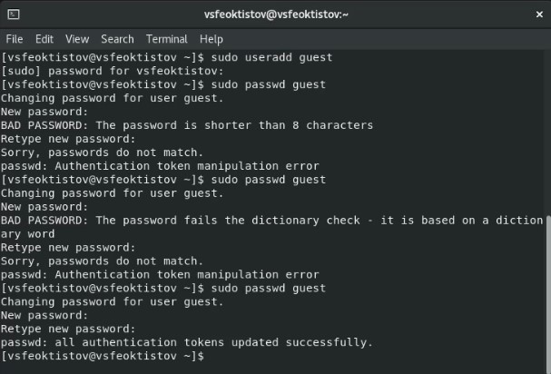
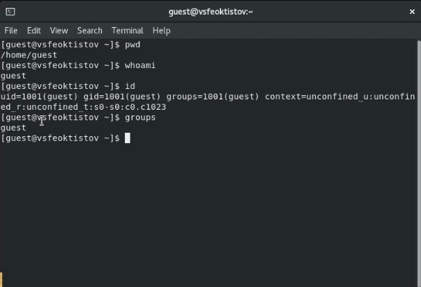
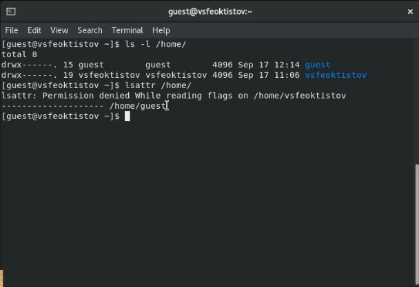
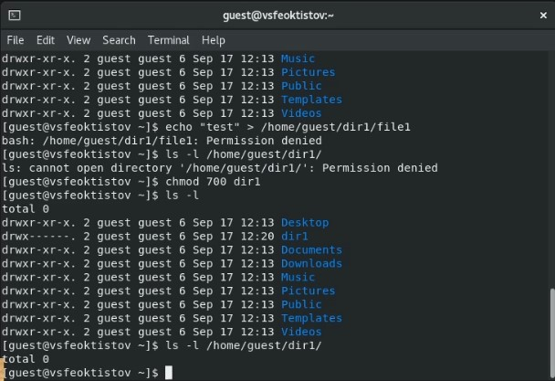
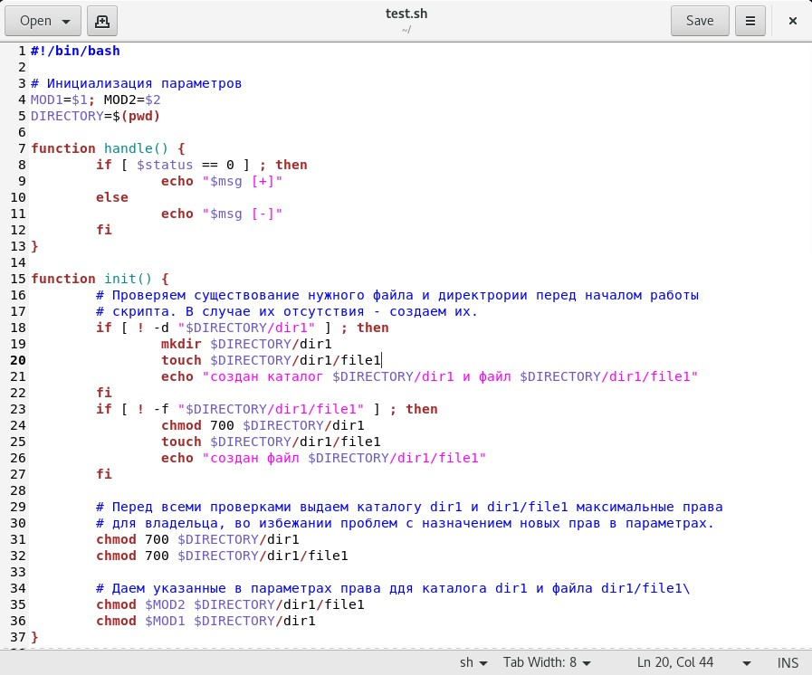

---
## Front matter
lang: ru-RU
title: Лабораторная работа №2
subtitle: Основы информационной безопасности
author:
  - Феоктистов Владислав Сергеевич
institute:
  - Российский университет дружбы народов, Москва, Россия
  - НПМбд-01-19
date: 17 сентября 2022

## i18n babel
babel-lang: russian
babel-otherlangs: english

## Formatting pdf
toc: false
toc-title: Содержание
slide_level: 2
aspectratio: 169
section-titles: true
theme: metropolis
header-includes:
 - \metroset{progressbar=frametitle,sectionpage=progressbar,numbering=fraction}
 - '\makeatletter'
 - '\beamer@ignorenonframefalse'
 - '\makeatother'
---

## Цель лабораторной работы

Целью данной работы является: приобретение практических навыков работы в консоли с правами и атрибутами файлов и каталогов, закрепление теоретических основ дискреционного разграничения доступа в современных системах с открытым кодом на базе ОС Linux, проверка необходимых наборов прав для выполнения различных действий над файлами и каталогами, получение навыков чтения выделенных прав через консоль.

## Задачи лабораторной работы

- Создать нового пользователя под именем guest с паролем; 
- войти в систему от имени нового пользователя и получить о нем всю необходимую информацию через консоль; 
- проверить и изменить права на существующие и созданные файлы и каталоги; 
- проверить как снятие всех атрибутов с директории повлияло на возможности работы с ним.

# Ход выполнения лабораторной работы

## Создание нового пользователя и установка пароля

С помощью команды useradd создаем нового пользователя, а с помощью команды passwd устанавливаем для него пароль.

{ #fig:1 width=50% }

## Получение информации о пользователе

Заходим в систему под созданным пользователем и получаем ифнормацию о текущем каталоге [**cmd:** *pwd*] (домашнаяя директория); имя пользователя [**cmd:** *whoami*]; id,gip,groups [**cmd:** *id*]. Эту же информацию можно найти в файле */etc/passwd*.

{ #fig:2 width=50% }

## Просмотр атрибутов

- Для просмотра прав доступа/атрибутов используется команда [**cmd:** *ls -l*]
- Для просмотра расширенных атрибутов используется команда [**cmd:** *lsattr*]

{ #fig:3 width=50% }

## Изменение прав

Изменение прав для файла/каталога осуществляется командой *chmod*. Только root, владелец файла или пользователь с привилегией sudo могут изменять права доступа к файлу или каталогу. Разрешения можно указывать с помощью символьного, числового или справочного режимов.

{ #fig:4 width=50% }

## Автоматизация процесса провреки

Для заполнения таблицы "Установленные права и разрешенные действия" можно написать bash-скрипт, который будет создавать и выдавать права каталогу dir1 и файлу file1, чтобы потом проверить какие действия над ними можно будет совершать.

{ #fig:5 width=50% }

## Разрешенные действия

После перебора всех атрибутов, используя bash-скрипт, можно заполнить такую таблицу:

| Права директории | Права файла           | Создание файла | Удаление файла | Запись в файл | Чтение файла | Смена директории | Просмотр файлов в директории | Переименование файла | Смена атрибутов файла |
|------------------|-----------------------|----------------|----------------|---------------|--------------|------------------|------------------------------|----------------------|-----------------------|
| d--------- (000) | --------- (000)       | -              | -              | -             | -            | -                | -                            | -                    | -                     |
| d--x------ (100) | --------- (000)       | -              | -              | -             | -            | +                | -                            | -                    | -                     |
| ...              | ...                   | ...            | ...            | ...           | ...          | ...              | ...                          | ...                  | ...                   |
| drwx------ (700) | rwx------ (700)       | +              | +              | +             | +            | +                | +                            | +                    | +                     |

## Минимальные требования

На основе предыдущей таблицы можно определить минимально необходимые права для выполнения определенных действий над файлами и директориями.

| Операция               | Минимальные права на директорию | Минимальные права на файл |
|------------------------|---------------------------------|---------------------------|
| Создание файла         | d-wx (300)                      | --- (000)                 |
| Удаление файла         | d-wx (300)                      | --- (000)                 |
| Чтение файла           | d--x (100)                      | r-- (400)                 |
| Запись в файл          | d--x (100)                      | -w- (200)                 |
| Переименование файла   | d-wx (300)                      | --- (000)                 |
| Создание поддиректории | d-wx (300)                      | --- (000)                 |
| Удаление поддиректории | d-wx (300)                      | --- (000)                 |

## Выводы

- Приобрел практические навыки работы в консоли с правами и атрибутами файлов и каталогов;
- закрепил теоретические основы дискреционного разграничения доступа в современных системах с открытым кодом на базе ОС Linux;
- проверил необходимый наборов прав для выполнения различных действий над файлами и каталогами;
- получил навыки чтения выделенных прав через консоль.
