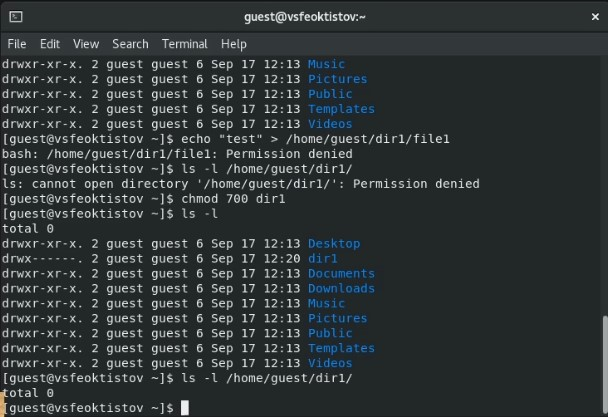
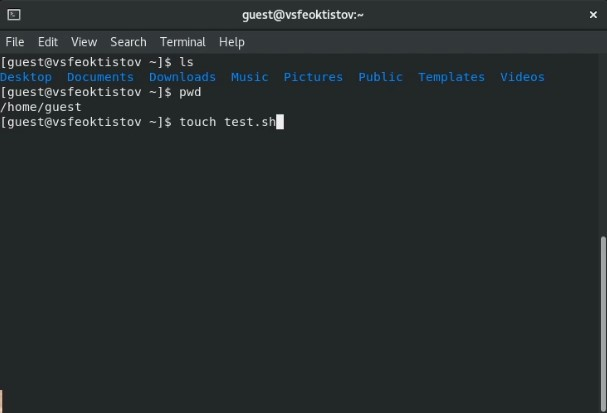
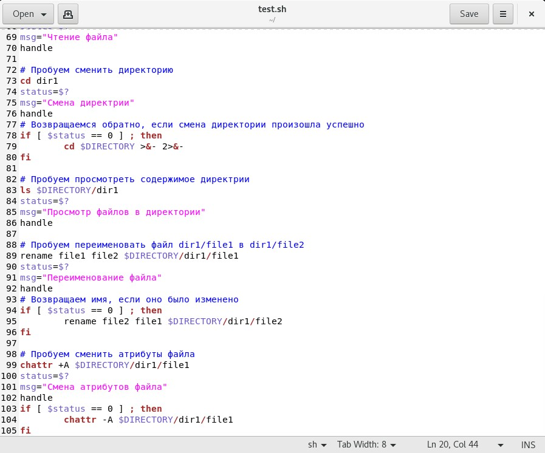

---
## Front matter
title: "Лабораторная работа №2"
subtitle: "Дисциплина: Основы информационной безопасности"
author: "Феоктистов Владислав Сергеевич"

## Generic otions
lang: ru-RU
toc-title: "Содержание"

## Bibliography
bibliography: bib/cite.bib
csl: pandoc/csl/gost-r-7-0-5-2008-numeric.csl

## Pdf output format
toc: true # Table of contents
toc-depth: 2
lof: true # List of figures
lot: true # List of tables
fontsize: 12pt
linestretch: 1.5
papersize: a4
documentclass: scrreprt
## I18n polyglossia
polyglossia-lang:
  name: russian
  options:
	- spelling=modern
	- babelshorthands=true
polyglossia-otherlangs:
  name: english
## I18n babel
babel-lang: russian
babel-otherlangs: english
## Fonts
mainfont: PT Serif
romanfont: PT Serif
sansfont: PT Sans
monofont: PT Mono
mainfontoptions: Ligatures=TeX
romanfontoptions: Ligatures=TeX
sansfontoptions: Ligatures=TeX,Scale=MatchLowercase
monofontoptions: Scale=MatchLowercase,Scale=0.9
## Biblatex
biblatex: true
biblio-style: "gost-numeric"
biblatexoptions:
  - parentracker=true
  - backend=biber
  - hyperref=auto
  - language=auto
  - autolang=other*
  - citestyle=gost-numeric
## Pandoc-crossref LaTeX customization
figureTitle: "Рис."
tableTitle: "Таблица"
listingTitle: "Листинг"
lofTitle: "Список иллюстраций"
lotTitle: "Список таблиц"
lolTitle: "Листинги"
## Misc options
indent: true
header-includes:
  - \usepackage{indentfirst}
  - \usepackage{float} # keep figures where there are in the text
  - \floatplacement{figure}{H} # keep figures where there are in the text
---

# Цель работы

Целью данной работы является: приобретение практических навыков работы в консоли с правами и атрибутами файлов и каталогов, закрепление теоретических основ дискреционного разграничения доступа в современных системах с открытым кодом на базе ОС Linux, проверка необходимых наборов прав для выполнения различных действий над файлами и каталогами, получение навыков чтения выделенных прав через консоль.

# Задание

Создать нового пользователя под именем guest с паролем; войти в систему от имени нового пользователя и получить о нем всю необходимую информацию через консоль; проверить и изменить права на существующие и созданные файлы и каталоги; проверить как снятие всех атрибутов с директории повлияло на возможности работы с ним.

# Теоретическое введение

В ОС Linux права доступа к файлам, атрибуты и владение управляют уровнем доступа, который система обрабатывает, а пользователи имеют к файлам. Это гарантирует, что только авторизованные пользователи и процессы могут получить доступ к опеределенным файлам и каталогам. Атрибуты сосотят из девяти битов, которые и определяют права для разных групп пользователей. Первая тройка битов определяет права доступа для владельца, вторая тройка - для членов группы, последняя тройка - для всех остальных пользователей в системе. Каждая тройка битов (класс пользователей) определяет права на чтение, запись и исполнение. Эта концепция позволяет контролировать, какие пользователи могут читать, записывать (изменять) или выполнять файлы/каталоги.

Чтобы просмотреть права доступа к файлу, использовуется команда ls с опцией -l. Первый символ указывает тип файла. Это может быть обычный файл (-), каталог (d), символическая ссылка (l) или другие спицефические типы файлов. Следующие девять символов предоставляют доступ к файлу, три тройки по три символа каждая (три пользователя, три типа прав: r - чтение, w - запись, x - исполнение).

Права доступа к файлу/каталогу можно изменить с помощью команды chmod. Только root, владелец файла или пользователь с привилегией sudo могут изменять права доступа к файлу или каталогу. Разрешения можно указывать с помощью символьного, числового или справочного режимов.

: Описание некоторых каталогов файловой системы GNU Linux {#tbl:std-dir}

| Имя каталога | Описание каталога                                                                                                          |
|--------------|----------------------------------------------------------------------------------------------------------------------------|
| `/`          | Корневая директория, содержащая всю файловую                                                                               |
| `/bin `      | Основные системные утилиты, необходимые как в однопользовательском режиме, так и при обычной работе всем пользователям     |
| `/etc`       | Общесистемные конфигурационные файлы и файлы конфигурации установленных программ                                           |
| `/home`      | Содержит домашние директории пользователей, которые, в свою очередь, содержат персональные настройки и данные пользователя |
| `/media`     | Точки монтирования для сменных носителей                                                                                   |
| `/root`      | Домашняя директория пользователя  `root`                                                                                   |
| `/tmp`       | Временные файлы                                                                                                            |
| `/usr`       | Вторичная иерархия для данных пользователя                                                                                 |

: Описание некоторых используемых в работе команд {#tbl:cmds}

| Команда      | Описание команды                                                                                                                                         |
|--------------|----------------------------------------------------------------------------------------------------------------------------------------------------------|
| `useradd`    | Создание пользователя в Linux. Необходимо будет указать имя нового пользователя.                                                                         |
| `passwd `    | Создание и изменение пользовательских паролей. Необходимо будет указать имя пользователя, для которого нужно создать/изменить пароль.                    |
| `pwd`        | Выводит полный путь от корневого каталога к текущему рабочему каталогу: в контексте которого (по умолчанию) будут исполняться выводимые команды.         |
| `whoami`     | Отображает имя вошедшего в систему пользователя.                                                                                                         |
| `id`         | Выводи UID (идентификатор пользователя), GID (идентификатор группы пользователя), groups (основные группы пользователя)                                  |
| `groups`     | Выводит список групп, в которых состоит текущий пользователь или пользователь с указанным именем.                                                        |
| `cat`        | Вывод содержимого указанного файла.                                                                                                                      |
| `ls`         | Выводит содержимое каталога. Опция -l выводит дополнительную информацию, -a отображает скрытые файлы, в названии которых в самом начале стоит символ '.' |
| `lsattr`     | Просмотр аттрибутов файлов/каталогов в файловой системе Linux.                                                                                           |
| `mkdir`      | Создание каталога по указанному пути и с указанным именем  внутри пути.                                                                                  |
| `chmod`      | Изменение прав доступа к файлам и каталогам, используемых в Unix-подобных операционных системах.                                                         |
| `echo`       | Вывод переданных аргументов, строки, текста.                                                                                                             |
| `chattr`     | Изменяет атрибуты файлов/каталогов в файловой системе Linux.                                                                                             |
| `touch`      | Создает текстовый файл по указанному пути и с указанным именем внутри пути.                                                                              |
| `rm`         | Удаляет файл(ы) (каталог(и) при указании опции -r) по указанному(ым) пути(ям).                                                                           |
| `rename`     | Переименование файла/каталога. Формат rename [старое имя] [новое имя] [путь до файла].                                                                   |
| `cd`         | Перемещение по файловой системе.                                                                                                                         |
| `grep`       | Дает возможность вести поиск строкт. Также можно передать вывод любой команды в grep, что сильно упрощает работу во время поиска                         |

Более подробно об Unix см. в [@gnu-doc:bash;@newham:2005:bash;@zarrelli:2017:bash;@robbins:2013:bash;@tannenbaum:arch-pc:ru;@tannenbaum:modern-os:ru].

# Выполнение лабораторной работы

## Иполнение команд в консоли

Создаю нового пользователя под именем *guest* через команду useradd [**cmd:** *sudo useradd guest*] и создаю для него пароль с помощью команды passwd [**cmd:** *sudo passwd guest*]. После терминал попросит указать и подтвердить новый пароль (рис. [-@fig:1]). 

{ #fig:1 width=70% }

Далее захожу в систему под только что созданным пользователем, вводя установленный ранее пароль. Сменить пользователя можно нажав на кнопку с иконкой замка в меню с выключением системы. В случае, если Вам предлагается ввести пароль для предыдущего пользователя, то нажмите на кнопку "Log in as another user" (рис. [-@fig:2]).

{ #fig:2 width=70% }

После входа в систему под именем пользователя guest, я запустил терминал и выполнил команду *pwd*, тем самым получим путь до текущего каталога (домашняя директория пользователя *guest*). Далее можно уточнить имя пользователя, через которого я вошел в систему, для этого ввожу команду whoami. Очевидно, что выведится имя пользователя *guest*. С помощью команды *id* можно узнать UID пользователя (идентификатор пользователя = 1001), GID (индентификатор группы пользователя = 1001), а также к какой группе пользователей он принадлежит (на данный момент только к группе пользователей *guest*). Информацию о принадлежности текущего пользователя к группам пользователей можно также получить через команду *groups* (рис. [-@fig:3]). 

{ #fig:3 width=70% }

Схожую информацию можно найти в содержании файла /etc/passwd (рис. [-@fig:4]).

{ #fig:4 width=70% }

Далее я определил содержимое каталога /home с помощью команды *ls* [**cmd:** *ls -l /home*]. Получил информацию о двух каталогах: *vsfeoktistov* и *guest* - , которые находятся в указанной директории. Также через команду lsattr посмотрел расширенные атрибуты каталогов в директории /home [**cmd:** *lsattr /home*]. По выводу команды можно определить, что расширенные атрибуты можно увидеть только у файлов, владельцем которых является текущий пользователь (рис. [-@fig:5]).

{ #fig:5 width=70% }

После я создал каталог dir1 в домашней директории [**cmd:** *mkdir dir1*] и посмотрел чем он отличается по правам и расшренным атрибутам от других файлов в домашней директории [**cmds:** *ls -l* и *lsattr*]. Как видно, каталог dir1 имеет чуть больше прав, чем другие каталоги: членны группы имеют право редактирования/изменения (вторая тройка символов прав). В плане расширенных атрибутов каталог dir1 ни чем не отличается от других: не имеет никаких расширенных атрибутов (рис. [-@fig:6]).

{ #fig:6 width=70% }

Далее я снял все атрибуты прав с директории dir1 [**cmd:** *chmod 000 dir1*] и проверил изменения, к которым эта команда привела: посмотрел какие права доступа теперь имеет этот каталог [**cmd:** *ls -l*], попробовал создать и внести данные в файл внутри этого каталога (файл не создался, поскольку все изменения в каталоге запрещены) [**cmd:** *echo "test" > /home/guest/dir1/file1*], попробовал просмотреть содержимое каталога (просмотр не удался, поскольку у каталога забрал права на чтение, т.е. просмотр) [**cmd:** ls -l */home/guest/dir1*]. Проверить факт того, что файл file1 не было создан можно только после переназначения прав для каталога dir1 [**cmd:** *chmod 700 dir1*], либо командой [**cmd:** *chmod 400 dir1*] (дает права только на просмотр содержимого каталога) (рис. [-@fig:7] и [-@fig:8]).

{ #fig:7 width=70% }

{ #fig:8 width=70% }

## Создание и использование скрипта

Далее я изучил какие действия можно будет совершать над файлами/каталогами при различных комбинациях атрибутов прав доступа. Для этого можно последовательно выполнить ряд команд: *touch* - попытка создать файл, *rm* - попытка удопить файл, *echo "" > /path* - попытка записать данные в файл, *cat* - попытка прочитать информацию из файла, *cd* - попытка перейти в директорию, *ls* - попытка просмотреть содержимое директории, *rename* - попытка переименовать файл, *chattr* - попытка изменить расширенные атрибуты файла. Но поскольку всего таких комбинаций атрибутов 8*8=64, то учитывая то, что нужно еще заполнить 8 колонок, то понадобится исполнить не менее 8*8*8=512 команд, что достаточно много. Поэтому я написал bash скрипт, который упрощает проверку (рис. [-@fig:9] - [-@fig:12]).

{ #fig:9 width=70% }

{ #fig:10 width=70% }

{ #fig:11 width=70% }

{ #fig:12 width=70% }

Запустить этот скрипт можно с помощью команды [**cmd:** *sh test.sh 000 000*]. Таким образом, он снимет все права для файла file1 и каталога dir1 и покажет какие действия можно будет над ними выполнить (рис. [-@fig:13]). 

{ #fig:13 width=70% }

## Таблицы прав и разрешенных действий

: Установленные права и разрешенные действия {#tbl:tab1}

| Права директории | Права файла           | Создание файла | Удаление файла | Запись в файл | Чтение файла | Смена директории | Просмотр файлов в директории | Переименование файла | Смена атрибутов файла |
|------------------|-----------------------|----------------|----------------|---------------|--------------|------------------|------------------------------|----------------------|-----------------------|
| d--------- (000) | --------- (000)       | -              | -              | -             | -            | -                | -                            | -                    | -                     |
| d--x------ (100) | --------- (000)       | -              | -              | -             | -            | +                | -                            | -                    | -                     |
| d-w------- (200) | --------- (000)       | -              | -              | -             | -            | -                | -                            | -                    | -                     |
| d-wx------ (300) | --------- (000)       | +              | +              | -             | -            | +                | -                            | +                    | -                     |
| dr-------- (400) | --------- (000)       | -              | -              | -             | -            | -                | +                            | -                    | -                     |
| dr-x------ (500) | --------- (000)       | -              | -              | -             | -            | +                | +                            | -                    | -                     |
| drw------- (600) | --------- (000)       | -              | -              | -             | -            | -                | +                            | -                    | -                     |
| drwx------ (700) | --------- (000)       | +              | +              | -             | -            | +                | +                            | +                    | -                     |
|------------------|-----------------------|----------------|----------------|---------------|--------------|------------------|------------------------------|----------------------|-----------------------|
| d--------- (000) | --x------ (100)       | -              | -              | -             | -            | -                | -                            | -                    | -                     |
| d--x------ (100) | --x------ (100)       | -              | -              | -             | -            | +                | -                            | -                    | -                     |
| d-w------- (200) | --x------ (100)       | -              | -              | -             | -            | -                | -                            | -                    | -                     |
| d-wx------ (300) | --x------ (100)       | +              | +              | -             | -            | +                | -                            | +                    | -                     |
| dr-------- (400) | --x------ (100)       | -              | -              | -             | -            | -                | +                            | -                    | -                     |
| dr-x------ (500) | --x------ (100)       | -              | -              | -             | -            | +                | +                            | -                    | -                     |
| drw------- (600) | --x------ (100)       | -              | -              | -             | -            | -                | +                            | -                    | -                     |
| drwx------ (700) | --x------ (100)       | +              | +              | -             | -            | +                | +                            | +                    | -                     |
|------------------|-----------------------|----------------|----------------|---------------|--------------|------------------|------------------------------|----------------------|-----------------------|
| d--------- (000) | -w------- (200)       | -              | -              | -             | -            | -                | -                            | -                    | -                     |
| d--x------ (100) | -w------- (200)       | -              | -              | +             | -            | +                | -                            | -                    | -                     |
| d-w------- (200) | -w------- (200)       | -              | -              | -             | -            | -                | -                            | -                    | -                     |
| d-wx------ (300) | -w------- (200)       | +              | +              | +             | -            | +                | -                            | +                    | -                     |
| dr-------- (400) | -w------- (200)       | -              | -              | -             | -            | -                | +                            | -                    | -                     |
| dr-x------ (500) | -w------- (200)       | -              | -              | +             | -            | +                | +                            | -                    | -                     |
| drw------- (600) | -w------- (200)       | -              | -              | -             | -            | -                | +                            | -                    | -                     |
| drwx------ (700) | -w------- (200)       | +              | +              | +             | -            | +                | +                            | +                    | -                     |
|------------------|-----------------------|----------------|----------------|---------------|--------------|------------------|------------------------------|----------------------|-----------------------|
| d--------- (000) | -wx------ (300)       | -              | -              | -             | -            | -                | -                            | -                    | -                     |
| d--x------ (100) | -wx------ (300)       | -              | -              | +             | -            | +                | -                            | -                    | -                     |
| d-w------- (200) | -wx------ (300)       | -              | -              | -             | -            | -                | -                            | -                    | -                     |
| d-wx------ (300) | -wx------ (300)       | +              | +              | +             | -            | +                | -                            | +                    | -                     |
| dr-------- (400) | -wx------ (300)       | -              | -              | -             | -            | -                | +                            | -                    | -                     |
| dr-x------ (500) | -wx------ (300)       | -              | -              | +             | -            | +                | +                            | -                    | -                     |
| drw------- (600) | -wx------ (300)       | -              | -              | -             | -            | -                | +                            | -                    | -                     |
| drwx------ (700) | -wx------ (300)       | +              | +              | +             | -            | +                | +                            | +                    | -                     |
|------------------|-----------------------|----------------|----------------|---------------|--------------|------------------|------------------------------|----------------------|-----------------------|
| d--------- (000) | r-------- (400)       | -              | -              | -             | -            | -                | -                            | -                    | -                     |
| d--x------ (100) | r-------- (400)       | -              | -              | -             | +            | +                | -                            | -                    | +                     |
| d-w------- (200) | r-------- (400)       | -              | -              | -             | -            | -                | -                            | -                    | -                     |
| d-wx------ (300) | r-------- (400)       | +              | +              | -             | +            | +                | -                            | +                    | +                     |
| dr-------- (400) | r-------- (400)       | -              | -              | -             | -            | -                | +                            | -                    | -                     |
| dr-x------ (500) | r-------- (400)       | -              | -              | -             | +            | +                | +                            | -                    | +                     |
| drw------- (600) | r-------- (400)       | -              | -              | -             | -            | -                | +                            | -                    | -                     |
| drwx------ (700) | r-------- (400)       | +              | +              | -             | +            | +                | +                            | +                    | +                     |
|------------------|-----------------------|----------------|----------------|---------------|--------------|------------------|------------------------------|----------------------|-----------------------|
| d--------- (000) | r-x------ (500)       | -              | -              | -             | -            | -                | -                            | -                    | -                     |
| d--x------ (100) | r-x------ (500)       | -              | -              | -             | +            | +                | -                            | -                    | +                     |
| d-w------- (200) | r-x------ (500)       | -              | -              | -             | -            | -                | -                            | -                    | -                     |
| d-wx------ (300) | r-x------ (500)       | +              | +              | -             | +            | +                | -                            | +                    | +                     |
| dr-------- (400) | r-x------ (500)       | -              | -              | -             | -            | -                | +                            | -                    | -                     |
| dr-x------ (500) | r-x------ (500)       | -              | -              | -             | +            | +                | +                            | -                    | +                     |
| drw------- (600) | r-x------ (500)       | -              | -              | -             | -            | -                | +                            | -                    | -                     |
| drwx------ (700) | r-x------ (500)       | +              | +              | -             | +            | +                | +                            | +                    | +                     |
|------------------|-----------------------|----------------|----------------|---------------|--------------|------------------|------------------------------|----------------------|-----------------------|
| d--------- (000) | rw------- (600)       | -              | -              | -             | -            | -                | -                            | -                    | -                     |
| d--x------ (100) | rw------- (600)       | -              | -              | +             | +            | +                | -                            | -                    | +                     |
| d-w------- (200) | rw------- (600)       | -              | -              | -             | -            | -                | -                            | -                    | -                     |
| d-wx------ (300) | rw------- (600)       | +              | +              | +             | +            | +                | -                            | +                    | +                     |
| dr-------- (400) | rw------- (600)       | -              | -              | -             | -            | -                | +                            | -                    | -                     |
| dr-x------ (500) | rw------- (600)       | -              | -              | +             | +            | +                | +                            | -                    | +                     |
| drw------- (600) | rw------- (600)       | -              | -              | -             | -            | -                | +                            | -                    | -                     |
| drwx------ (700) | rw------- (600)       | +              | +              | +             | +            | +                | +                            | +                    | +                     |
|------------------|-----------------------|----------------|----------------|---------------|--------------|------------------|------------------------------|----------------------|-----------------------|
| d--------- (000) | rwx------ (700)       | -              | -              | -             | -            | -                | -                            | -                    | -                     |
| d--x------ (100) | rwx------ (700)       | -              | -              | +             | +            | +                | -                            | -                    | +                     |
| d-w------- (200) | rwx------ (700)       | -              | -              | -             | -            | -                | -                            | -                    | -                     |
| d-wx------ (300) | rwx------ (700)       | +              | +              | +             | +            | +                | -                            | +                    | +                     |
| dr-------- (400) | rwx------ (700)       | -              | -              | -             | -            | -                | +                            | -                    | -                     |
| dr-x------ (500) | rwx------ (700)       | -              | -              | +             | +            | +                | +                            | -                    | +                     |
| drw------- (600) | rwx------ (700)       | -              | -              | -             | -            | -                | +                            | -                    | -                     |
| drwx------ (700) | rwx------ (700)       | +              | +              | +             | +            | +                | +                            | +                    | +                     |

: Минимальные права для совершения операций {#tbl:tab2}

| Операция               | Минимальные права на директорию | Минимальные права на файл |
|------------------------|---------------------------------|---------------------------|
| Создание файла         | d-wx (300)                      | --- (000)                 |
| Удаление файла         | d-wx (300)                      | --- (000)                 |
| Чтение файла           | d--x (100)                      | r-- (400)                 |
| Запись в файл          | d--x (100)                      | -w- (200)                 |
| Переименование файла   | d-wx (300)                      | --- (000)                 |
| Создание поддиректории | d-wx (300)                      | --- (000)                 |
| Удаление поддиректории | d-wx (300)                      | --- (000)                 |

# Выводы

В процессе выполнения лабораторной работы я приобрел практические навыки работы в консоли с правами и атрибутами файлов и каталогов, закрепил теоретические основы дискреционного разграничения доступа в современных системах с открытым кодом на базе ОС Linux, проверил необходимый наборов прав для выполнения различных действий над файлами и каталогами, получил навыки чтения выделенных прав через консоль.

# Список литературы{.unnumbered}

::: {#refs}
:::
