---
## Front matter
title: "Лабораторная работа №3"
subtitle: "Дисциплина: Основы информационной безопасности"
author: "Феоктистов Владислав Сергеевич"

## Generic otions
lang: ru-RU
toc-title: "Содержание"

## Bibliography
bibliography: bib/cite.bib
csl: pandoc/csl/gost-r-7-0-5-2008-numeric.csl

## Pdf output format
toc: true # Table of contents
toc-depth: 2
lof: true # List of figures
lot: true # List of tables
fontsize: 12pt
linestretch: 1.5
papersize: a4
documentclass: scrreprt
## I18n polyglossia
polyglossia-lang:
  name: russian
  options:
	- spelling=modern
	- babelshorthands=true
polyglossia-otherlangs:
  name: english
## I18n babel
babel-lang: russian
babel-otherlangs: english
## Fonts
mainfont: PT Serif
romanfont: PT Serif
sansfont: PT Sans
monofont: PT Mono
mainfontoptions: Ligatures=TeX
romanfontoptions: Ligatures=TeX
sansfontoptions: Ligatures=TeX,Scale=MatchLowercase
monofontoptions: Scale=MatchLowercase,Scale=0.9
## Biblatex
biblatex: true
biblio-style: "gost-numeric"
biblatexoptions:
  - parentracker=true
  - backend=biber
  - hyperref=auto
  - language=auto
  - autolang=other*
  - citestyle=gost-numeric
## Pandoc-crossref LaTeX customization
figureTitle: "Рис."
tableTitle: "Таблица"
listingTitle: "Листинг"
lofTitle: "Список иллюстраций"
lotTitle: "Список таблиц"
lolTitle: "Листинги"
## Misc options
indent: true
header-includes:
  - \usepackage{indentfirst}
  - \usepackage{float} # keep figures where there are in the text
  - \floatplacement{figure}{H} # keep figures where there are in the text
---

# Цель работы

Целью данной работы является: приобретение практических навыков работы в консоли с правами и атрибутами файлов и каталогов для групп пользователей, закрепление теоретических основ дискреционного разграничения доступа в современных системах с открытым кодом на базе ОС Linux, проверка необходимых наборов прав для выполнения различных действий над файлами и каталогами для групп пользователей, получение навыков чтения выделенных прав через консоль.

# Задание

Создать нового пользователя под именем guest2 с паролем и добавить его в группу guest; осуществить вход в систему от двух пользоваетелей на двух различных консолях и получить информацию о них различными способами; выполнить регистрацию пользователя в группе; проверить и изменить права на существующие файлы и каталоги; заполнить таблицы разрешенных действий и минимальных прав для групп пользователей.

# Теоретическое введение

## Изменение атрибутов

В ОС Linux права доступа к файлам, атрибуты и владение управляют уровнем доступа, который система обрабатывает, а пользователи имеют к файлам. Это гарантирует, что только авторизованные пользователи и процессы могут получить доступ к опеределенным файлам и каталогам. Атрибуты сосотят из девяти битов, которые и определяют права для разных групп пользователей. Первая тройка битов определяет права доступа для владельца, вторая тройка - для членов группы, последняя тройка - для всех остальных пользователей в системе. Каждая тройка битов (класс пользователей) определяет права на чтение, запись и исполнение. Эта концепция позволяет контролировать, какие пользователи могут читать, записывать (изменять) или выполнять файлы/каталоги.

Чтобы просмотреть права доступа к файлу, использовуется команда ls с опцией -l. Первый символ указывает тип файла. Это может быть обычный файл (-), каталог (d), символическая ссылка (l) или другие спицефические типы файлов. Следующие девять символов предоставляют доступ к файлу, три тройки по три символа каждая (три пользователя, три типа прав: r - чтение, w - запись, x - исполнение).

Права доступа к файлу/каталогу можно изменить с помощью команды chmod. Только root, владелец файла или пользователь с привилегией sudo могут изменять права доступа к файлу или каталогу. Разрешения можно указывать с помощью символьного, числового или справочного режимов [@gnu-doc-2:bash].

## Добавление пользователя в группу

Для каждого пользователя существует два типа групп - это первичная, основная для него группа, и вторичная, дополнительная.

 - Первичная группа (основная) - создается автоматически, когда пользователь регистрируется в системе, в большинстве случаев имеет такое же имя, как и имя пользователя. Пользователь может иметь только одну основную группу;

 - Вторичная группа - это дополнительные группы, к которым пользователь может быть добавлен в процессе работы.

Как обычно, лучше всего будет добавлять пользователя в группу через терминал, поскольку это даст вам больше гибкости и возможностей. Для изменения параметров пользователя используется команда gpasswd [@gnu-doc-3:bash]. 

## Регистрация пользователя в новой группе

Программа newgrp используется для изменения ID текущей группы в работающем сеансе. Если указан необязательный параметр -, то окружение пользователя будет инициализировано повторно, как если бы пользователь заново вошёл в систему, иначе имеющееся окружение, включая текущий рабочий каталог, изменено не будет.

Программа newgrp изменяет идентификатор текущей реальной группы на заданный или на группу по умолчанию, указанную в файле /etc/passwd, в случае если имя группы не указано. Программа newgrp также пытается добавить группу в список групп пользователя. Если пользователь не является суперпользователем, то его попросят ввести пароль, даже если он его не имеет (в файле /etc/shadow, если для этого пользователя имеется запись в файле теневых паролей, иначе используется файл /etc/passwd), а группа имеет, или если пользователь не является членом группы, а группа имеет пароль. Если пользователь не является членом группы, а у группы пустой пароль, то пользователю будет отказано в доступе.

Если есть запись для этой группы в файле /etc/gshadow, то список членов и пароль этой группы будут взяты из этого файла, иначе используется запись из файла /etc/group [@gnu-doc-4:bash].

## Таблицы

: Описание некоторых каталогов файловой системы GNU Linux {#tbl:std-dir}

| Имя каталога | Описание каталога                                                                                                          |
|--------------|----------------------------------------------------------------------------------------------------------------------------|
| `/`          | Корневая директория, содержащая всю файловую                                                                               |
| `/bin `      | Основные системные утилиты, необходимые как в однопользовательском режиме, так и при обычной работе всем пользователям     |
| `/etc`       | Общесистемные конфигурационные файлы и файлы конфигурации установленных программ                                           |
| `/home`      | Содержит домашние директории пользователей, которые, в свою очередь, содержат персональные настройки и данные пользователя |
| `/media`     | Точки монтирования для сменных носителей                                                                                   |
| `/root`      | Домашняя директория пользователя  `root`                                                                                   |
| `/tmp`       | Временные файлы                                                                                                            |
| `/usr`       | Вторичная иерархия для данных пользователя                                                                                 |

: Описание некоторых используемых в работе команд {#tbl:cmds}

| Команда      | Описание команды                                                                                                                                         |
|--------------|----------------------------------------------------------------------------------------------------------------------------------------------------------|
| `useradd`    | Создание пользователя в Linux. Необходимо будет указать имя нового пользователя.                                                                         |
| `passwd `    | Создание и изменение пользовательских паролей. Необходимо будет указать имя пользователя, для которого нужно создать/изменить пароль.                    |
| `gpasswd `   | Добавление указанного в опции пользователя в указанную группу. Опция -G дополнительные группы для пользователя, -a добавляет пользователя в дополнительные группы из параметра -G, а не заменяет им текущее значение. |
| `pwd`        | Выводит полный путь от корневого каталога к текущему рабочему каталогу: в контексте которого (по умолчанию) будут исполняться выводимые команды.         |
| `whoami`     | Отображает имя вошедшего в систему пользователя.                                                                                                         |
| `id`         | Выводи UID (идентификатор пользователя), GID (идентификатор группы пользователя), groups (основные группы пользователя)                                  |
| `groups`     | Выводит список групп, в которых состоит текущий пользователь или пользователь с указанным именем.                                                        |
| `cat`        | Вывод содержимого указанного файла.                                                                                                                      |
| `ls`         | Выводит содержимое каталога. Опция -l выводит дополнительную информацию, -a отображает скрытые файлы, в названии которых в самом начале стоит символ '.' |
| `lsattr`     | Просмотр аттрибутов файлов/каталогов в файловой системе Linux.                                                                                           |
| `mkdir`      | Создание каталога по указанному пути и с указанным именем  внутри пути.                                                                                  |
| `chmod`      | Изменение прав доступа к файлам и каталогам, используемых в Unix-подобных операционных системах.                                                         |
| `echo`       | Вывод переданных аргументов, строки, текста.                                                                                                             |
| `chattr`     | Изменяет атрибуты файлов/каталогов в файловой системе Linux.                                                                                             |
| `touch`      | Создает текстовый файл по указанному пути и с указанным именем внутри пути.                                                                              |
| `rm`         | Удаляет файл(ы) (каталог(и) при указании опции -r) по указанному(ым) пути(ям).                                                                           |
| `rename`     | Переименование файла/каталога. Формат rename [старое имя] [новое имя] [путь до файла].                                                                   |
| `cd`         | Перемещение по файловой системе.                                                                                                                         |
| `grep`       | Дает возможность вести поиск строкт. Также можно передать вывод любой команды в grep, что сильно упрощает работу во время поиска                         |

Более подробно об Unix см. в [@gnu-doc:bash;@newham:2005:bash;@zarrelli:2017:bash;@robbins:2013:bash;@tannenbaum:arch-pc:ru;@tannenbaum:modern-os:ru].

# Выполнение лабораторной работы

## Иполнение команд в консоли

Так как в предыдущей лабораторной работе пользователь *guest* уже был создан, то создавать его по новой не нужно (рис. [-@fig:1]). Поэтому создаем только нового пользователя под именем *guest2* через команду useradd [**cmd:** *sudo useradd guest2*] и создем для него пароль с помощью команды passwd [**cmd:** *sudo passwd guest2*]. После терминал попросит указать и подтвердить новый пароль. Затем добавялем пользователя *guest2* в группу *guest* командой gpasswd [**cmd:** *sudo passwd -a guest2 guest*] (рис. [-@fig:2]). 

{ #fig:1 width=70% }

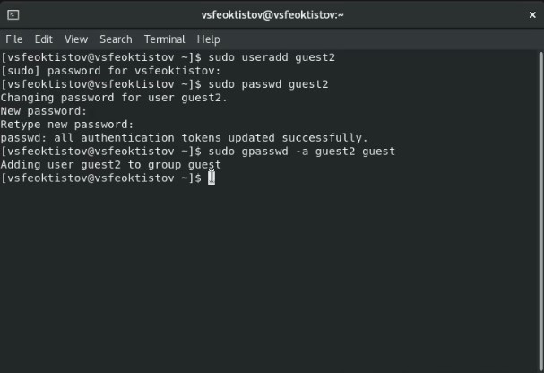{ #fig:2 width=70% }

Далее осуществляем вход в систему от двух пользователей на двух разных консолях: *guest* на первой консоли и *guest2* на второй. Сделать это можно, прописав команду su - [имя пользователя] [**cmds:** *su - guest* и *su - guest2*]. После чего получим некоторую информацию о этих пользователях (рис. [-@fig:3]): 
 
 - определим текущую директорию [**cmd:** *pwd*] (т.к. мы только что вошли в систему от имени другого пользователя, то, очевидно, что текущим каталогом будет домашний каталог текущего пользователя, т.е. для *guest* - */home/guest*, для *guest2* - */home/guest2*. Сравнивая вывод команды pwd с приглашение командной строки (набор символов перед знаком $, где имя перед знаком @ - имя текущего пользователя, имя после @ - имя хоста, после которого через пробел идет путь до текущего каталога), определяем, что текущий каталог из pwd совпадает с путем, указанным в приглашении (знак *~* - путь до домашнего каталога текущего пользователя));
 
 - уточним имя пользователя [**cmd:** *whoami*];
 
 - уточним группу пользователя [**cmd:** *id*]. Определяем это из значения переменной *gid*;

 - уточним группы, в которые входит пользователь [**cmds:** *groups* или *groups [имя пользователя]*];

После чего сравним вывод команды groups с выводом команд id -Gn и id -G (или id -Gn [имя пользователя] и id -G [имя пользователя]). Из вывода команд видно, что команды groups и id -Gn одинаковые, т.е. выводят имена групп, в которых состоит пользователь, а команда id -G в отличие от них выводит gid групп.

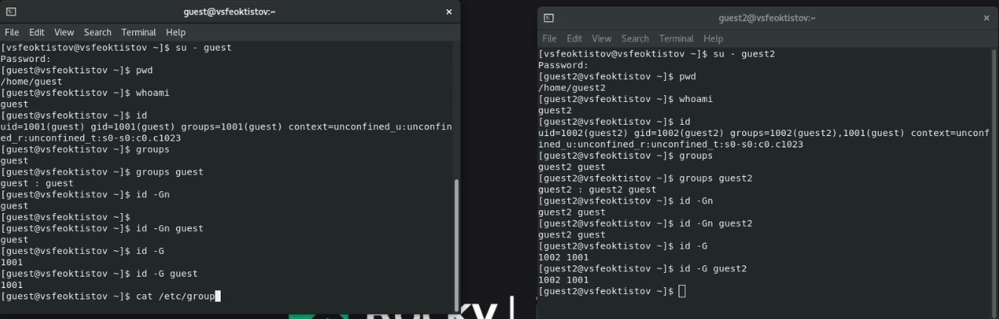{ #fig:3 width=70% }

Полученную информацию сравним с содержимым файла */etc/group* [**cmd:** *cat /etc/group*]. Как видно, этот файл содержит информацию о всех группах в системе: их gid (Group identificator), а также какие пользователи состоят в этих группах. Т.е. команды groups и id выводят информацию о том, в каких группах состоит пользователь, в то время как файл */etc/group* содержит информацию о том, кто состоит в группах (рис. [-@fig:4]).

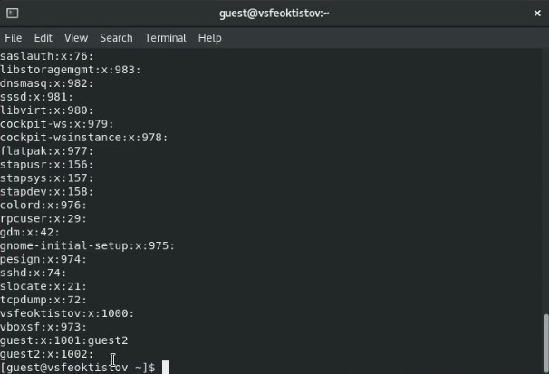{ #fig:4 width=70% }

Далее переход во вторую консоль, в которой вошли в систему от имени пользователя *guest2*, и выполняем регистрацию пользователя *guest2* в группе *guest* командой newgrp guest (рис. [-@fig:5]). Из картинки [-@fig:5] видно, что в результате меняется текущий идентификатор реальной группы на заданный (gid пользователя *guest2* поменяелся с 1002 на 1001), но не меняется внутри файла */etc/passwd*. Если не указывать имя группы в команде newgrp, то установится идентификатор группы из файла */etc/passwd* для этого пользователя. 

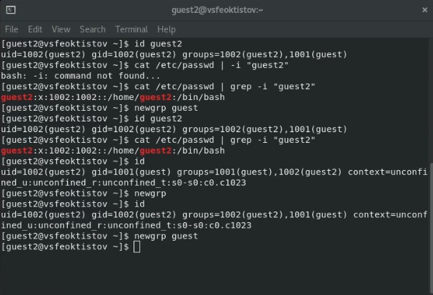{ #fig:5 width=70% }

От имени пользователя *guest* изменим права директории */home/guest*, разрешив все действия для пользователей группы [**cmd:** *chmod g+rwx /home/guest*], а также снимем с директории */home/guest/dir1* все атрибуты команой chmod 000 dir1. С помощью команд ls -l можно посмтреть как меняются атрибуты каталогов (рис. [-@fig:6]).

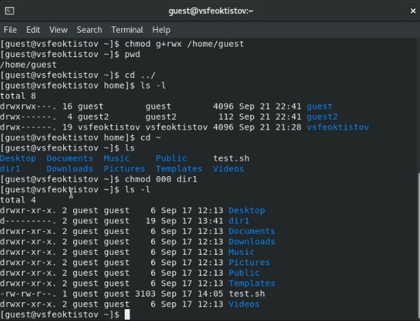{ #fig:6 width=70% }

Директория /home/guest/dir1 и файл /home/guest/dir1/file1 были созданы еще в предыдущей лабораторной работе (рис. [-@fig:7]).

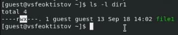{ #fig:7 width=70% }

## Создание и использование скрипта

Далее я изучил какие действия можно будет совершать над файлами/каталогами при различных комбинациях атрибутов прав доступа для групп. Для этого можно последовательно выполнить ряд команд: *touch* - попытка создать файл, *rm* - попытка удалить файл, *echo "" > /path* - попытка записать данные в файл, *cat* - попытка прочитать информацию из файла, *cd* - попытка перейти в директорию, *ls* - попытка просмотреть содержимое директории, *rename* - попытка переименовать файл, *chattr* - попытка изменить расширенные атрибуты файла. Но поскольку всего таких комбинаций атрибутов 8*8=64, то учитывая то, что нужно еще заполнить 8 колонок, то понадобится исполнить не менее 8*8*8=512 команд, что достаточно много. Поэтому я написал bash скрипт, который упрощает проверку. Причем подобный скрипт уже был написан в предыдущей лабораторной работе, поэтому будет достаточно только немного его отредактировать: скопировать его в домашний каталог пользователя *guest2*, убрать часть с ининциализацией и добавить опцию указания пути, где будут проводиться проверки действий над файлом и каталогом, а в домашнем каталоге *guest* переименовать скрипт в init.sh и оставить только часть с инициализацией (рис. [-@fig:8] - [-@fig:11]).

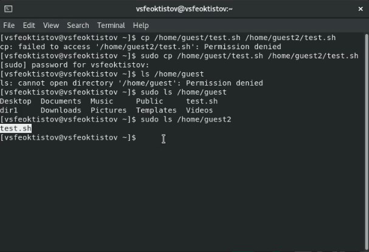{ #fig:8 width=70% }

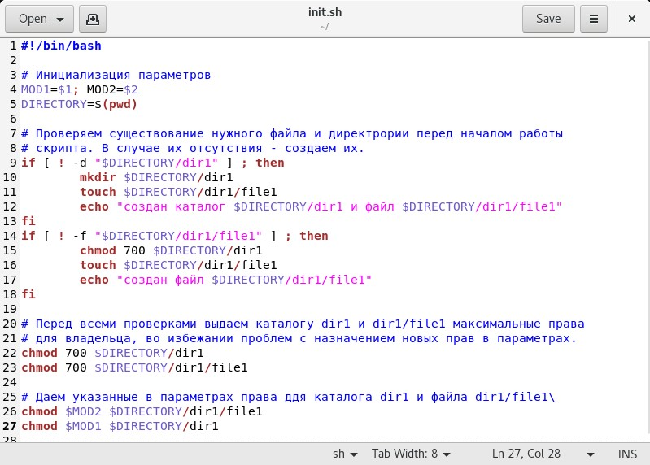{ #fig:9 width=70% }

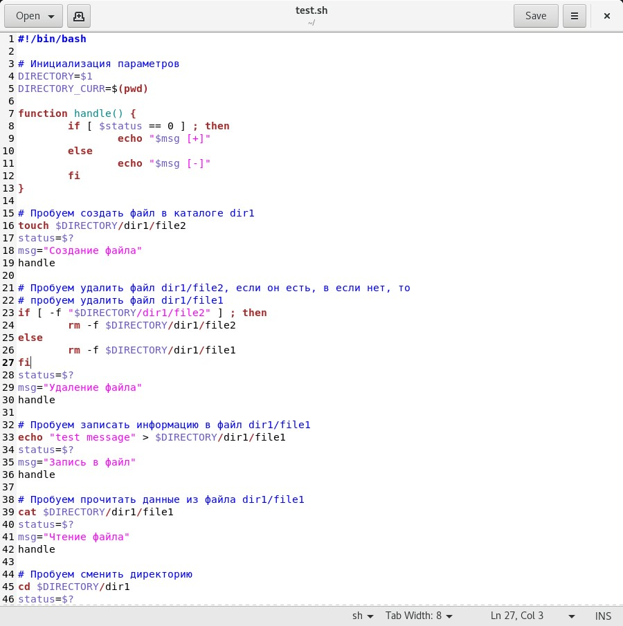{ #fig:10 width=70% }

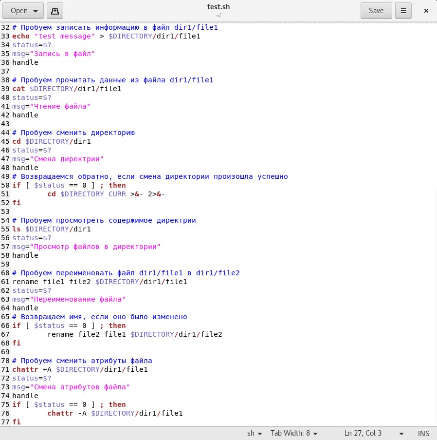{ #fig:11 width=70% }

Запустить эти скрипты можно с помощью команд [**cmds:** *sh init.sh 000 000* в первом терминале и *sh test.sh /home/guest* во втором терминале]. Таким образом, скрипт init.sh снимет все права для файла */home/guest/dir1/file1* и каталога */home/guest/dir1*, а скрипт test.sh показывает какие действия можно будет над ними выполнять (рис. [-@fig:12]). 

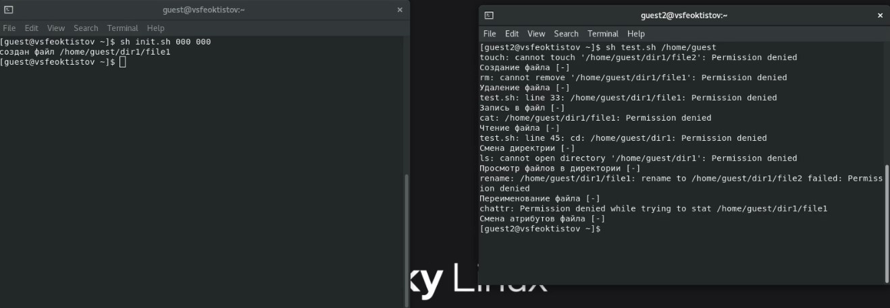{ #fig:12 width=70% }

## Таблицы прав и разрешенных действий

: Установленные права и разрешенные действия для групп {#tbl:tab1}

| Права директории | Права файла           | Создание файла | Удаление файла | Запись в файл | Чтение файла | Смена директории | Просмотр файлов в директории | Переименование файла | Смена атрибутов файла |
|------------------|-----------------------|----------------|----------------|---------------|--------------|------------------|------------------------------|----------------------|-----------------------|
| d--------- (000) | --------- (000)       | -              | -              | -             | -            | -                | -                            | -                    | -                     |
| d-----x--- (010) | --------- (000)       | -              | -              | -             | -            | +                | -                            | -                    | -                     |
| d----w---- (020) | --------- (000)       | -              | -              | -             | -            | -                | -                            | -                    | -                     |
| d----wx--- (030) | --------- (000)       | +              | +              | -             | -            | +                | -                            | +                    | -                     |
| d---r----- (040) | --------- (000)       | -              | -              | -             | -            | -                | +                            | -                    | -                     |
| d---r-x--- (050) | --------- (000)       | -              | -              | -             | -            | +                | +                            | -                    | -                     |
| d---rw---- (060) | --------- (000)       | -              | -              | -             | -            | -                | +                            | -                    | -                     |
| d---rwx--- (070) | --------- (000)       | +              | +              | -             | -            | +                | +                            | +                    | -                     |
|------------------|-----------------------|----------------|----------------|---------------|--------------|------------------|------------------------------|----------------------|-----------------------|
| d--------- (000) | -----x--- (010)       | -              | -              | -             | -            | -                | -                            | -                    | -                     |
| d-----x--- (010) | -----x--- (010)       | -              | -              | -             | -            | +                | -                            | -                    | -                     |
| d----w---- (020) | -----x--- (010)       | -              | -              | -             | -            | -                | -                            | -                    | -                     |
| d----wx--- (030) | -----x--- (010)       | +              | +              | -             | -            | +                | -                            | +                    | -                     |
| d---r----- (040) | -----x--- (010)       | -              | -              | -             | -            | -                | +                            | -                    | -                     |
| d---r-x--- (050) | -----x--- (010)       | -              | -              | -             | -            | +                | +                            | -                    | -                     |
| d---rw---- (060) | -----x--- (010)       | -              | -              | -             | -            | -                | +                            | -                    | -                     |
| d---rwx--- (070) | -----x--- (010)       | +              | +              | -             | -            | +                | +                            | +                    | -                     |
|------------------|-----------------------|----------------|----------------|---------------|--------------|------------------|------------------------------|----------------------|-----------------------|
| d--------- (000) | ----w---- (020)       | -              | -              | -             | -            | -                | -                            | -                    | -                     |
| d-----x--- (010) | ----w---- (020)       | -              | -              | +             | -            | +                | -                            | -                    | -                     |
| d----w---- (020) | ----w---- (020)       | -              | -              | -             | -            | -                | -                            | -                    | -                     |
| d----wx--- (030) | ----w---- (020)       | +              | +              | +             | -            | +                | -                            | +                    | -                     |
| d---r----- (040) | ----w---- (020)       | -              | -              | -             | -            | -                | +                            | -                    | -                     |
| d---r-x--- (050) | ----w---- (020)       | -              | -              | +             | -            | +                | +                            | -                    | -                     |
| d---rw---- (060) | ----w---- (020)       | -              | -              | -             | -            | -                | +                            | -                    | -                     |
| d---rwx--- (070) | ----w---- (020)       | +              | +              | +             | -            | +                | +                            | +                    | -                     |
|------------------|-----------------------|----------------|----------------|---------------|--------------|------------------|------------------------------|----------------------|-----------------------|
| d--------- (000) | ----wx--- (030)       | -              | -              | -             | -            | -                | -                            | -                    | -                     |
| d-----x--- (010) | ----wx--- (030)       | -              | -              | +             | -            | +                | -                            | -                    | -                     |
| d----w---- (020) | ----wx--- (030)       | -              | -              | -             | -            | -                | -                            | -                    | -                     |
| d----wx--- (030) | ----wx--- (030)       | +              | +              | +             | -            | +                | -                            | +                    | -                     |
| d---r----- (040) | ----wx--- (030)       | -              | -              | -             | -            | -                | +                            | -                    | -                     |
| d---r-x--- (050) | ----wx--- (030)       | -              | -              | +             | -            | +                | +                            | -                    | -                     |
| d---rw---- (060) | ----wx--- (030)       | -              | -              | -             | -            | -                | +                            | -                    | -                     |
| d---rwx--- (070) | ----wx--- (030)       | +              | +              | +             | -            | +                | +                            | +                    | -                     |
|------------------|-----------------------|----------------|----------------|---------------|--------------|------------------|------------------------------|----------------------|-----------------------|
| d--------- (000) | ---r----- (040)       | -              | -              | -             | -            | -                | -                            | -                    | -                     |
| d-----x--- (010) | ---r----- (040)       | -              | -              | -             | +            | +                | -                            | -                    | -                     |
| d----w---- (020) | ---r----- (040)       | -              | -              | -             | -            | -                | -                            | -                    | -                     |
| d----wx--- (030) | ---r----- (040)       | +              | +              | -             | +            | +                | -                            | +                    | -                     |
| d---r----- (040) | ---r----- (040)       | -              | -              | -             | -            | -                | +                            | -                    | -                     |
| d---r-x--- (050) | ---r----- (040)       | -              | -              | -             | +            | +                | +                            | -                    | -                     |
| d---rw---- (060) | ---r----- (040)       | -              | -              | -             | -            | -                | +                            | -                    | -                     |
| d---rwx--- (070) | ---r----- (040)       | +              | +              | -             | +            | +                | +                            | +                    | -                     |
|------------------|-----------------------|----------------|----------------|---------------|--------------|------------------|------------------------------|----------------------|-----------------------|
| d--------- (000) | ---r-x--- (050)       | -              | -              | -             | -            | -                | -                            | -                    | -                     |
| d-----x--- (010) | ---r-x--- (050)       | -              | -              | -             | +            | +                | -                            | -                    | -                     |
| d----w---- (020) | ---r-x--- (050)       | -              | -              | -             | -            | -                | -                            | -                    | -                     |
| d----wx--- (030) | ---r-x--- (050)       | +              | +              | -             | +            | +                | -                            | +                    | -                     |
| d---r----- (040) | ---r-x--- (050)       | -              | -              | -             | -            | -                | +                            | -                    | -                     |
| d---r-x--- (050) | ---r-x--- (050)       | -              | -              | -             | +            | +                | +                            | -                    | -                     |
| d---rw---- (060) | ---r-x--- (050)       | -              | -              | -             | -            | -                | +                            | -                    | -                     |
| d---rwx--- (070) | ---r-x--- (050)       | +              | +              | -             | +            | +                | +                            | +                    | -                     |
|------------------|-----------------------|----------------|----------------|---------------|--------------|------------------|------------------------------|----------------------|-----------------------|
| d--------- (000) | ---rw---- (060)       | -              | -              | -             | -            | -                | -                            | -                    | -                     |
| d-----x--- (010) | ---rw---- (060)       | -              | -              | +             | +            | +                | -                            | -                    | -                     |
| d----w---- (020) | ---rw---- (060)       | -              | -              | -             | -            | -                | -                            | -                    | -                     |
| d----wx--- (030) | ---rw---- (060)       | +              | +              | +             | +            | +                | -                            | +                    | -                     |
| d---r----- (040) | ---rw---- (060)       | -              | -              | -             | -            | -                | +                            | -                    | -                     |
| d---r-x--- (050) | ---rw---- (060)       | -              | -              | +             | +            | +                | +                            | -                    | -                     |
| d---rw---- (060) | ---rw---- (060)       | -              | -              | -             | -            | -                | +                            | -                    | -                     |
| d---rwx--- (070) | ---rw---- (060)       | +              | +              | +             | +            | +                | +                            | +                    | -                     |
|------------------|-----------------------|----------------|----------------|---------------|--------------|------------------|------------------------------|----------------------|-----------------------|
| d--------- (000) | ---rwx--- (070)       | -              | -              | -             | -            | -                | -                            | -                    | -                     |
| d-----x--- (010) | ---rwx--- (070)       | -              | -              | +             | +            | +                | -                            | -                    | -                     |
| d----w---- (020) | ---rwx--- (070)       | -              | -              | -             | -            | -                | -                            | -                    | -                     |
| d----wx--- (030) | ---rwx--- (070)       | +              | +              | +             | +            | +                | -                            | +                    | -                     |
| d---r----- (040) | ---rwx--- (070)       | -              | -              | -             | -            | -                | +                            | -                    | -                     |
| d---r-x--- (050) | ---rwx--- (070)       | -              | -              | +             | +            | +                | +                            | -                    | -                     |
| d---rw---- (060) | ---rwx--- (070)       | -              | -              | -             | -            | -                | +                            | -                    | -                     |
| d---rwx--- (070) | ---rwx--- (070)       | +              | +              | +             | +            | +                | +                            | +                    | -                     |

: Минимальные права для совершения операций от имени пользователей входящих в группу {#tbl:tab2}

| Операция               | Минимальные права на директорию | Минимальные права на файл |
|------------------------|---------------------------------|---------------------------|
| Создание файла         | d -wx (030)                     | --- (000)                 |
| Удаление файла         | d -wx (030)                     | --- (000)                 |
| Чтение файла           | d --x (010)                     | r-- (040)                 |
| Запись в файл          | d --x (010)                     | -w- (020)                 |
| Переименование файла   | d -wx (030)                     | --- (000)                 |
| Создание поддиректории | d -wx (030)                     | --- (000)                 |
| Удаление поддиректории | d -wx (030)                     | --- (000)                 |

# Выводы

В процессе выполнения лабораторной работы я приобрел практические навыки работы в консоли с правами и атрибутами файлов и каталогов  для групп пользователей, закрепил теоретдля групп пользователейические основы дискреционного разграничения доступа в современных системах с открытым кодом на базе ОС Linux, проверил необходимый наборов прав для выполнения различных действий над файлами и каталогами , получил навыки чтения выделенных прав через консоль.

# Список литературы{.unnumbered}

::: {#refs}
:::
