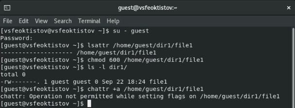
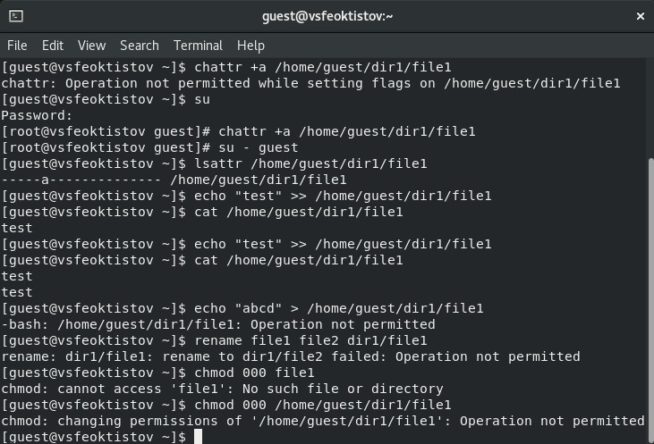
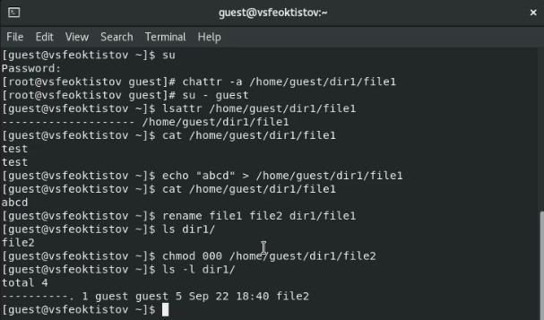
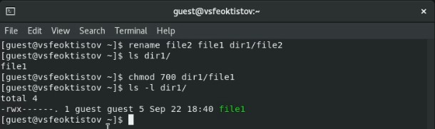
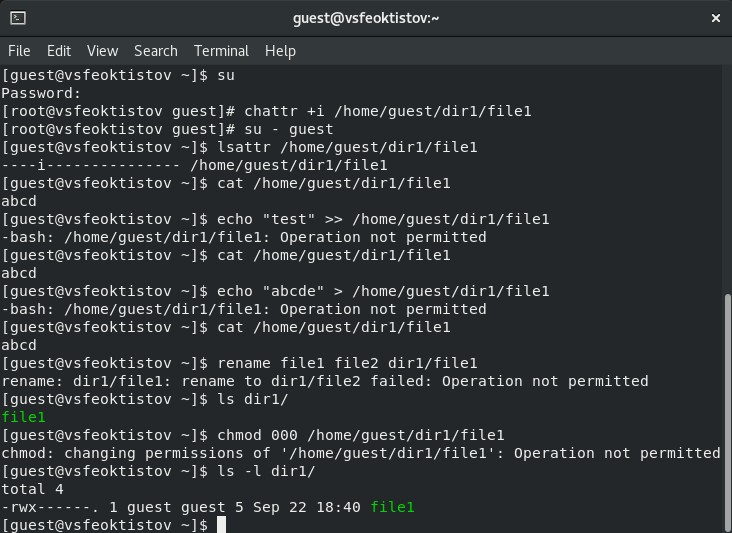

---
## Front matter
lang: ru-RU
title: Лабораторная работа №4
subtitle: Основы информационной безопасности
author:
  - Феоктистов Владислав Сергеевич
institute:
  - Российский университет дружбы народов, Москва, Россия
  - НПМбд-01-19
date: 22 сентября 2022

## i18n babel
babel-lang: russian
babel-otherlangs: english

## Formatting pdf
toc: false
toc-title: Содержание
slide_level: 2
aspectratio: 169
section-titles: true
theme: metropolis
header-includes:
 - \metroset{progressbar=frametitle,sectionpage=progressbar,numbering=fraction}
 - '\makeatletter'
 - '\beamer@ignorenonframefalse'
 - '\makeatother'
---

## Цель лабораторной работы

Целью данной работы является получение практических навыков работы в консоли с расширенными атрибутами файлов.

## Задачи лабораторной работы

 - От имени пользователя *guest* проверить существующие расширенные атрибуты файла *file1*, установить на файл права 600 и попытаться добавить ему атрибут "a";
 - попытаться установить расширенный атрибут "a" от имен суперпользователя;
 - от пользователя *guest* проверить изменения, попробовать добавить информацию файл, считать содержимое, стереть данные, переименовать файл, установить новые права на файл;
 - повторить операции, которые ранее не удалось выполнить, без расширенного атрибута "a";
 - повторить все действия с расширенным атрибутом "i". 

# Ход выполнения лабораторной работы

## Установка и просмотр прав и расширенных атрибутов 

- От имени пользователя *guest* определяем расширенные атрибуты файла */home/guest/dir1/file1*.
- Разрешаем только чтение и запись файла *file1* для его владельца.
- Пробуем установить атрибут "a" от имени пользователя *guest*.

{ #fig:1 width=40% }

## Работа с расширенным атрибутом "a" 

- Через root-пользователя устанвливаем атрибут "a".
- Пробуем от имени пользователя *guest* добавить информацию в файл, считать файл, перезаписать ифнормацию, переименовать и изменить права для файла.

По итогу, перезапись, переименование и переопредеоение прав будет не доступно, поскольку они выходят за рамки только добавления информации.

{ #fig:2 width=40% }

## Работа без расширенного атрибута "a" 

- Через root-пользователя убираем атрибут "a".
- Повторяем операции, которые не работли с атрибутом "a".

По итогу, все эти операции выполнились без ошибок, поскольку теперь ограничение на только добавление информации исчезло.

{ #fig:3 width=40% }

## Возвращение предыдущего имени файла и установка прав 

Так как права и имя файла *file1* было изменено на *file2*, то для повторения предыдущих действий с раширенным атрибутом "i" необходимо будет вернуть права и предыдущее название

{ #fig:4 width=60% }

## Работа с расширенным атрибутом "i" 

- Через root-пользователя устанвливаем атрибут "i".
- Повторяем все шаги.

Так как расширенный атрибут "i" делает файл неизменяемым, т.е. добавление, перезапись информации в файле *file1*, а также переименование и изменение прав файла будет невозможно

{ #fig:5 width=40% }

## Выводы

- Приобрел практические навыки работы в консоли с расширенными атрибутами файлов через терминал; 
- на примерах понял, как используются расширенные атрибуты "a" и "i" при разграничении доступа.
