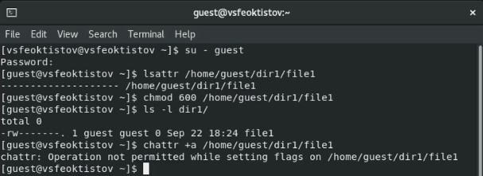
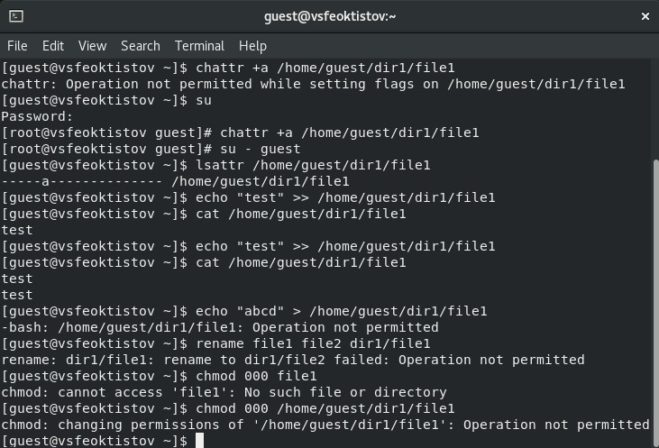
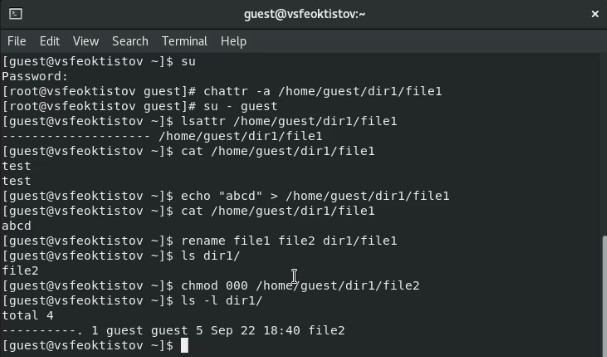
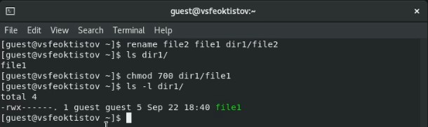
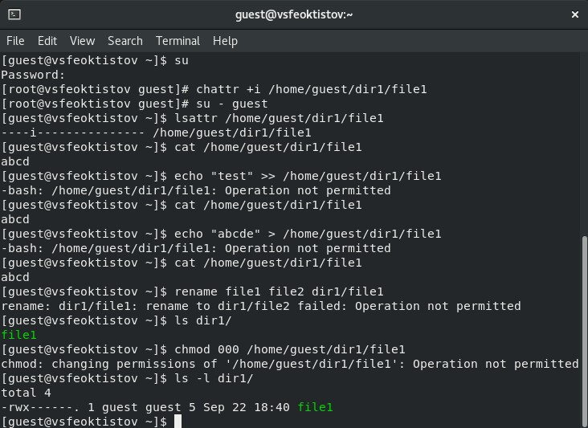

---
## Front matter
title: "Лабораторная работа №4"
subtitle: "Дисциплина: Основы информационной безопасности"
author: "Феоктистов Владислав Сергеевич"

## Generic otions
lang: ru-RU
toc-title: "Содержание"

## Bibliography
bibliography: bib/cite.bib
csl: pandoc/csl/gost-r-7-0-5-2008-numeric.csl

## Pdf output format
toc: true # Table of contents
toc-depth: 2
lof: true # List of figures
lot: true # List of tables
fontsize: 12pt
linestretch: 1.5
papersize: a4
documentclass: scrreprt
## I18n polyglossia
polyglossia-lang:
  name: russian
  options:
	- spelling=modern
	- babelshorthands=true
polyglossia-otherlangs:
  name: english
## I18n babel
babel-lang: russian
babel-otherlangs: english
## Fonts
mainfont: PT Serif
romanfont: PT Serif
sansfont: PT Sans
monofont: PT Mono
mainfontoptions: Ligatures=TeX
romanfontoptions: Ligatures=TeX
sansfontoptions: Ligatures=TeX,Scale=MatchLowercase
monofontoptions: Scale=MatchLowercase,Scale=0.9
## Biblatex
biblatex: true
biblio-style: "gost-numeric"
biblatexoptions:
  - parentracker=true
  - backend=biber
  - hyperref=auto
  - language=auto
  - autolang=other*
  - citestyle=gost-numeric
## Pandoc-crossref LaTeX customization
figureTitle: "Рис."
tableTitle: "Таблица"
listingTitle: "Листинг"
lofTitle: "Список иллюстраций"
lotTitle: "Список таблиц"
lolTitle: "Листинги"
## Misc options
indent: true
header-includes:
  - \usepackage{indentfirst}
  - \usepackage{float} # keep figures where there are in the text
  - \floatplacement{figure}{H} # keep figures where there are in the text
---

# Цель работы

Целью данной работы является получение практических навыков работы в консоли с расширенными атрибутами файлов.

# Задание

 - От имени пользователя *guest* проверить существующие расширенные атрибуты файла *file*, установить на файл права 600 и попытаться добавить ему атрибут "a";
 - попытаться установить расширенный атрибут "a" от имен суперпользователя;
 - от пользователя *guest* проверить изменения, попробовать добавить информацию файл, считать содержимое, стереть данные, переименовать файл, установить новые права на файл;
 - повторить операции, которые ранее не удалось выполнить, без расширенного атрибута "a";
 - повторить все действия с расширенным атрибутом "i". 

# Теоретическое введение

## Изменение атрибутов

В ОС Linux права доступа к файлам, атрибуты и владение управляют уровнем доступа, который система обрабатывает, а пользователи имеют к файлам. Это гарантирует, что только авторизованные пользователи и процессы могут получить доступ к опеределенным файлам и каталогам. Атрибуты сосотят из девяти битов, которые и определяют права для разных групп пользователей. Первая тройка битов определяет права доступа для владельца, вторая тройка - для членов группы, последняя тройка - для всех остальных пользователей в системе. Каждая тройка битов (класс пользователей) определяет права на чтение, запись и исполнение. Эта концепция позволяет контролировать, какие пользователи могут читать, записывать (изменять) или выполнять файлы/каталоги.

Чтобы просмотреть права доступа к файлу, использовуется команда ls с опцией -l. Первый символ указывает тип файла. Это может быть обычный файл (-), каталог (d), символическая ссылка (l) или другие спицефические типы файлов. Следующие девять символов предоставляют доступ к файлу, три тройки по три символа каждая (три пользователя, три типа прав: r - чтение, w - запись, x - исполнение).

Права доступа к файлу/каталогу можно изменить с помощью команды chmod. Только root, владелец файла или пользователь с привилегией sudo могут изменять права доступа к файлу или каталогу. Разрешения можно указывать с помощью символьного, числового или справочного режимов [@gnu-doc-2:bash].

## Изменение расширенных атрибутов

Помимо битов режима файла, которые управляют разрешениями пользователей и групп на чтение, запись и выполнение, некоторые файловые системы поддерживают атрибуты файла (расширенные атрибуты), которые позволяют дополнительно настраивать допустимые операции с файлами. 

Пакет e2fsprogs содержит программы lsattr(1) и chattr(1), которые позволяют просмотреть и изменить атрибуты файла соответственно.

Здесь приведены некоторые полезные атрибуты. Не все файловые системы поддерживают каждый упомянутый атрибут.

 - a - append only: Файл может быть открыт только для добавления.
 - c - compressed: Включить сжатие на уровне файловой системы для файла.
 - i - immutable: Не может быть изменён, удалён или переименован. Может быть установлен только пользователем root.
 - j - data journaling: Использовать журнал для записи данных файла так же, как и метаданных.
 - m - no compression: Отключить сжатие на уровне файловой системы для файла.
 - A - no atime update: Время получения доступа к файлу не будет обновляться.
 - C - no copy on write: Отключение copy-on-write на поддерживающих это файловых системах.

Дополнительную информацию можно получить на сайте [@gnu-doc-3:bash]. 

## Таблицы

: Описание некоторых каталогов файловой системы GNU Linux {#tbl:std-dir}

| Имя каталога | Описание каталога                                                                                                          |
|--------------|----------------------------------------------------------------------------------------------------------------------------|
| `/`          | Корневая директория, содержащая всю файловую                                                                               |
| `/bin `      | Основные системные утилиты, необходимые как в однопользовательском режиме, так и при обычной работе всем пользователям     |
| `/etc`       | Общесистемные конфигурационные файлы и файлы конфигурации установленных программ                                           |
| `/home`      | Содержит домашние директории пользователей, которые, в свою очередь, содержат персональные настройки и данные пользователя |
| `/media`     | Точки монтирования для сменных носителей                                                                                   |
| `/root`      | Домашняя директория пользователя  `root`                                                                                   |
| `/tmp`       | Временные файлы                                                                                                            |
| `/usr`       | Вторичная иерархия для данных пользователя                                                                                 |

: Описание некоторых используемых в работе команд {#tbl:cmds}

| Команда      | Описание команды                                                                                                                                         |
|--------------|----------------------------------------------------------------------------------------------------------------------------------------------------------|
| `cat`        | Вывод содержимого указанного файла.                                                                                                                      |
| `ls`         | Выводит содержимое каталога. Опция -l выводит дополнительную информацию, -a отображает скрытые файлы, в названии которых в самом начале стоит символ '.' |
| `lsattr`     | Просмотр аттрибутов файлов/каталогов в файловой системе Linux.                                                                                           |
| `chmod`      | Изменение прав доступа к файлам и каталогам, используемых в Unix-подобных операционных системах.                                                         |
| `echo`       | Вывод переданных аргументов, строки, текста.                                                                                                             |
| `chattr`     | Изменяет атрибуты файлов/каталогов в файловой системе Linux.                                                                                             |
| `rename`     | Переименование файла/каталога. Формат rename [старое имя] [новое имя] [путь до файла].                                                                   |

Более подробно об Unix см. в [@gnu-doc:bash;@newham:2005:bash;@zarrelli:2017:bash;@robbins:2013:bash;@tannenbaum:arch-pc:ru;@tannenbaum:modern-os:ru].

# Выполнение лабораторной работы

## Иполнение команд в консоли

Определим от имени пользователя *guest* (в случае, если Вы сейчас находитесь в системе под именем другого пользователя, то нужно будет зайти под пользователем *guest* с помощью команды su - guest) расширенные атрибуты файла */home/guest/dir1/file1* [**cmd:** *lsattr /home/guest/dir1/file1*] (каталог *dir1* и файл *file1* были созданы в предыдущих лабораторных работах). Из рисунка [-@fig:1] видно, что в начале файл не имел никаких расширенных атрибутов. После установим разрешение только на чтение и запись файла *file1* для его владельца, попробуем установить для этого же файла расширенный атрибут "a" от того же пользователя [**cmd:** *chattr +a /home/guest/dir1/file1*] (рис. [-@fig:1]).

{ #fig:1 width=70% }

Как видно из рисунка [-@fig:1], у пользователя *guest* не достаточно прав для установление расширенных атрибутов (Operation not permitted).

Попробуем установить расширенные атрибуты от имени суперпользователя. Для этого введем команду su и повтортим команду [**cmd:** *chattr +a /home/guest/dir1/file1*]. Из рисунка [-@fig:2] видно, что теперь эта команда выполнилась без ошибок. Проверим, что атрибуты действительно изменились, для этого выполним команду lsattr от имени пользователя *guest* [**cmds:** *su - guest* и *lsattr /home/guest/dir1/file1*]. Из того же рисунка видно, что теперь у файла *file1* появился атрибут "a".

Далее попытаемся выполнить ряд действий над файлом. Попытаемся дозаписать в файл *file1* слово "test" командой echo "test" >> /home/guest/dir1/file1, а после считать информацию с файла, чтобы убедиться, что слово "test" было успешно добавлено в файл [**cmd:** *cat /home/guest/dir1/file1*]. Для того, чтобы убедиться, что сообщения добавляется именно в конец файла (не стирает предыдущую информацию, чтобы записать новую), можно повторить недавние команды. После попытаемся стереть и перезаписать информацию в файле *file1* [**cmd:** *echo "abcd" > cat /home/guest/dir1/file1*]. Появится сообщение о том, что такое действие над файлом не возможно, поскольку атрибут "a" разшрешает только дополнять данные, а не перезписывать их (командой cat можно проверить, что содержимое файла действительно не изменилось). Также не будет доступна команда переименования файла [**cmd:** *rename file1 file2 /home/guest/dir1/file1*] и команда переопределения прав доступа [**cmd:** *chmod 000 dir1/file1*], поскольку они приводят к изменению метаданных файла (эти действия можно проверить с помощью команд ls и ls -l) (рис. [-@fig:2]).

{ #fig:2 width=70% }

Теперь же попробуем повторить операции, которые выдали сообщение о невозможности исполнения, только уже без расширенного атрибута "a". Для снятия атрибута "a" используем команду chattr -a /home/guest/dir1/file1 от имени суперпользователя (рис. [-@fig:3]).

{ #fig:3 width=70% }

По итогу, все эти операции выполнились без ошибок, поскольку теперь ограничение на только добавление информации исчезло.

Так как права и имя файла *file1* было изменено на *file2*, то для повторения предыдущих действий с раширенным атрибутом "i" необходимо будет вернуть права и предыдущее название [**cmds:** *rename file2 file1 /home/guest/dir1/file2* и *chmod 700 /home/guest/dir1/file2*]. Для проверки изменений используются команды ls и ls -l (рис. [-@fig:4]).

{ #fig:4 width=70% }

Повторим действия по шагам, заменив атрибут "a" атрибутом "i". Так как атрибут "a" быд ранее уже снят, то необходимо только добавить атрибут "i" от имени суперпользователя [**cmd:** *chattr +a /home/guest/dir1/file1*] (рис. [-@fig:5]).

{ #fig:5 width=70% }

Так как расширенный атрибут "i" делает файл неизменяемым, то любое действие, которое будет приводить к измнению файла, будет отклонено. Т.е. добавление, перезапись информации в файле *file1*, а также переименование и изменение прав файла будет невозможно (рис. [-@fig:5]).

# Выводы

В процессе выполнения лабораторной работы приобрел практические навыки работы в консоли с расширенными атрибутами файлов через терминал; на примерах понял, как используются расширенные атрибуты "a" и "i" при разграничении доступа.

# Список литературы{.unnumbered}

::: {#refs}
:::
