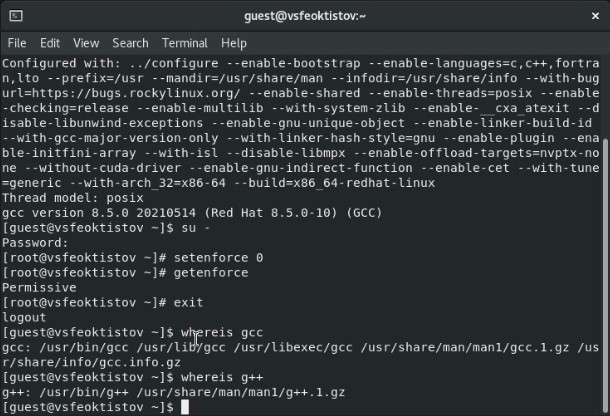
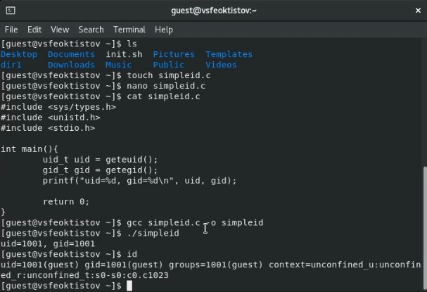
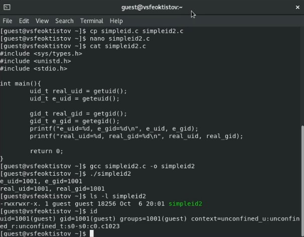
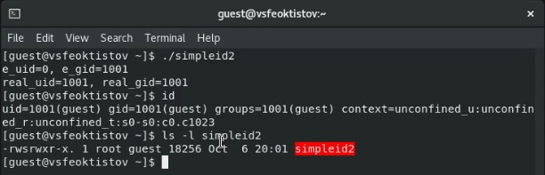
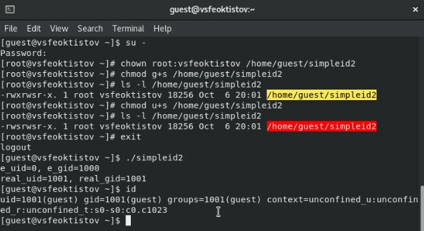
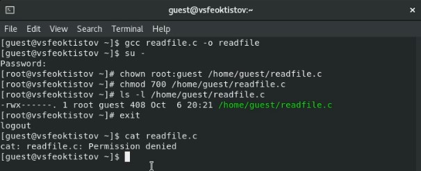
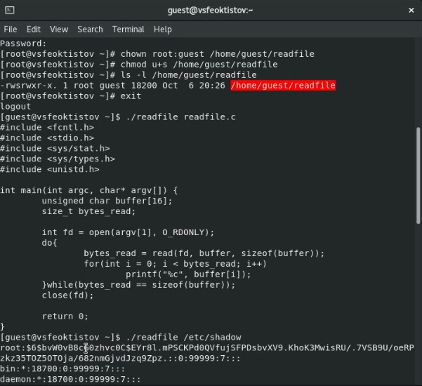
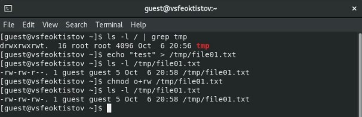
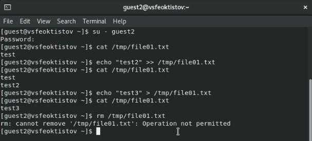
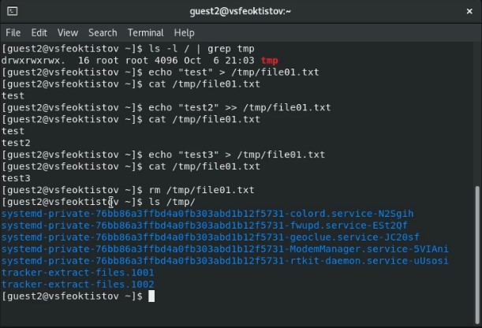

---
## Front matter
lang: ru-RU
title: Лабораторная работа №5
subtitle: Основы информационной безопасности
author:
  - Феоктистов Владислав Сергеевич
institute:
  - Российский университет дружбы народов, Москва, Россия
  - НПМбд-01-19
date: 22 сентября 2022

## i18n babel
babel-lang: russian
babel-otherlangs: english

## Formatting pdf
toc: false
toc-title: Содержание
slide_level: 2
aspectratio: 169
section-titles: true
theme: metropolis
header-includes:
 - \metroset{progressbar=frametitle,sectionpage=progressbar,numbering=fraction}
 - '\makeatletter'
 - '\beamer@ignorenonframefalse'
 - '\makeatother'
---

## Цель лабораторной работы

Целью данной работы является:

 - изучение механизмов изменения индификаторов, применения SetUID- и Sticky-битов; 
 - получение практических навыков работы в консоли с дополнительными атрибутами;
 - рассмотрение работы механизма смены индентфикаторов процессов пользователей;
 - изучение влияния Sticky-бита на запись и удаление файлов. 

## Задачи лабораторной работы

 - Создать программу, выводящую реальные и эффективные идентификторы (uid, gid), посмотрить и сравнить результаты с выводом команды id до и после добавления SetUID- и SetGID-битов;
 - Создать программу для чтения содержимого текстовых файлов и проверить его работу чтения файла с разрешением на его чтение только для владельца и с установленным SetUID-битом, запуская программу от друго пользовтеля, неявляющегося владельцем файла. Сравнить с использованием команды cat;
 - Изучить влияние Sticky-бита на работу с фалами и возможностью их удаления, работя с каталогом /tmp.

# Ход выполнения лабораторной работы

## Подготовка лабораторного стенда

Перед выполнением лабораторной работы необходимо убедиться, что установлен компилятор gcc и отключен механизм защиты для работы со Sticky-битом.

{ #fig:1 width=40% }

## Написание первой версии программы вывода uid и gid

- От имени пользователя *guest* создали программу *simpleid.c*, которая выводит эффективные идентификторы uid и gid; 
- Скомпилировалт программу *simpleid.c* в исполняемый файл simpleid и запустим его;
- Выводимые эффективные идентификторы совпадали с идентификаторами пользователя, который их запускал.

{ #fig:2 width=40% }

## Написание второй версии программы вывода uid и gid

- От того же пользователя скопировали файл *simpleid.c* в файл *simpleid2.c* и добавили в программе вывод реальных идентификаторов;
- Снова скомпилировали файл и запустили его;
- Выводимые идентификаторы (реальные и эффективные) совпали с индентификаторами команды id, как и до этого. 

{ #fig:3 width=30% }

## Запуск программы после смены владельца и установки SetUID-бита 

- Через root-пользователя поменяли владельца исполняемого файла и устанавливаем ему SetUID-бит;
- После запуска программы от имени пользователя *guest*, эффективный идентификатор uid отличался от реального uid и uid команды id. Идентфикатор gid напротив же не изменился.

{ #fig:4 width=45% }

## Запуск программы после смены группы владельцев и установки SetGID-бита 

- Через root-пользователя поменяли группу владельцев исполняемого файла и устанавливаем ему SetGID-бит (заодно оставили предыдущего владельца и SetUID-бит);
- После запуска программы от имени пользователя *guest*, уже и эффективный идентификатор gid отличался от реального gid и gid команды id.

{ #fig:5 width=35% }

**Вывод:** реальные идентификаторы показывают идентификаторы пользователя, который запустил программу, а эффективные - идентификатор владельца файла. 

## Программа вывода содержимого файлов

- Написали программу *readfile.c* для вывода в консоль содержимого указанного файла и скомпилировали её;
- Через root-пользователя поменяли владельца исходного файла и разрешили его чтение только новому владельцу;
- Попробовали через пользователя *guest* прочитать его содержимое.

{ #fig:6 width=40% }

## Программа вывода содержимого файлов со SetUID-битом

- Добавили через root-пользователя SetUID-бит для исполняемого файла, установив ему того же владельца, что и у исходного файла;
- Попробовали прочитать содержимое исходного файла и файла */etc/shadow*.

{ #fig:7 width=30% }

**Вывод:** SetUID- и SetGID-биты позволяют исполнять программы от имени их пользователей.

## Проверка Sticky-бита и создание файла в каталоге

- Посмотрели наличие Sticky-бита у каталога */tmp*;
- Создали в нем файл *file01.txt* с сообщением *test* и добавили права чтения и записи для группы "остальные пользователи".

{ #fig:8 width=45% } 

## Работа с текстовым фалом при наличии Sticky-бита

Попробовали произвести чтение, дозапись, перезапись и удаление текстоого файла при наличии Sticky-бита у каталога, в котором находится этот файл (*/tmp*). Из картинки ниже, видно, что невозможно было только удаление.

{ #fig:9 width=45% }

## Работа с текстовым фалом при отсутствии Sticky-бита

Повторили те же действия, только уже после снятия Sticky-бита с каталога /tmp [**cmd:** *chmod -t /tmp*] от имени суперпользователя. В результате, успешно сработали все команды, в том числе и удаление.

{ #fig:10 width=30% }

**Вывод:** Sticky-бит запрещает удаление содержимого каталога для пользователей, неявляющихся владельцем директории. Остальные действия разрешены в соответствии с установленными на них правами.

## Выводы

В процессе выполнения лабораторной работы:

 - изученили механизмы изменения индификаторов, применения SetUID- и Sticky-битов; 
 - получили практические навыки работы в консоли с дополнительными атрибутами;
 - рассмотрели работу механизма смены индентфикаторов процессов пользователей;
 - изученили влияние Sticky-бита на запись и удаление файлов. 
