---
## Front matter
title: "Лабораторная работа №5"
subtitle: "Дисциплина: Основы информационной безопасности"
author: "Феоктистов Владислав Сергеевич"

## Generic otions
lang: ru-RU
toc-title: "Содержание"

## Bibliography
bibliography: bib/cite.bib
csl: pandoc/csl/gost-r-7-0-5-2008-numeric.csl

## Pdf output format
toc: true # Table of contents
toc-depth: 2
lof: true # List of figures
lot: true # List of tables
fontsize: 12pt
linestretch: 1.5
papersize: a4
documentclass: scrreprt
## I18n polyglossia
polyglossia-lang:
  name: russian
  options:
	- spelling=modern
	- babelshorthands=true
polyglossia-otherlangs:
  name: english
## I18n babel
babel-lang: russian
babel-otherlangs: english
## Fonts
mainfont: PT Serif
romanfont: PT Serif
sansfont: PT Sans
monofont: PT Mono
mainfontoptions: Ligatures=TeX
romanfontoptions: Ligatures=TeX
sansfontoptions: Ligatures=TeX,Scale=MatchLowercase
monofontoptions: Scale=MatchLowercase,Scale=0.9
## Biblatex
biblatex: true
biblio-style: "gost-numeric"
biblatexoptions:
  - parentracker=true
  - backend=biber
  - hyperref=auto
  - language=auto
  - autolang=other*
  - citestyle=gost-numeric
## Pandoc-crossref LaTeX customization
figureTitle: "Рис."
tableTitle: "Таблица"
listingTitle: "Листинг"
lofTitle: "Список иллюстраций"
lotTitle: "Список таблиц"
lolTitle: "Листинги"
## Misc options
indent: true
header-includes:
  - \usepackage{indentfirst}
  - \usepackage{float} # keep figures where there are in the text
  - \floatplacement{figure}{H} # keep figures where there are in the text
---

# Цель работы

Целью данной работы является:

 - изучение механизмов изменения индификаторов, применения SetUID- и Sticky-битов; 
 - получение практических навыков работы в консоли с дополнительными атрибутами;
 - рассмотрение работы механизма смены индентфикаторов процессов пользователей;
 - изучение влияния Sticky-бита на запись и удаление файлов. 

# Задание

Первая часть задания:

 - Написать программу simpleid.c, скомпилировать ее и сравнить результат ее выполнения с командой id;
 - Усложнить программу, назвав его simpleid2.c и добавив вывод действительных идентификаторов и повторить предыдущие действия;
 - От имени суперпользователя изменить владельца исполняемого файла simpleid2 и установить для нового владельца файла SetUID;
 - Запустить исполняемый файл simpleid2 и снова сравнить результат с командой id;
 - Повторить два предыдущих действия, установив SetGID;
 - Создать программу readfile.c для чтения содержимого файлов и скомпилировать ее;
 - Попробовать прочитать файл readfile.c, заранее отобрав права на чтение для пользователя guest и сменив владельца файла;
 - Попробовать прочитать файл readfile.c и /etc/shadow через исполняемый файл readfile, заранее изменив владельца испольняемого файла и установив для него SetUID.

Вторая часть задания:

 - Просмотреть наличие Stick-бита у каталога /tmp и попробовать создать, прочить и изменить текстовый файл в нем, а затем попытаться его удалить;
 - Попробовать сделать тоже самое, только сняв атрибут t;
 - Вернуть обратно Stick-бит для каталога /tmp.

# Теоретическое введение

## Изменение атрибутов

В ОС Linux права доступа к файлам, атрибуты и владение управляют уровнем доступа, который система обрабатывает, а пользователи имеют к файлам. Это гарантирует, что только авторизованные пользователи и процессы могут получить доступ к опеределенным файлам и каталогам. Атрибуты сосотят из девяти битов, которые и определяют права для разных групп пользователей. Первая тройка битов определяет права доступа для владельца, вторая тройка - для членов группы, последняя тройка - для всех остальных пользователей в системе. Каждая тройка битов (класс пользователей) определяет права на чтение, запись и исполнение. Эта концепция позволяет контролировать, какие пользователи могут читать, записывать (изменять) или выполнять файлы/каталоги.

Чтобы просмотреть права доступа к файлу, использовуется команда ls с опцией -l. Первый символ указывает тип файла. Это может быть обычный файл (-), каталог (d), символическая ссылка (l) или другие спицефические типы файлов. Следующие девять символов предоставляют доступ к файлу, три тройки по три символа каждая (три пользователя, три типа прав: r - чтение, w - запись, x - исполнение).

Права доступа к файлу/каталогу можно изменить с помощью команды chmod. Только root, владелец файла или пользователь с привилегией sudo могут изменять права доступа к файлу или каталогу. Разрешения можно указывать с помощью символьного, числового или справочного режимов [@gnu-doc-1:bash].

## Использование SetUID, SetGID и Sticky-bit для расширенной настройки прав досутпа в ОС Linux

**Setuid** – это бит разрешения, который позволяет пользователю запускать исполняемый файл с правами владельца этого файла. Другими словами, использование этого бита позволяет нам поднять привилегии пользователя в случае, если это необходимо. Классический пример использования этого бита в операционной системе это команда sudo.

Принцип работы **Setgid** очень похож на setuid с отличием, что файл будет запускаться пользователем от имени группы, которая владеет файлом.

Последний специальный бит разрешения – это **Sticky Bit** . В случае, если этот бит установлен для папки, то файлы в этой папке могут быть удалены только их владельцем. 

Дополнительную информацию можно получить на сайте [@gnu-doc-2:bash].

## Реальные и эффективные идентификаторы

**Реальный идентификатор** - идентификатор пользователя, запустившего процесс. Эффективный идентификатор служит для определения прав доступа процесса к системным ресурсам (в первую очередь к ресурсам файловой системы).

**Эффективный идентификатор (effective id, effective gid)** - идентификатор пользователя или группы, получаемый процессом после вызова выполняемого файла; определяет права процесса. . Возможность изменения эффективных идентификаторов процесса удобна для организации абстрактных типов данных. Используя этот механизм, можно строить файлы, с которыми разрешено выполнять только определенный набор операций.

Обычно реальный и эффективный идентификаторы эквивалентны, т.е. процесс имеет в системе те же права, что и пользователь, запустивший его.

Дополнительную информацию можно получить на сайтах [@gnu-doc-3:bash], [@gnu-doc-4:bash].

## Таблицы

: Описание некоторых каталогов файловой системы GNU Linux {#tbl:std-dir}

| Имя каталога | Описание каталога                                                                                                          |
|--------------|----------------------------------------------------------------------------------------------------------------------------|
| `/`          | Корневая директория, содержащая всю файловую                                                                               |
| `/bin `      | Основные системные утилиты, необходимые как в однопользовательском режиме, так и при обычной работе всем пользователям     |
| `/etc`       | Общесистемные конфигурационные файлы и файлы конфигурации установленных программ                                           |
| `/home`      | Содержит домашние директории пользователей, которые, в свою очередь, содержат персональные настройки и данные пользователя |
| `/media`     | Точки монтирования для сменных носителей                                                                                   |
| `/root`      | Домашняя директория пользователя  `root`                                                                                   |
| `/tmp`       | Временные файлы                                                                                                            |
| `/usr`       | Вторичная иерархия для данных пользователя                                                                                 |

: Описание некоторых используемых в работе команд {#tbl:cmds}

| Команда      | Описание команды                                                                                                                                         |
|--------------|----------------------------------------------------------------------------------------------------------------------------------------------------------|
| `cat`        | Вывод содержимого указанного файла.                                                                                                                      |
| `ls`         | Выводит содержимое каталога. Опция -l выводит дополнительную информацию, -a отображает скрытые файлы, в названии которых в самом начале стоит символ '.' |
| `id`         | Выводи UID (идентификатор пользователя), GID (идентификатор группы пользователя), groups (основные группы пользователя)                                  |
| `chmod`      | Изменение прав доступа к файлам и каталогам, используемых в Unix-подобных операционных системах.                                                         |
| `chown`      | Изменение владельца и группы пользователей файла или каталога, используемых в Unix-подобных операционных системах.                                       |
| `echo`       | Вывод переданных аргументов, строки, текста.                                                                                                             |
| `touch`      | Создает текстовый файл по указанному пути и с указанным именем внутри пути.                                                                              |
| `rm`         | Удаляет файл(ы) (каталог(и) при указании опции -r) по указанному(ым) пути(ям).                                                                           |
| `cd`         | Перемещение по файловой системе.                                                                                                                         |
| `grep`       | Дает возможность вести поиск строкт. Также можно передать вывод любой команды в grep, что сильно упрощает работу во время поиска                         |
| `whereis`    | Выводит расположение бинарных или исходных файлов.                                                                                                       |
| `gcc`        | Копиляция исходного C файла в исполняемый (объектный) файл.                                                                                              |

Более подробно об Unix см. в [@gnu-doc:bash;@newham:2005:bash;@zarrelli:2017:bash;@robbins:2013:bash;@tannenbaum:arch-pc:ru;@tannenbaum:modern-os:ru].

# Выполнение лабораторной работы

## Подготовка лабораторного стенда

Перед выполнением лабораторной работы стоит убедиться в том, что gcc уже предустановлен в системе, для этого введем команду *gcc -v*. Отсутствие сообщения об ошибки и наличие о версии gcc, говорит о том, что gcc уже установлен в системе. Кроме того, так как программы с установленным битом SetUID могут представлять большую брешь в системе безопасности, в современных системах используются дополнитнльные механизмы защиты. Чтобы защита системы не мешала выполнению работы, необходимо будет ее отключить, для этого нужно будет ввести команду *setenforce 0* от имени суперпользователя. В случае успеха команда *getenforce* должна вывести сообщение *Permissive*.

Дополнительно можно посмотреть пути до компиляторов для языков C и C++ [**cmds:** *whereis gcc* и *whereis g++*] (рис. [-@fig:1]).

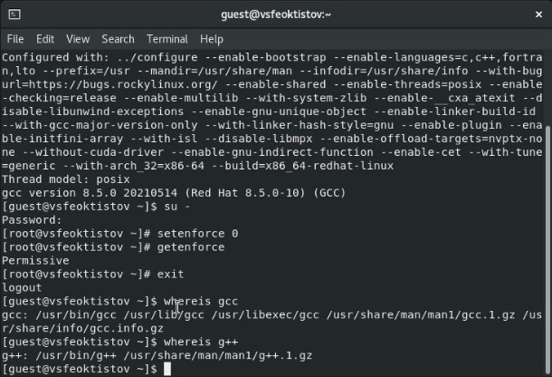{ #fig:1 width=70% }

## Создание программы

Для начала войдем в систему под пользователем guest после запуска вирутральной машины и операционной системы, а после создадим программу *simpleid.c* (рис. [-@fig:2]), как это указано в документе с описанием выполнения лабораторной работы №5 [**cmds:** *touch simpleid.c* и *nano simpleid.c*]. Для сохранения изменений нужно сажать клавиши Ctrl + X, ввести y и нажать Enter. Провить, что исходный код успешно сохранился, можно командой cat [**cmd:** *cat simpleid.c*].

После компиляции [**cmd:** *gcc simpleid.c -o simpleid*] и запуска исполняемого файла [**cmd:** *./simpleid*] сравним результат работы программы с выводом команды *id*. Как можно заметить идентификторы uid и gid совпадают в обоих случаях (рис. [-@fig:3]).

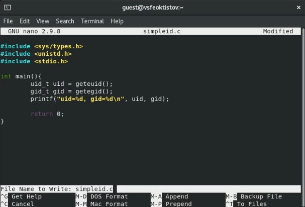{ #fig:2 width=70% }

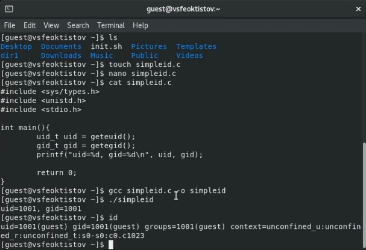{ #fig:3 width=70% }

Усложним программу, добавив вывод действительных идентификаторов (рис. [-@fig:4]). Программу сохраним под названием *simpleid2.c*. Для удобства проще будет скопировать файл *simpleid.c* в этот же каталог, но уже под названием *simpleid2.c* [**cmd:** *cp simpleid.c simpleid2.c*], а затем уже отредактировать его.

После компиляции [**cmd:** *gcc simpleid2.c -o simpleid2*] и запуска исполняемого файла [**cmd:** *./simpleid2*] сравним результат работы программы с выводом команды *id*. Как можно заметить реальные, эффективные и пользовательские идентификторы совпадают (рис. [-@fig:5]).

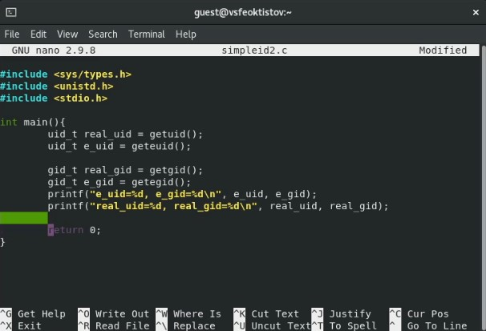{ #fig:4 width=70% }

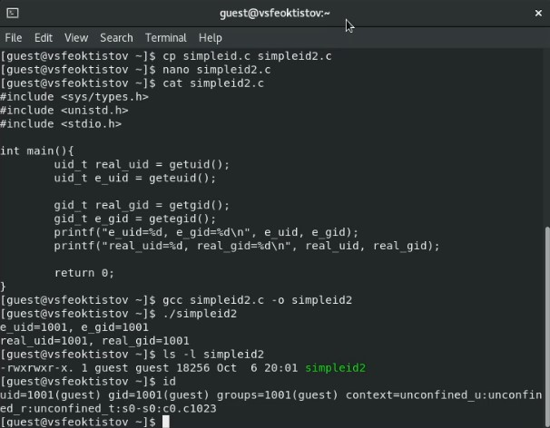{ #fig:5 width=70% }

От имени суперпользователя [**cmd:** *su -*] изменим владельца исполняемого файла *simpleid2* [**cmd:** *chown root:guest /home/guest/simpleid2*], установим для нового владельца дополнительный атрибут s (SetUID) [**cmd:** *chmod u+s /home/guest/simpleid2*] и проверим как изменились атрибуты прав и владельцы файла [**cmd:** *ls -l /home/guest/simpleid2*]. Как видно в первой тройке битов вместо привычного символа x стоит символ s, что и говорит об успешной установке SetUID. После выполнения этих команд нужно вернуться к пользователю guest [**cmd:** *exit*] (рис. [-@fig:6]). 

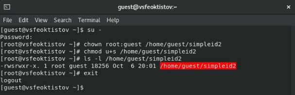{ #fig:6 width=70% }

Повторно запустим исполняемый файл после вышеописанных действий и сравним результат выполнения программы с выводом команды *id*. Как можно заметить, теперь e_uid отличается от real_uid и uid в id. Это произошло, поскольку файл запускался от имени пользователя guest, а исполнялся от пользователя root (у root-пользователя uid=0) (рис. [-@fig:7]).

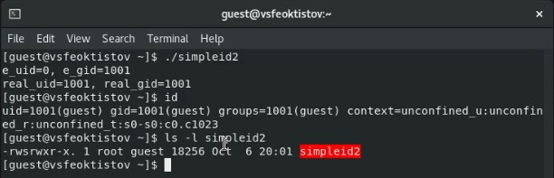{ #fig:7 width=70% }

Проделаем те же самые действия только с еще установленным SetGID-битом (рис. [-@fig:8]).

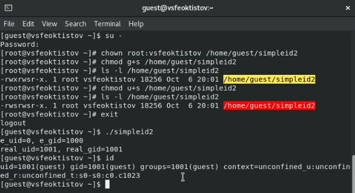{ #fig:8 width=70% }

В результате, теперь еще и e_gid отличается от real_gid и gid пользователя. Теперь программа исполняется от новой уствновленной группы (*vsfeoktistov* gid=1000) (рис. [-@fig:8]).

Далее создадим программу readfile.c, которая будет читать содержимое указанного файла (рис. [-@fig:9] и [-@fig:10]).

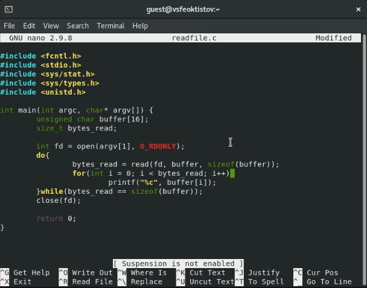{ #fig:9 width=70% }

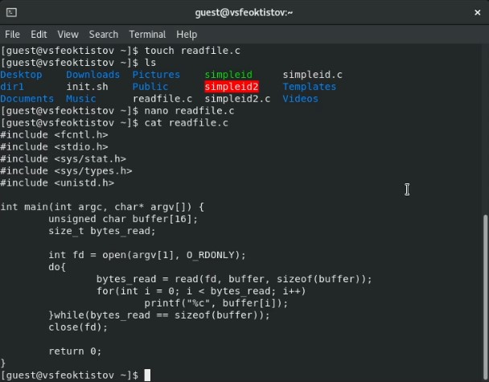{ #fig:10 width=70% }

Скомпилируем файл [**cmd:** *gcc readfile.c -o readfile*], сменим владельца файла *readfile.c* и изменим права так, чтобы только суперпользователь (*root*) мог прочитать его, а guest не мог [**cmds:** *chown root:guest /home/guest/readfile.c* и *chmod 700 /home/guest/readfile.c*]. Как можно видеть, теперь пользователь *guest* не может его прочитать (рис. [-@fig:11]).

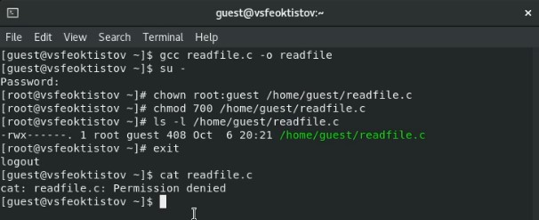{ #fig:11 width=70% }

Далее сменим владельца программы *readfile* и установим SetUID-бит [**cmds:** *chown root:guest /home/guest/readfile* и *chmod u+s /home/guest/readfile*]. Затем проверим: может ли программа *readfile* прочитать файл *readfile.c* [**cmd:** *./readfile readfile.c*]. Как видно из рисунка [-@fig:12], программа успешно прочитала содержимое, поскольку имполнилась от имени владельца, который имеет право чтения файла *readfile.c*. Кроме того, программа также может вывести содержимое файла */etc/shadow* [**cmd:** *./readfile /etc/shadow*] (рис. [-@fig:12]).

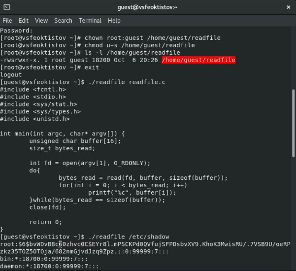{ #fig:12 width=70% }

## Исследование Sticky-бита

В первую очередь, выясним, установлен ли атрибут Sticky на директорию */tmp* [**cmd:** *ls -l / | grep tmp*]. Символ *t* вместо *x* в конце, в третьей тройке битов атрибутов, указывает на его наличие. От имени пользователя *guest* создадим файл *file01.txt* в директории */tmp* со словом *test* [**cmd:** *echo "test" > /tmp/file01.txt*], а после просмотрим атрибуты у только что созданного файла [**cmd:** *ls -l /tmp/file01.txt*] и разрешим чтение и запись жля категории пользователей "все остальные" [**cmd:** *chmod o+rw /tmp/file01.txt*] (рис. [-@fig:13]).

{ #fig:13 width=70% }

Далее от имени пользователя *guest2* [**cmd:** *su - guest2*] попробуем прочитать, дозаписать, перезаписать и удалить файл *file01.txt*. Как видно из рисунка [-@fig:14], все работает, кроме удаления, поскольку Sticky-бит разрешает удаление файлов в каталоге только владельцу этого каталога.

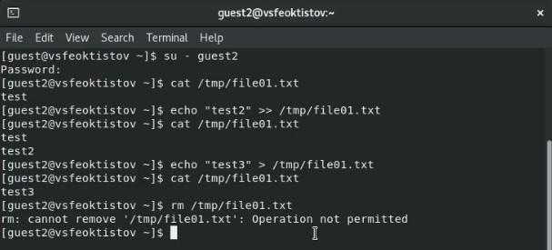{ #fig:14 width=70% }

Повысим права до суперпользователя [**cmd:** *su -*], выполним команду, снимающую атрибут t (Sticky-бит) с директории */tmp* [**cmd:** *chmod -t /tmp*] и покинем режим суперпользователя [**cmd:** *exit*] (рис. [-@fig:15]).

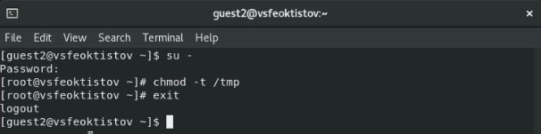{ #fig:15 width=70% }

Повторим предыдущие шаги и пронаблюдаем изменения. В результате, все команды сработали, в том числе и удаление файла из директории (рис. [-@fig:16]).

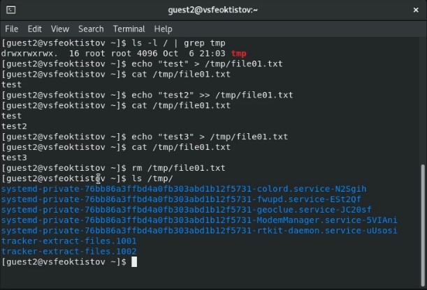{ #fig:16 width=70% }

После окончания работы необходимо вернуть атрибут t на директорию */tmp*, чтобы сохранить безопасность и функциональность системы (рис. [-@fig:17]).

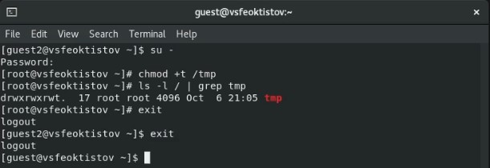{ #fig:17 width=70% }

# Выводы

В процессе выполнения лабораторной работы:

 - изученил механизмы изменения индификаторов, применения SetUID- и Sticky-битов; 
 - получил практические навыки работы в консоли с дополнительными атрибутами;
 - рассмотрел работу механизма смены индентфикаторов процессов пользователей;
 - изученил влияние Sticky-бита на запись и удаление файлов. 

# Список литературы{.unnumbered}

::: {#refs}
:::
