---
## Front matter
lang: ru-RU
title: Лабораторная работа №6
subtitle: Основы информационной безопасности
author:
  - Феоктистов Владислав Сергеевич
institute:
  - Российский университет дружбы народов, Москва, Россия
  - НПМбд-01-19
date: 22 сентября 2022

## i18n babel
babel-lang: russian
babel-otherlangs: english

## Formatting pdf
toc: false
toc-title: Содержание
slide_level: 2
aspectratio: 169
section-titles: true
theme: metropolis
header-includes:
 - \metroset{progressbar=frametitle,sectionpage=progressbar,numbering=fraction}
 - '\makeatletter'
 - '\beamer@ignorenonframefalse'
 - '\makeatother'
---

## Цель лабораторной работы

Целью данной работы является:

 - развитие навыка администрирования ОС Linux;
 - получение первого практического знакомства с технологией SELinux;
 - проверка работы SELinux на практике совместо с веб-сервером Apache.

## Задачи лабораторной работы

 - Проверить режим работы и политику SELinux, запустить сервер Apache;
 - Создать html-файл test.html и обратимся к нему через веб-сервер;
 - Поменять контекст html-файла и поменять порт прослушивания.

# Ход выполнения лабораторной работы

## Подготовка лабораторного стенда

Перед выполнением лабораторной работы убедились, что поддерживается технология SELinux и установлен apache, проверили конфигурационные файлы apache и SELinux, отключили пакетный фильтр и позволили подключаться к 80-у и 81-у портам протокола TCP.

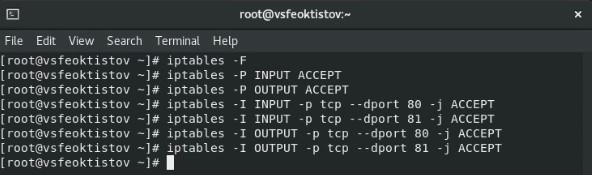{ #fig:1 width=40% }

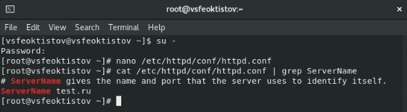{ #fig:2 width=40% }

## Режим и политика SELinux

В первую очередь убедились, что SELinux работает в режиме *enforcing* политики *targeted* с помощью команд *getenforce* и *sestatus*.

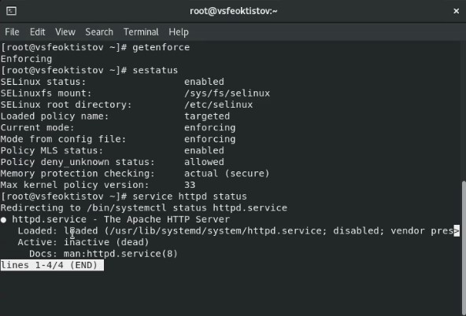{ #fig:3 width=40% }

## Запуск сервера Apache

С помощью команды service httpd status проверили статус работы Apache.

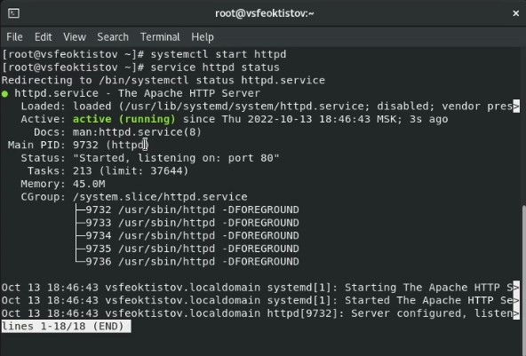{ #fig:4 width=40% }

## Создание html-файла и обращение к нему через браузер 

- Через root-пользователя в каталоге */var/www/html/* создали html-файл *test.html* и записали в нем простейшую структуру веб-страницы;
- Обратились к файлу через веб-сервер, введя в браузере адрес *http://127.0.0.1/test.html*.

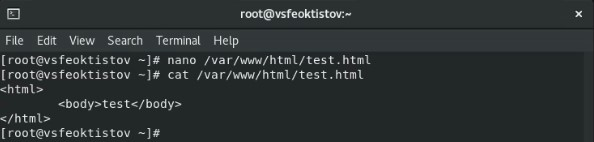{ #fig:5 width=30% }

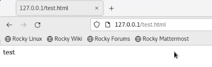{ #fig:6 width=30% }

## Смена контекста html-файла 

- Поменяли контекст html-файла *test.html* командой chcon с *httpd_sys_content_t* на *samba_share_t*;
- Перезагрузили веб-страницу и получили сообщение об отказе достпуа;
- Посмотри лог-файлы.

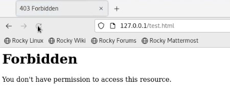{ #fig:7 width=25% }

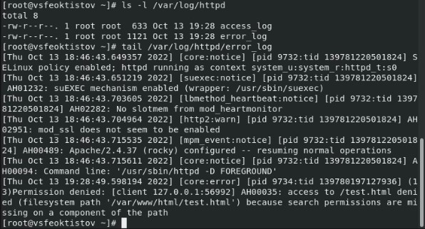{ #fig:8 width=25% }

## Установка порта прослушивания и возвращение контекста безопасности

- В конфигурационном файле */etc/httpd/conf/httpd.conf* установили 81 порт прослушивания;
- С помощью команды *semanage* добавили этот порт в список прослушиваемых порторв и проверили его добавление;
- Перезапустили Apache, вернули контекст *httpd_sys_content_t* файлу *test.html* и зашли на веб-страницу под 81 портом.

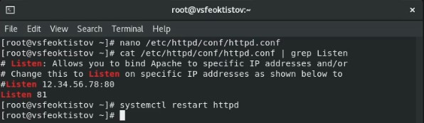{ #fig:9 width=30% }     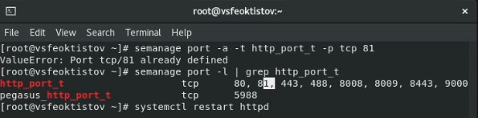{ #fig:10 width=30% }

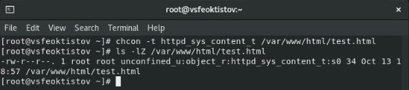{ #fig:11 width=30% }     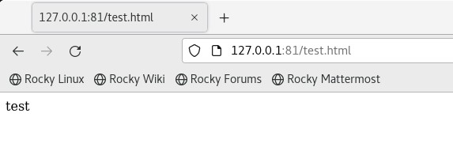{ #fig:12 width=30% }

## Возвращение стандратных настроек

Перед завершением работы, исправили конфигурационный файл Apache, вернув *Listen 80*, удалили привязку *http_port* к 81 порту и удалили файл */var/www/html/test.html*.

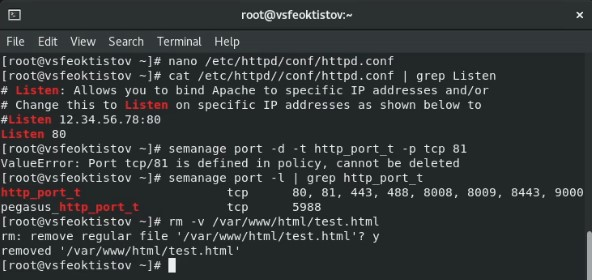{ #fig:13 width=40% }

## Выводы

В процессе выполнения лабораторной работы:

 - развил навыки администрирования ОС Linux;
 - получил первое практическое знакомство с технологией SELinux;
 - проверил работу SELinux на практике совместо с веб-сервером Apache.
