---
## Front matter
title: "Лабораторная работа №6"
subtitle: "Дисциплина: Основы информационной безопасности"
author: "Феоктистов Владислав Сергеевич"

## Generic otions
lang: ru-RU
toc-title: "Содержание"

## Bibliography
bibliography: bib/cite.bib
csl: pandoc/csl/gost-r-7-0-5-2008-numeric.csl

## Pdf output format
toc: true # Table of contents
toc-depth: 2
lof: true # List of figures
lot: true # List of tables
fontsize: 12pt
linestretch: 1.5
papersize: a4
documentclass: scrreprt
## I18n polyglossia
polyglossia-lang:
  name: russian
  options:
	- spelling=modern
	- babelshorthands=true
polyglossia-otherlangs:
  name: english
## I18n babel
babel-lang: russian
babel-otherlangs: english
## Fonts
mainfont: PT Serif
romanfont: PT Serif
sansfont: PT Sans
monofont: PT Mono
mainfontoptions: Ligatures=TeX
romanfontoptions: Ligatures=TeX
sansfontoptions: Ligatures=TeX,Scale=MatchLowercase
monofontoptions: Scale=MatchLowercase,Scale=0.9
## Biblatex
biblatex: true
biblio-style: "gost-numeric"
biblatexoptions:
  - parentracker=true
  - backend=biber
  - hyperref=auto
  - language=auto
  - autolang=other*
  - citestyle=gost-numeric
## Pandoc-crossref LaTeX customization
figureTitle: "Рис."
tableTitle: "Таблица"
listingTitle: "Листинг"
lofTitle: "Список иллюстраций"
lotTitle: "Список таблиц"
lolTitle: "Листинги"
## Misc options
indent: true
header-includes:
  - \usepackage{indentfirst}
  - \usepackage{float} # keep figures where there are in the text
  - \floatplacement{figure}{H} # keep figures where there are in the text
---

# Цель работы

Целью данной работы является:

 - развитие навыка администрирования ОС Linux;
 - получение первого практического знакомства с технологией SELinux;
 - проверка работы SELinux на практике совместо с веб-сервером Apache.

# Задание

 - Проверить режим работы, политику и состояние переключателей SELinux, проверить работу веб-сервера;
 - Найти процесс веб-сервера, определить его контекст;
 - Посмотреть статистику политики, определить типы поддиректорий и файлов, определить круг пользователей с правами создания файлов в указанной поддиректрии;
 - Создать html-файл, определить его контекст по умолчанию, подключиться к веб-серверу в браузере;
 - Изучить справку httpd_selinux;
 - Попробовать подключиться к веб-серверу в браузере с другим контекстом html-файла;
 - Попробовать подключиться к веб-серверу в браузере с другим контекстом html-файла и другим TCP-портом;
 - Попробовать подключиться к веб-серверу по новому адресу в браузере с другим контекстом html-файла и другим TCP-портом;
 - Вернуть старые настройки и проанализировать все необходимые Apache лог-файлы.

# Теоретическое введение

## Технология SELinux

**SELinux (SELinux)** — это система принудительного контроля доступа, реализованная на уровне ядра. Впервые эта система появилась в четвертой версии CentOS, а в 5 и 6 версии реализация была существенно дополнена и улучшена. Эти улучшения позволили SELinux стать универсальной системой, способной эффективно решать массу актуальных задач. Стоит помнить, что классическая система прав Unix применяется первой, и управление перейдет к SELinux только в том случае, если эта первичная проверка будет успешно пройдена.

Основные термины, использующиеся в SELinux:

 - Домен — список действий, которые может выполнять процесс. Обычно в качестве домена определяется минимально-возможный набор действий, при помощи которых процесс способен функционировать. Таким образом, если процесс дискредитирован, злоумышленнику не удастся нанести большого вреда.
 - Роль — список доменов, которые могут быть применены. Если какого-то домена нет в списке доменов какой-то роли, то действия из этого домена не могут быть применены.
 - Тип — набор действий, которые допустимы по отношения к объекту. Тип отличается от домена тем, что он может применяться к пайпам, каталогам и файлам, в то время как домен применяется к процессам.
 - Контекст безопасности — все атрибуты SELinux — роли, типы и домены.

SELinux имеет три основных режим работы, при этом по умолчанию установлен режим Enforcing. Это довольно жесткий режим, и в случае необходимости он может быть изменен на более удобный для конечного пользователя.

 - Enforcing: Режим по-умолчанию. При выборе этого режима все действия, которые каким-то образом нарушают текущую политику безопасности, будут блокироваться, а попытка нарушения будет зафиксирована в журнале.
 - Permissive: В случае использования этого режима, информация о всех действиях, которые нарушают текущую политику безопасности, будут зафиксированы в журнале, но сами действия не будут заблокированы.
 - Disabled: Полное отключение системы принудительного контроля доступа.

Вы можете посмотреть текущий режим и другие настройки SELinux (а в случае необходимости и изменить его) при помощи специального GUI-инструмента, доступного в меню «Администрирование» (system-config-selinux). Если же вы привыкли работать в консоли, то можете посмотреть текущий статус командой sestatus.

Также вы можете узнать статус SELinux при помощи команды getenforce.

Команда «setenforce» позволяет быстро переключаться между режимами Enforcing и Permissive, изменения вступают в силу без перезагрузки. Но если вы включаете или отключаете SELinux, требуется перезагрузка, ведь нужно заново устанавливать метки безопасности в файловой системе.

Для того, чтобы выбрать режим по-умолчанию, который будет применяться при каждой загрузке системы, задайте значение строки 'SELINUX=' в файле /etc/selinux/config, задав один из режимов — 'enforcing', 'permissive' или 'disabled'. Например: 'SELINUX=permissive'.

Более подробно на сайте [@gnu-doc-1:bash].

## Apache

**Apache** — это свободное программное обеспечение, с помощью которого можно создать веб-сервер. Несмотря на то, что Apache чаще всего называют сервером (более того, его официальное название — Apache HTTP Server) — это всё-таки программа, которую устанавливают на сервер, чтобы добиться определённых результатов. Русскоязычная аудитория нередко называет серверы с такими программами коротко — Апач.

Для чего нужен Apache сервер:

 - чтобы открывать динамические PHP-страницы,
 - для распределения поступающей на сервер нагрузки,
 - для обеспечения отказоустойчивости сервера,
 - чтобы потренироваться в настройке сервера и запуске PHP-скриптов.

Apache является кроссплатформенным ПО и поддерживает такие операционные системы, как Linux, BSD, MacOS, Microsoft, BeOS и другие.

Основные компоненты архитектуры сервера Апач — динамические модули, ядро и конфигурационные файлы. 

Основные задачи ядра веб-сервера — модерация работы конфигурационных файлов, а также исполнение HTTP и HTTPS протоколов. Однако в чистом виде ядро имеет весьма ограниченный функционал и не справляется с такими задачами. Как можно расширить функционал веб-сервера? Для этого ядро должно работать сообща с системой модулей. 

Модули — это по сути файлы, которые помогают расширять возможности той или иной системы. Базовая часть модулей для Апач устанавливается по дефолту, а дополнительные модули нужно подключать самостоятельно. При этом каждый модуль отвечает за отдельный компонент работы с запросом. Например, аутентификацию или кэширование. Для оптимизации ядра существует свыше 500 различных модулей — под любую задачу или проект.

Конфигурационный файл — это файл, который хранит настройки операционной системы и приложений, а также позволяет вносить в них изменения. Конфигурация сервера Apache основана на текстовых конфигурационных файлах. Эти файлы отвечают за каждый из трёх уровней: 

 - Файл уровня конфигурации сервера  — httpd.conf.  Он содержит директивы, которые управляют работой веб-сервера. В каждой операционной системе httpd.conf по-разному расположен. Чтобы узнать его местоположение, достаточно ввести в терминале команду: httpd -V
 - Файл (или файлы) уровня конфигурации каталога — .htaccess. Файл .htaccess отвечает за настройки веб-сервера только в том каталоге, в котором он размещен, а также в его дочерних каталогах. То есть вносимые в .htaccess изменения не затрагивают глобальные настройки. Также настройки .htaccess имеют приоритет перед настройками httpd.conf. 
 - Файл уровня виртуального хоста — extra/httpd-vhosts.conf. Такие хосты нужны пользователям, которые запускают несколько сайтов на одном виртуальном сервере. На один сервер можно добавить неограниченное количество виртуальных хостов. 

Как правило, основные конфигурационные файлы располагаются в папке conf, а дополнительные в папке extra. Изменения в эти файлы можно вносить как через командную строку, так и путем редактирования самого файла.

Более подробно на сайте [@gnu-doc-2:bash].

## Таблицы

: Описание некоторых каталогов файловой системы GNU Linux {#tbl:std-dir}

| Имя каталога | Описание каталога                                                                                                          |
|--------------|----------------------------------------------------------------------------------------------------------------------------|
| `/`          | Корневая директория, содержащая всю файловую                                                                               |
| `/bin `      | Основные системные утилиты, необходимые как в однопользовательском режиме, так и при обычной работе всем пользователям     |
| `/etc`       | Общесистемные конфигурационные файлы и файлы конфигурации установленных программ                                           |
| `/home`      | Содержит домашние директории пользователей, которые, в свою очередь, содержат персональные настройки и данные пользователя |
| `/media`     | Точки монтирования для сменных носителей                                                                                   |
| `/root`      | Домашняя директория пользователя  `root`                                                                                   |
| `/tmp`       | Временные файлы                                                                                                            |
| `/usr`       | Вторичная иерархия для данных пользователя                                                                                 |

: Описание некоторых используемых в работе команд {#tbl:cmds}

| Команда       | Описание команды                                                                                                                                         |
|---------------|----------------------------------------------------------------------------------------------------------------------------------------------------------|
| `getenforce`  | Получение статуса SELinux: enforcing, permissive, disabled                                                                                               |
| `sestatus`    | Текущий режим и другие настройки SELinux                                                                                                                 |
| `service`     | Выводит список всех сервисов при использовании опции --status-all и выводит статус конкретного сервиса при указании его названия               |
| `cat`         | Вывод содержимого указанного файла.                                                                                                                      |
| `ls`          | Выводит содержимое каталога. Опция -l выводит дополнительную информацию, -a отображает скрытые файлы, в названии которых в самом начале стоит символ '.', -Z - выводит контекст файла в SELinux |
| `touch`       | Создает текстовый файл по указанному пути и с указанным именем внутри пути.                                                                              |
| `rm`          | Удаляет файл(ы) (каталог(и) при указании опции -r) по указанному(ым) пути(ям).                                                                           |
| `cd`          | Перемещение по файловой системе.                                                                                                                         |
| `grep`        | Дает возможность вести поиск строкт. Также можно передать вывод любой команды в grep, что сильно упрощает работу во время поиска                         |
| `nano`        | Запуск в терминале текстовый редактор                                                                                                                    |
| `ps`          | Выводит список запущенных процессов с их идентификаторами                                                                                                |
| `chcon`       | Помогает изменить контекст SELinux                                                                                                                       |
| `tail`        | Просмотр последних строк файла                                                                                                                           |
| `semanage`    | Инструмент, использумый доя настройки определенных элементов политики SELinux без измненеия или перекомпиляции источников политики                       |
| `systemctl`   | Позволяет управлять основными процессами Linux                                                                                                           |
| `matchpathcon`| Выводит контекст безопасности по умолчанию для указанного файла                                                                                          |

Более подробно об Unix см. в [@gnu-doc:bash;@newham:2005:bash;@zarrelli:2017:bash;@robbins:2013:bash;@tannenbaum:arch-pc:ru;@tannenbaum:modern-os:ru].

# Подготовка лабораторного стенда

Для проведения указанной лабораторной работы на одно рабочее место требуется компьютер с установленной операционной системой Linux, поддерживающей технологию SELinux (Rocky Linux поддерживает технологию SELinux по умолчанию с включённой политикой SELinux targeted и режимом enforcing). При этом следует убедиться, что политика и режим включены, особенно когда работа будет проводиться повторно и велика вероятность изменений при предыдущем использовании системы.

Для выполнения заданий требуется наличие учётной записи администратора (root) и учётной записи обычного пользователя. Постоянно работать от учётной записи root неправильно с точки зрения безопасности (несмотря на это все команды выполнялись от имени root-пользователя, чтобы не тратить время).

Перед выполением работы можно посмотреть содержимое конфигурационного файла */etc/selinux/config* (рис. [-@fig:1]). В нем можно поменять режимы SELinux по умолчанию. 

Необходимо, чтобы был установлен веб-сервер Apache. При установке системы в конфигурации «рабочая станция» указанный пакет не ставится. Проверить наличие Apache в Rocky Linux можно с помощью команды *httpd -v*. Если Apache установлен, то должна вывестить его версия, иначе нужно будет уставновить его [**cmd:** sudo *yum install httpd*] (рис. [-@fig:1]).

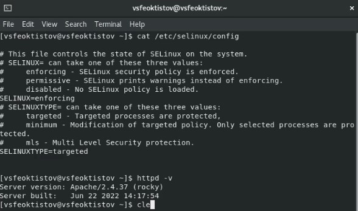{ #fig:1 width=70% }

В конфигурационном файле */etc/httpd/conf/httpd.conf* необходимо задать параметр *ServerName test.ru*, чтобы при запуске веб-сервера не выдавались лишние сообщения об ошибках, не относящихся к лабораторной работе (рис. [-@fig:2]).

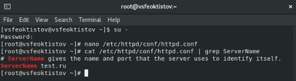{ #fig:2 width=70% }

Также необходимо проследить, чтобы пакетный фильтр был отключён или в своей рабочей конфигурации позволял подключаться к 80-у и 81-у портам протокола tcp (рис. [-@fig:3]).

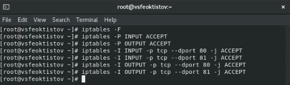{ #fig:3 width=70% }

# Выполнение лабораторной работы

В первую очередь, убедимся, что SELinux работает в режиме *enforcing* политики *targeted* с помощью команд *getenforce* и *sestatus*. Как видно из рисунка [-@fig:4], команда *getenfoce* вывела сообщение *Enforcing*, а команда *sestatus* в параметре *Loaded policy name* - *targeted*, что и было необходимо.

После этого стоит убедиться, что сервер работает [**cmd:** *service httpd status*] и обратиться к веб-сервису через браузер. 

{ #fig:4 width=70% }

Если у Вас, как и на рисунке [-@fig:4], значение *Active* - это *inactive (dead)*, т.е. режим работы Apache - выключен (неактивен), то его нужно будет запустить с помощью команды *systemctl start httpd* и снова проверить статус сервера [**cmd:** *service httpd status*], теперь он должен быть со значением *active (running)* (включен) (рис. [-@fig:5]).

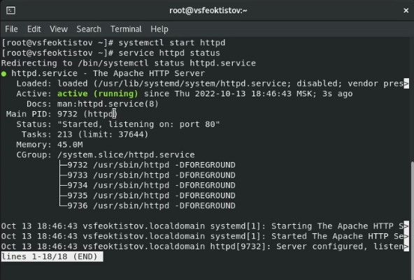{ #fig:5 width=70% }

После этого можно будет обратится к веб-сервису через любой браузер. Для этого нужно будет ввести в адресной строке бразуера локальный адрес: *http://127.0.0.1* (рис. [-@fig:6]). В результате откоется сайт со справкой использования Apache сервера.

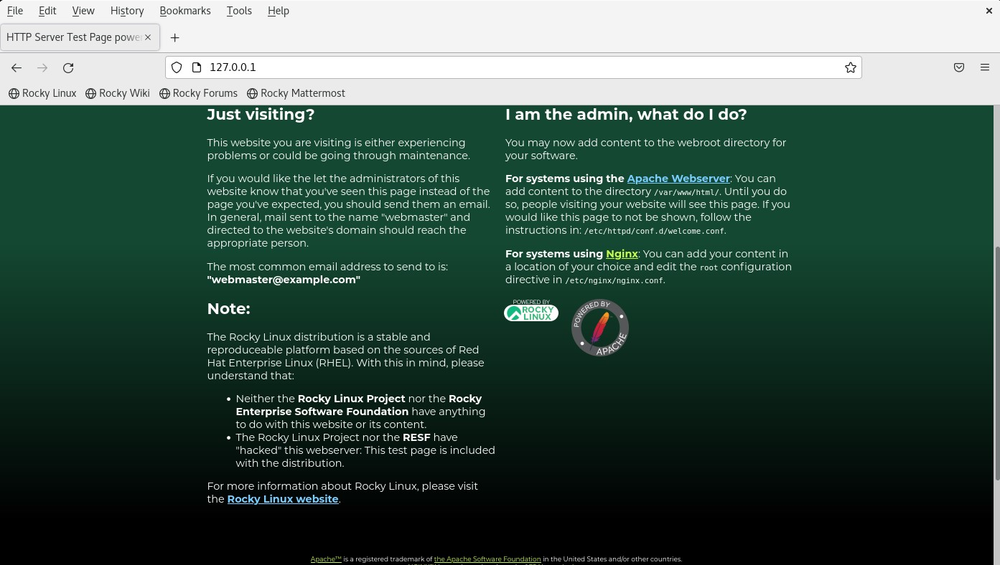{ #fig:6 width=70% }

Далее найдем веб-сервер Apache в списке процессов, определим его конекст безопасности [**cmd:** ps -eZ | grep httpd] и посмотрим текущее состояние переключателей SELinux [**cmd:** *sestatus -b httpd*]. Как видно из рисунка [-@fig:7], контекст безопасности веб-сервера - system_u:system_r:httpd_t:s0, а многие переключатели находятся в положении "off".

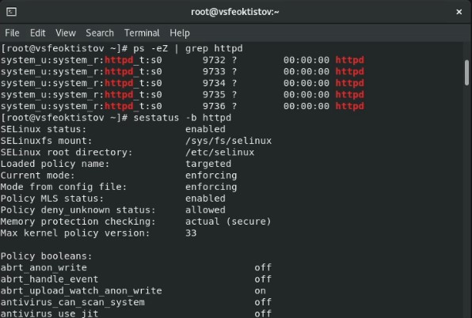{ #fig:7 width=70% }

С помощью команды *seinfo* определим, что в политике SELinux всего 8 пользователя, 14 ролей и 4982 типа (рис. [-@fig:8]).

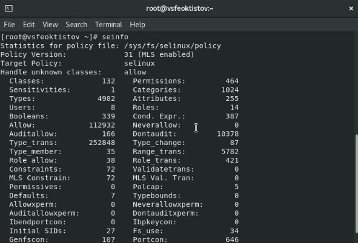{ #fig:8 width=70% }

С помощью команды *ls -lZ /var/www* узнаем, что тип директории */var/www/cgi-bin* - *httpd_sys_script_exec_t*, а директории *var/www/html* - *httpd_sts_content_t*. Директория *var/www/html* не содержит никаких файлов и каталогов. Кроме того, видно, что только root-пользователь может создавать файлы в директории *var/www/html*, поскольку только не есть для этого минимальный набор прав: право на запись и исполнения для каталога (рис. [-@fig:9]). Минимальный набор прав мы определили во 2ой лабораторной работе (рис. [-@fig:10]).

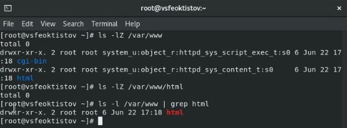{ #fig:9 width=70% }

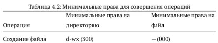{ #fig:10 width=70% }

От имени root-пользователя (т.к. в дистрибутиве после установки только ему разрашена запись в директории */var/www/html*) создадим html-файл */var/www/html/test.html* (рис. [-@fig:11]). Можно либо сначала создать файл с помощью команды *touch*, а потом уже его отредактировать, либо можно сразу запустить nano редактор, по указанному пути. Если по указанному пути не будет текстового файла, то он автоматически создастся редактором.

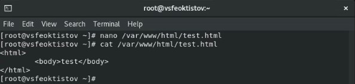{ #fig:11 width=70% }

Проверим контекст созданного файла [**cmd:** matchpathcon /var/www/html/test.html]. Как видно из рисунка [-@fig:12], *system_u:object_r:httpd_sys_content_t:s0* - это присваиваемый по умолчанию конекст у вновь созданных файлов в директории */var/www/html* и он полностью совпадает с контекстом безопасности каталога */var/www/html* (рис. [-@fig:9]).

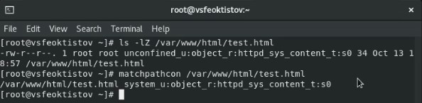{ #fig:12 width=70% }

Обратимся к файлу через веб-сервер, введя в браузере адрес *http://127.0.0.1/test.html*, и убедимся, что файл был успешно отображен (рис. [-@fig:13]).

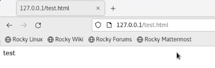{ #fig:13 width=70% }

Далее из справки [**cmd:** *man httpd_selinux*] узнаем, что для *httpd* определены следующие контексты файлов: *httpd_sys_content_t, httpd_sys_script_exec_t, httpd_script_ro_t, httpd_sys_script_rw_t, httpd_sys_script_ra_t, httpd_unconfined_script_exec_t*, а также узнаем, что у файла *test.html* контекст файла есть в этом списке - *httpd_sys_content_t* [**cmd:** *ls -Z /var/www/html/test.html*] (рис. [-@fig:14] и рис. [-@fig:15]).

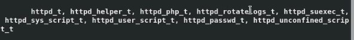{ #fig:14 width=70% }

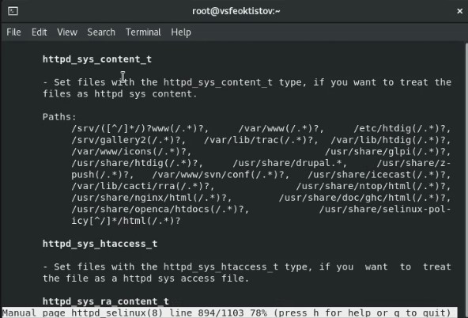{ #fig:15 width=70% }

Рассмотрим полученный контекст детально. Так как по умолчанию пользователи Rocky Linux являются свободными от типа (unconfined в переводе с англ. означает свободный), созданному нами файлу *test.html* был сопоставлен SELinux, пользователь unconfined_u.

Это первая часть контекста.

Далее политика ролевого разделения доступа RBAC используется процессами, но не файлами, поэтому роли не имеют никакого значения для файлов. Роль object_r используется по умолчанию для файлов на «постоянных» носителях и на сетевых файловых системах. (В директории /рroc файлы, относящиеся к процессам, могут иметь роль system_r. Если активна политика MLS, то могут использоваться и другие роли, например, secadm_r. Данный случай мы рассматривать не будем, как и предназначение :s0).

Тип httpd_sys_content_t позволяет процессу httpd получить доступ к файлу. Благодаря наличию последнего типа мы получили доступ к файлу при обращении к нему через браузер.

С помощью команды *chcon -t samba_share_t /var/www/html/test.html* изменим контекст файла */var/www/html/test.html* с *httpd_sys_content_t* на *samba_share_t*, к которому процесс *httpd* не должен иметь доступа. Проверить, что контекст поменялся, можно с помощью команды *ls -Z /var/www/html/test.html* (рис. [-@fig:16]).

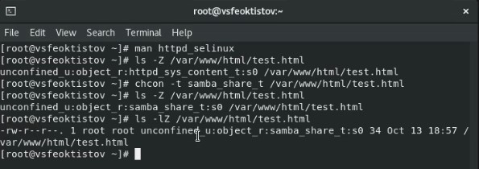{ #fig:16 width=70% }

Попробуем еще раз получить доступ к файлу через веб-сервер, введя в браузере адрес *http://127.0.0.1/test.html*. В итоге получаем следующее сообщение об ошибке: *Forrbidden You don't have permission to access this resource* (рис. [-@fig:17]). Это произошло, поскольку для файла *test.html* мы установили контекст файла, к которму процесс *httpd* не имеет доступа.

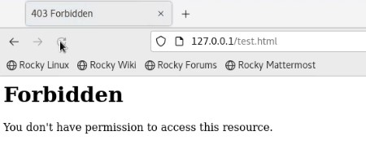{ #fig:17 width=70% }

Посмотрим log-файлы веб-сервера Apache (рис. [-@fig:18] и [-@fig:19]).

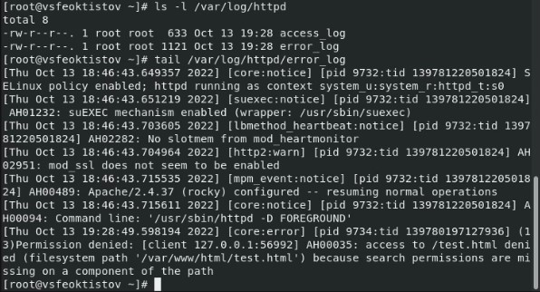{ #fig:18 width=70% }

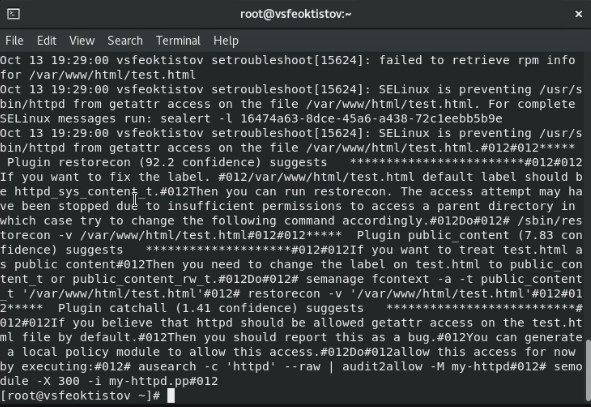{ #fig:19 width=70% }

Из логов видно, что для файла *test.html* нужно установить контекст *httpd_sys_content_t*.

Попробуем запустить веб-сервер Apache на прослушение TCP-порта 81, а не 80, как рекомендует IANA и прописано в */etc/services*. Для этого в файле */etc/httpd/conf/httpd.conf* найдем строчку *Listen 80* и заменим её на *Listen 81* (поиск лучше производить через зажатие клавиш *Ctrl + w*), а после перезапустим Apache [**cmd:** *systemctl restart httpd*] (рис. [-@fig:20]).

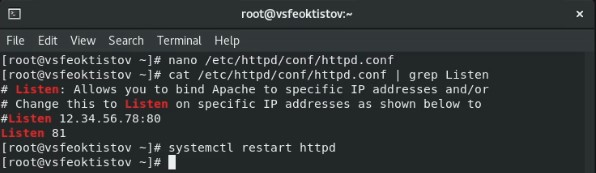{ #fig:20 width=70% }

При попытке запустить веб-сервер под старым адресом, получим ошибку: *Unable to connect* (рис. [-@fig:21]). Если мы пишем адрес *http://127.0.0.1/test.html*, то по умолчанию подключение идет по 80 порту, т.е. этот адрес эквивалентен адресу *http://127.0.0.1:80/test.html*. После смены TCP-порта с 80 на 81, подключаться к веб-серверу нужно по адресу *http://127.0.0.1:81/test.html*, явно указывая порт. 

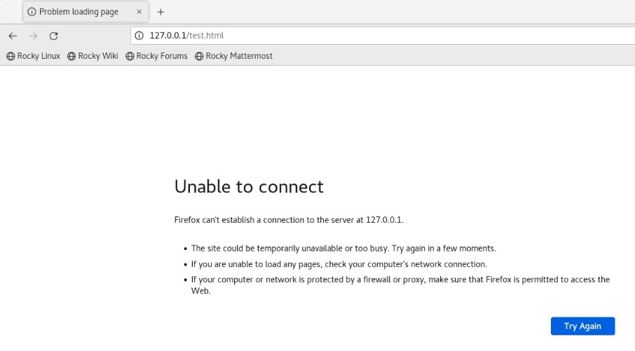{ #fig:21 width=70% }

Проанализируем лог-файлы */var/log/messages*, */var/log/http/error_log*, */var/log/http/access_log* и */var/log/audit/audit.log*. Как видно из рисунка [-@fig:22], в файлах *messages* и *error_log* появились новые записи. Для просмотра удобно использовать команду *tail -n1* для просмотра последней строки.

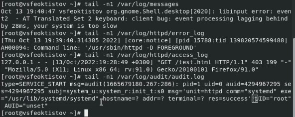{ #fig:22 width=70% }

Однако, перед этим рекомендуется добавить этот порт в список порторв с помощью команды *semanage port -a -t http_port_t -p tcp 81*. Проверить наличие порта в списке можно командой *semanage port -l | grep http_port_t*. По умолчанию порт 81 уже добавлен в список TCP-портов Apache (рис. [-@fig:23]).

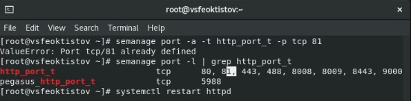{ #fig:23 width=70% }

Теперь же, если зайти на веб-сервер по адресу *http://127.0.0.1:81/test.html*, то мы снова сможем подключиться к сереверу и получить ошибку *Forrbidden You don't have permission to access this resource*, т.к. контекст файла *test.html* мы еще пока не изменили на нужный (рис. [-@fig:24]).

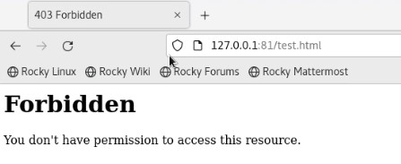{ #fig:24 width=70% }

Вернем контекст *httpd_sys_content_t* к файлу */var/www/html/test.html* командой *chcon -t httpd_sys_content_t /var/www/html/test.html* (рис. [-@fig:25]) и попробуем получить доступ к файлу через веб-сервер, введя в браузере адрес *http://127.0.0.1:81/test.html* (рис. [-@fig:26]).

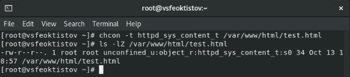{ #fig:25 width=70% }

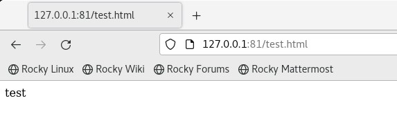{ #fig:26 width=70% }

Как можно заметить, теперь наконец-то файл *test.html* нормально отображается на веб-сервере под 81 TCP-портом.

Перед завершением работы, исправим конфигурационный файл Apache, вернув *Listen 80*, удалим привязку *http_port* к 81 порту (81 порт из списка нельзя удалить, поскольку по политике он установлен там по умолчанию) и удалим файл */var/www/html/test.html* (рис. [-@fig:27]).

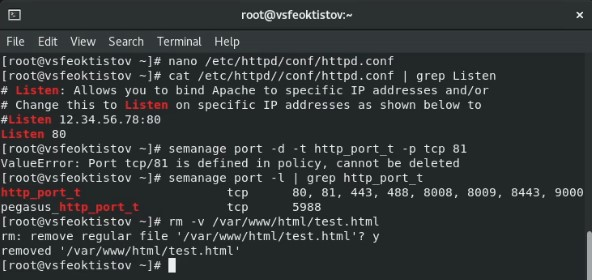{ #fig:27 width=70% }

# Выводы

В процессе выполнения лабораторной работы:

 - развил навыки администрирования ОС Linux;
 - получил первое практическое знакомство с технологией SELinux;
 - проверил работу SELinux на практике совместо с веб-сервером Apache.

# Список литературы{.unnumbered}

::: {#refs}
:::
