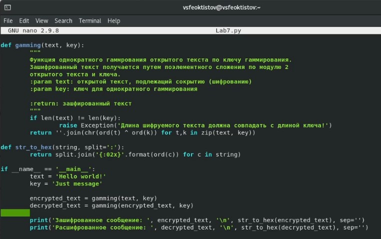

---
## Front matter
lang: ru-RU
title: Лабораторная работа №7
subtitle: Основы информационной безопасности
author:
  - Феоктистов Владислав Сергеевич
institute:
  - Российский университет дружбы народов, Москва, Россия
  - НПМбд-01-19
date: 22 сентября 2022

## i18n babel
babel-lang: russian
babel-otherlangs: english

## Formatting pdf
toc: false
toc-title: Содержание
slide_level: 2
aspectratio: 169
section-titles: true
theme: metropolis
header-includes:
 - \metroset{progressbar=frametitle,sectionpage=progressbar,numbering=fraction}
 - '\makeatletter'
 - '\beamer@ignorenonframefalse'
 - '\makeatother'
---

# Элементы криптографии. Однократное гаммирование.

## Цель лабораторной работы

Целью данной работы является освоение на практике применение режима однократного гаммирования.

## Задачи лабораторной работы

 - Написать программу, позволяющую шифровать и дешифровать данные в режиме однократного гаммирования;
 - Определить вид шифротекста при известном ключе и известном открытом тексте;
 - Определить ключ, с помощью которого шифротекст может быть преобразован в некоторый фрагмент текста, представляющий собой один из возможных вариантов прочтения открытого текста

## Теоретическое введение

Гаммирование представляет собой наложение (снятие) на открытые (зашифрованные) данные последовательности элементов других данных (ключа), чаще всего того же размера (ключ можно зациклить). Под наложением, по сути, подразумевается выполнение операции сложения по модулю 2 (XOR) (обозначаемая знаком $\oplus$) между элементами гаммы (ключа) и элементами, подлежащих сокрытию. Такой метод шифрования является симметричным, так как двойное прибавление одной и той же величины по модулю 2 восстанавливает исходное значение, а шифрование и расшифрование выполняется одной и той же программой (функицией).

# Ход выполнения лабораторной работы

## Функция однократного гаммирования и представления строки

Написали функцию, производящую однократное гаммирование постредством побитового сложения по модулю 2 элементов открытого текста и ключа, а так же функцию представления строки в виде последовательности символов в шестнадцатиричном виде, разделенных двоеточиями.

{ #fig:1 width=40% }

## Запуск программы. Первая версия

Однократное гаммирование открытого текста приводит к его шифрованию, а однакратное гаммирование зашифровааного текста тем же ключом - к расшифровке.

{ #fig:2 width=40% }

## Функция генерации необходимого ключа 

Написали функцию генерации ключа для указанного текста, которое будет после однокартного гаммирование этого текста этим ключом выдавать необходимый текст. По факту эта функция является оберткой функции *gamming*.

{ #fig:3 width=40% }

## Функия генерации случаной строки

Для удобства написали функцию генерации случайной строки заданной длины *lenght* с использованием заданных символов *letters*, причем по умолчанию - это латинские символы верхнего и нижнего регистров.

{ #fig:4 width=40% }

## Код проверки работы всех функций

Напсали небольшой код для проверки работы всех функций на примерах. Открытый текст будет содержать сообщение "C Днем народного единства!", а ключ гаммирования сгенерируется случайным образом. В результате смодем получить зашифрованный текст после первого гаммирования и расшифрованный - после второго. Также добавили переменную с желаемым тектом, получаемого после однократного гаммирования указанного сообщения, - "С Новым годом, друзья!    ".

{ #fig:5 width=40% }

## Запуск программы. Вторая версия

Для зашифрованного сообщения можно подобрать ключ, который после применения однократного гаммирования даст желаемое сообщение, отличное от начального (сообщения до шифрования).

{ #fig:6 width=40% }

## Выводы

В процессе выполнения лабораторной работы освоил на практике применение режима однократного гаммирования и написал программу, реализующую это шифрование.
