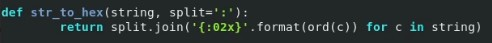

---
## Front matter
title: "Лабораторная работа №7"
subtitle: "Дисциплина: Основы информационной безопасности"
author: "Феоктистов Владислав Сергеевич"

## Generic otions
lang: ru-RU
toc-title: "Содержание"

## Bibliography
bibliography: bib/cite.bib
csl: pandoc/csl/gost-r-7-0-5-2008-numeric.csl

## Pdf output format
toc: true # Table of contents
toc-depth: 2
lof: true # List of figures
lot: true # List of tables
fontsize: 12pt
linestretch: 1.5
papersize: a4
documentclass: scrreprt
## I18n polyglossia
polyglossia-lang:
  name: russian
  options:
	- spelling=modern
	- babelshorthands=true
polyglossia-otherlangs:
  name: english
## I18n babel
babel-lang: russian
babel-otherlangs: english
## Fonts
mainfont: PT Serif
romanfont: PT Serif
sansfont: PT Sans
monofont: PT Mono
mainfontoptions: Ligatures=TeX
romanfontoptions: Ligatures=TeX
sansfontoptions: Ligatures=TeX,Scale=MatchLowercase
monofontoptions: Scale=MatchLowercase,Scale=0.9
## Biblatex
biblatex: true
biblio-style: "gost-numeric"
biblatexoptions:
  - parentracker=true
  - backend=biber
  - hyperref=auto
  - language=auto
  - autolang=other*
  - citestyle=gost-numeric
## Pandoc-crossref LaTeX customization
figureTitle: "Рис."
tableTitle: "Таблица"
listingTitle: "Листинг"
lofTitle: "Список иллюстраций"
lotTitle: "Список таблиц"
lolTitle: "Листинги"
## Misc options
indent: true
header-includes:
  - \usepackage{indentfirst}
  - \usepackage{float} # keep figures where there are in the text
  - \floatplacement{figure}{H} # keep figures where there are in the text
---

# Цель работы

Целью данной работы является освоение на практике применение режима однократного гаммирования.

# Задание

Нужно подобрать ключ, чтобы получить сообщение «С Новым Годом, друзья!». Требуется разработать приложение, позволяющее шифровать и дешифровать данные в режиме однократного гаммирования. Приложение должно:

1. Определить вид шифротекста при известном ключе и известном открытом тексте.
2. Определить ключ, с помощью которого шифротекст может быть преобразован в некоторый фрагмент текста, представляющий собой один из возможных вариантов прочтения открытого текста

# Теоретическое введение

## Однакратное гаммирование

Предложенная Г. С. Вернамом так называемая «схема однократного использования (гаммирования)» (рис. [-@fig:scheme_1]) является простой, но надёжной схемой шифрования данных.

{ #fig:scheme_1 width=70% }

Гаммирование представляет собой наложение (снятие) на открытые (зашифрованные) данные последовательности элементов других данных, полученной с помощью некоторого криптографического алгоритма, для получения зашифрованных (открытых) данных. Иными словами, наложение гаммы — это сложение её элементов с элементами открытого (закрытого) текста по некоторому фиксированному модулю, значение которого представляет собой известную часть алгоритма шифрования.

В соответствии с теорией криптоанализа, если в методе шифрования используется однократная вероятностная гамма (однократное гаммирование) той же длины, что и подлежащий сокрытию текст, то текст нельзя раскрыть.
Даже при раскрытии части последовательности гаммы нельзя получить информацию о всём скрываемом тексте.

Наложение гаммы по сути представляет собой выполнение операции сложения по модулю 2 (XOR) (обозначаемая знаком $\oplus$) между элементами гаммы и элементами подлежащего сокрытию текста. Напомним, как рабо-
тает операция XOR над битами: $0 \oplus 0 = 0, 0 \oplus 1 = 1, 1 \oplus 0 = 1, 1 \oplus 1 = 0$.

Такой метод шифрования является симметричным, так как двойное прибавление одной и той же величины по модулю 2 восстанавливает исходное значение, а шифрование и расшифрование выполняется одной и той же про-
граммой.

Если известны ключ и открытый текст, то задача нахождения шифротекста заключается в применении к каждому символу открытого текста следующего правила:

$$C_i = P_i \oplus K_i,$$

где $C_i$ — i-й символ получившегося зашифрованного послания, $P_i$ — i-й символ открытого текста, $K_i$ — i-й символ ключа, $i = \overline{1,m}$. Размерности открытого текста и ключа должны совпадать, и полученный шифротекст будет такой же длины.

Если известны шифротекст и открытый текст, то задача нахождения ключа решается также в соответствии с $C_i = P_i \oplus K_i,$, а именно, обе части равенства необходимо сложить по модулю 2 с $P_i$:

$$C_i \oplus P_i = P_i \oplus K_i \oplus P_i = K_i$$

$$K_i = C_i \oplus P_i$$

Открытый текст имеет символьный вид, а ключ — шестнадцатеричное представление. Ключ также можно представить в символьном виде, воспользовавшись таблицей ASCII-кодов.

К. Шеннон доказал абсолютную стойкость шифра в случае, когда однократно используемый ключ, длиной, равной длине исходного сообщения, является фрагментом истинно случайной двоичной последовательности с
равномерным законом распределения. Криптоалгоритм не даёт никакой информации об открытом тексте: при известном зашифрованном сообщении $C$ все различные ключевые последовательности K возможны и равновероятны, а значит, возможны и любые сообщения $P$.

Необходимые и достаточные условия абсолютной стойкости шифра:

- полная случайность ключа;
- равенство длин ключа и открытого текста;
- однократное использование ключа.

## Таблицы

: Описание некоторых каталогов файловой системы GNU Linux {#tbl:std-dir}

| Имя каталога | Описание каталога                                                                                                          |
|--------------|----------------------------------------------------------------------------------------------------------------------------|
| `/`          | Корневая директория, содержащая всю файловую                                                                               |
| `/bin `      | Основные системные утилиты, необходимые как в однопользовательском режиме, так и при обычной работе всем пользователям     |
| `/etc`       | Общесистемные конфигурационные файлы и файлы конфигурации установленных программ                                           |
| `/home`      | Содержит домашние директории пользователей, которые, в свою очередь, содержат персональные настройки и данные пользователя |
| `/media`     | Точки монтирования для сменных носителей                                                                                   |
| `/root`      | Домашняя директория пользователя  `root`                                                                                   |
| `/tmp`       | Временные файлы                                                                                                            |
| `/usr`       | Вторичная иерархия для данных пользователя                                                                                 |

: Описание некоторых используемых в работе команд {#tbl:cmds}

| Команда       | Описание команды                                                                                                                                         |
|---------------|----------------------------------------------------------------------------------------------------------------------------------------------------------|
| `touch`       | Создает текстовый файл по указанному пути и с указанным именем внутри пути.                                                                              |
| `nano`        | Запуск в терминале текстовый редактор                                                                                                                    |
| `python3`     | Компилятор языка программирования python. В работе используется для запуска .py  программ.                                                               |

Более подробно об Unix см. в [@gnu-doc:bash;@newham:2005:bash;@zarrelli:2017:bash;@robbins:2013:bash;@tannenbaum:arch-pc:ru;@tannenbaum:modern-os:ru].

# Выполнение лабораторной работы

Напшем программу, реализующую режим однократного гаммирования, в домашнем каталоге с помощью текстового редактора *nano* [**cmd:** nano Lab7.py] (рис. [-@fig:1]). В случае отсутствия файла, где будет происходить написание программы, *nano* автоматически его создаст.

{ #fig:1 width=70% }

Напишем функцию, позволяющую шифровать и дешифровать текстовые сообщения в режиме однократного гаммирования (рис. [-@fig:2]).

{ #fig:2 width=70% }

Также напишем функцию, представляющую исходную строку в виде строки последовательности символов в шестнадцатиричном виде, разделенных двоеточиями (рис. [-@fig:3]). Это необходимо, поскольку ключ имеет шестнадцатиричное представление. Также это необходимо будет еще и потому, что в процессе поэлементного применения XOR мы получаем новый код символа, который зачастую невозможно отобразить в нормальном виде.

{ #fig:3 width=70% }

Проверим работу, написанных нами, функций. В качестве открытого текста для шифрования используем сообщение "Hello world!", а в качестве ключа сообщение "Just message" (ключ может быть и случайным набором символов той же длины, что и открытый текст). Проверку будем осуществалять в блоке *if __name__ == '__main__':*, который отвечает за входную функцию при запуске программы (рис. [-@fig:4]).

{ #fig:4 width=70% }

В итоге, весь код будет выглядить следующим образом (рис. [-@fig:5]):

{ #fig:5 width=70% }

Запустим программу, для этого сохраним код и выйдем из редактора *nano* (сочтение клавиш *Ctrl + X* + ввод символа 'y' для подверждения изменений + нажатие клавиши 'Enter'), после чего с помощью команды *python3 Lab7.py* запустим её (рис. [-@fig:6]).

{ #fig:6 width=70% }

Как можно заметить, однократное гаммирование открытого текста приводит к его шифрованию, причем получается набор символов, которые не получается отобразить в нормальном виде в консоли (т.к. кодировка в консоли не имеет конкретное символьное представление для них), однако можно уведить шестнадцатиричное представление зашифрованного тектса; однакратное гаммирование зашифровааного текста тем же ключом приводит к его расшифровке. Важно отметить, что на самом деле порядок задания параметров в функции *gamming(text, key)* не имеет значение, т.е. вместо *key* можно подставить *text*, а вместо *text* - *key*. Это возможно, поскольку операция сложения по модулю 2 - коммутативна.

Далее расшифирим функционал программы: напишем функцию генерации необходимого ключа и функцию генерации случайно строки заданной длины.

Для начала напишем функцию генерации ключа для указанного текста, которое будет после однокартного гаммирование этого текста этим ключом выдавать необходимый текст (рис. [-@fig:7]).

{ #fig:7 width=70% }

Как можно заметить, по факту эта функция является оберткой функции *gamming*. Однако, эта функция удобнее в плане говорящего имени и параметров, а также в связи с друим выводом ошибки в случае, если длины строк, задаваеммых в параметрах, - разные.

Для удобства дальнейшей работы, напишем функцию генерации случайной строки заданной длины *lenght* с использованием заданных символов *letters*, причем по умолчанию - это латинские символы верхнего и нижнего регистров (рис. [-@fig:9]). Но перед этим нужно импортировать необходмую функцию из библиотеки *random* (рис. [-@fig:8]).

{ #fig:8 width=70% }

{ #fig:9 width=70% }

Теперь же можно переписать содержимое точки вхожления программы (условие *if __name__ == '__main__':*). Открытый текст теперь будет содержать сообщение "C Днем народного единства!", а ключ гаммирования мы сгенерируем случайным образом, с помощью функции генерации случайно строки. В результате получим зашифрованный текст после первого гаммирования и расшифрованный - после второго гаммирования. Также добавим переменную с желаемым тектом, получаемого после однократного гаммирования указанного сообщения, - "С Новым годом, друзья!    ". Пробелы в конце были добавлены, чтобы размеры сообщений и ключей совпадали. В процессе работы программы, все сообщения и ключи будут выведены в символьном и шестнадцатиричном видах.

{ #fig:10 width=70% }

В итоге, весь код будет выглядить следующим образом (рис. [-@fig:11] и [-@fig:12]):

{ #fig:11 width=70% }

{ #fig:12 width=70% }

Запустим программу и проверим ее работу [**cmd**: python3 Lab7.py] (рис. [-@fig:13]).

{ #fig:13 width=70% }

Как видно из рисунка выше, использование повторного гаммирования тем же ключом приводит к расшифровке (расшифрованное сообщение полностью совпадает с сообщением до шифрования). Для зашифрованного сообщения можно подобрать ключ, который после применения однократного гаммирования даст желаемое сообщение, отличное от начального (сообщения до шифрования). Такой же ключ можно сгенерировать и для открытого текста, например, чтобы запутать человека, которому не было адресовано настоящее сообщение. В результате применения такого ключа для зашифрованного сообщения, мы получили сообщение "С Новым Годом, друзья!".

# Выводы

В процессе выполнения лабораторной работы освоил на практике применение режима однократного гаммирования и написал программу, реализующую это шифрование.

# Контрольные вопросы

1. **Поясните смысл однократного гаммирования.**

	Гаммирование представляет собой наложение (снятие) на открытые (зашифрованные) данные последовательности элементов других данных (ключа), чаще всего того же размера (ключ можно зациклить). Под наложением, по сути, подразумевается выполнение операции сложения по модулю 2 (XOR) (обозначаемая знаком $\oplus$) между элементами гаммы (ключа) и элементами, подлежащих сокрытию. Такой метод шифрования является симметричным, так как двойное прибавление одной и той же величины по модулю 2 восстанавливает исходное значение, а шифрование и расшифрование выполняется одной и той же программой (функицией).

2. **Перечислите недостатки однократного гаммирования.**

	Недостатки однократного гаммирования:
	
	- ключ, используемый для шифрования/дешифрования, нельзя передать по открытой сети;
	- ключ зачастую должен совпадать с длиной шифруемого/дешифруемого текста, а зацикленный ключ легко вычеслить;
	- поэлементное шифрование без зависимости от предущего символа или текста в целом не обеспечивает надлежащую безопасность.

3. **Перечислите преимущества однократного гаммирования.**

	Преимущества однократного гаммирования:
	
	- простой принцип работы (это как плюс, так и минус);
	- работает очень быстро, так как нет сложных вычислений и зависимостей;
	- подбор ключа, с помощью которого можно зашифровать текст так, чтобы он казался похожим на исходный, но с друими данными, либо не представляющий интереса текст. Тем самым можно запутать третье лицо, котором не было адресовано сообщение.

4. **Почему длина открытого текста должна совпадать с длиной ключа?**

	Это требуется, поскольку а процессе однократного гаммирования происходит поэлементное сложение по модулю 2 открытого текста и ключа. Если длина ключа меньше длины открытого текста, то можно будет зашифровать тольео его часть, иначе же, нужно будет обрезать часть ключа до нужного размера.

5. **Какая операция используется в режиме однократного гаммирования, назовите её особенности?**

	В режиме однократного гаммиррвания происходит поэлементное сложение по модулю 2 (XOR) (обозначаемая знаком $\oplus$).

	Особенность XOR заключается в том, что одной и той же функией можно как зашифровать, так и расшифровать их (двойное прибавление одной и той же величины по модулю 2 восстанавливает исходное). 

6. **Как по открытому тексту и ключу получить шифротекст?**

	Если известны ключ и открытый текст, то задача нахождения шифротекста заключается в применении к каждому символу открытого текста следующего правила:

	$$C_i = P_i \oplus K_i,$$

	где $C_i$ — i-й символ получившегося зашифрованного послания, $P_i$ — i-й символ открытого текста, $K_i$ — i-й символ ключа, $i = \overline{1,m}$. Размерности открытого текста и ключа должны совпадать, и полученный шифротекст будет такой же длины.

7. **Как по открытому тексту и шифротексту получить ключ?**

	Если известны шифротекст и открытый текст, то задача нахождения ключа решается также в соответствии с $C_i = P_i \oplus K_i,$, а именно, обе части равенства необходимо сложить по модулю 2 с $P_i$:

	$$C_i \oplus P_i = P_i \oplus K_i \oplus P_i = K_i$$

	$$K_i = C_i \oplus P_i$$

	где $C_i$ — i-й символ получившегося зашифрованного послания, $P_i$ — i-й символ открытого текста, $K_i$ — i-й символ ключа, $i = \overline{1,m}$. Размерности открытого текста и ключа должны совпадать, и полученный шифротекст будет такой же длины.

8. **В чем заключаются необходимые и достаточные условия абсолютной стойкости шифра?**

	Необходимые и достаточные условия абсолютной стойкости шифра:

	- полная случайность ключа (ключ не должен состоять из одного и того же символа или зацикливаться, иначе его будет легко расшифровать);
	- равенство длин ключа и открытого текста (поэлементные операции требуют равенства длин);
	- однократное использование ключа (повторное использование приводит к возвращению к исходному тексту/последовательности битов).

# Список литературы{.unnumbered}

::: {#refs}
:::
