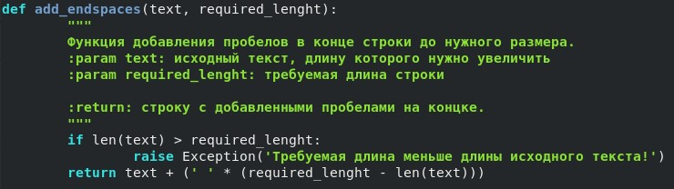
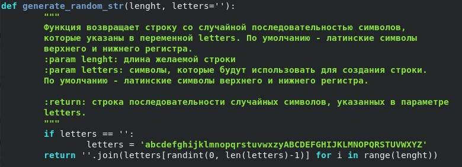
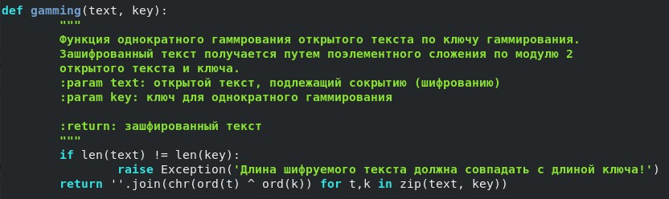
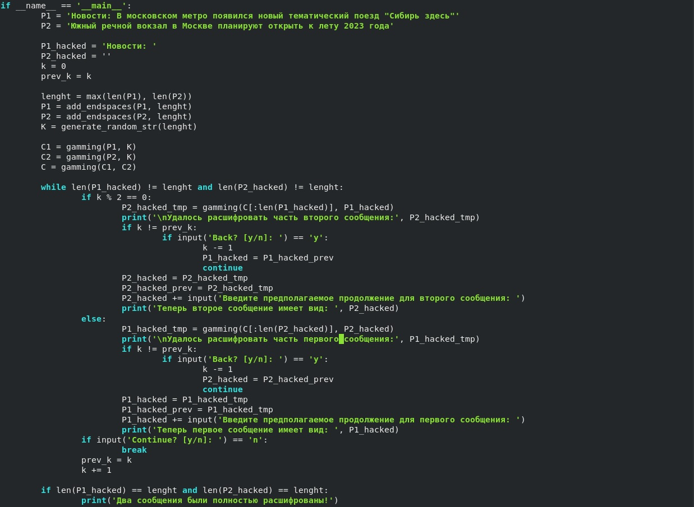
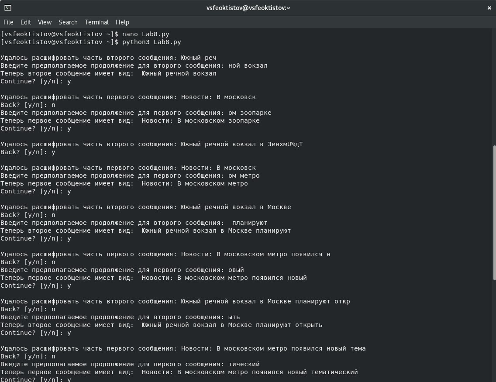

---
## Front matter
lang: ru-RU
title: Лабораторная работа №8
subtitle: Основы информационной безопасности
author:
  - Феоктистов Владислав Сергеевич
institute:
  - Российский университет дружбы народов, Москва, Россия
  - НПМбд-01-19
date: 22 сентября 2022

## i18n babel
babel-lang: russian
babel-otherlangs: english

## Formatting pdf
toc: false
toc-title: Содержание
slide_level: 2
aspectratio: 169
section-titles: true
theme: metropolis
header-includes:
 - \metroset{progressbar=frametitle,sectionpage=progressbar,numbering=fraction}
 - '\makeatletter'
 - '\beamer@ignorenonframefalse'
 - '\makeatother'
---

# Элементы криптографии. Шифрование (кодирование) различных исходных текстов одним ключом.

## Цель лабораторной работы

Целью данной работы является освоение на практике применение режима однократного гаммирования на примере кодирования различных исходных текстов одним ключом.

## Задачи лабораторной работы

Два текста кодируются одним ключом (однократное гаммирование). Требуется не зная ключа и не стремясь его определить, прочитать оба текста. Необходимо разработать приложение, позволяющее шифровать и дешифровать тексты $P_1$ и $P_2$ в режиме однократного гаммирования. Приложение должно определить вид шифротекстов $C_1$ и $C_2$ обоих текстов $P_1$ и $P_2$ при известном ключе ; Необходимо определить и выразить аналитически способ, при котором злоумышленник может прочитать оба текста, не зная ключа и не стремясь его определить.

## Теоретическое введение

Гаммирование представляет собой наложение (снятие) на открытые (зашифрованные) данные последовательности элементов других данных (ключа), чаще всего того же размера (ключ можно зациклить). Под наложением, по сути, подразумевается выполнение операции сложения по модулю 2 (XOR) (обозначаемая знаком $\oplus$) между элементами гаммы (ключа) и элементами, подлежащих сокрытию. Такой метод шифрования является симметричным, так как двойное прибавление одной и той же величины по модулю 2 восстанавливает исходное значение, а шифрование и расшифрование выполняется одной и той же программой (функицией).

# Ход выполнения лабораторной работы

## Функция добавления пробелов

Написали функцию добавления пробелов в конце строки до нужного размера строки. Это необходимо, посокльку длины открытых сообщений должны совпадать, иначе их нельзя будет зашифровать одним и тем же ключом гаммирования.

{ #fig:1 width=40% }

## Функия генерации случаной строки

Для удобства написали функцию генерации случайной строки заданной длины *lenght* с использованием заданных символов *letters*, причем по умолчанию - это латинские символы верхнего и нижнего регистров.

{ #fig:2 width=40% }

## Функция однократного гаммирования и представления строки

Написали функцию, производящую однократное гаммирование посредством побитового сложения по модулю 2 элементов открытого текста и ключа.

{ #fig:3 width=40% }

## Код эмуляции сценария расшифроваки злоумышленником двух сообщений

В условии точки входа программы написали небольшой код, эмулирующий ситуацию, когда злоумышленник знает начало первого сообщения и может с помощью него постепенно расшифровать оба сообщения, которые были зашифрованы однократным гаммированием одним ключом. 

{ #fig:4 width=40% }

## Запуск программы эмуляции сценария

Как можно видеть, зная лишь только часть одного из сообщений, можно постепенно расшифровать оба сообщения.

{ #fig:5 width=35% }

**Вывод:** использование одного и того же ключа для шифрования нескольких сообщений методов однократного гаммирования - это плохая идея.

## Выводы

В процессе выполнения лабораторной работы освоил на практике применение режима однократного гаммирования на примере кодирования различных исходных текстов одним ключом; написал программу, позволяющую расшифровать два сообщения, зная только один из них.
