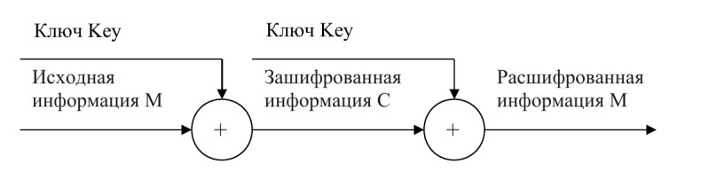
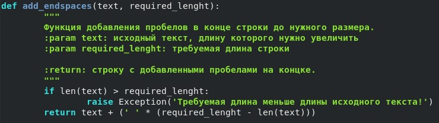
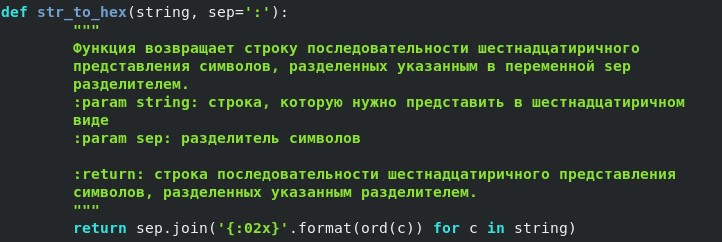
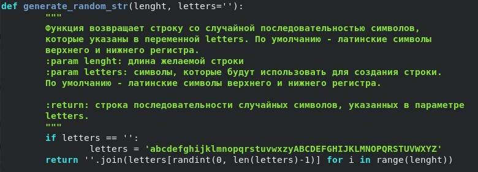
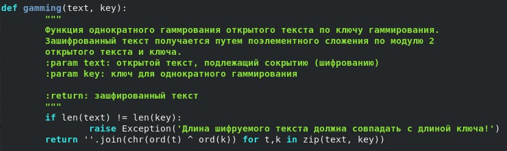
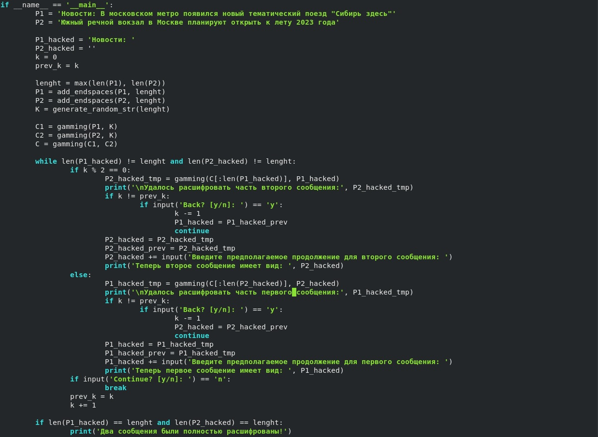
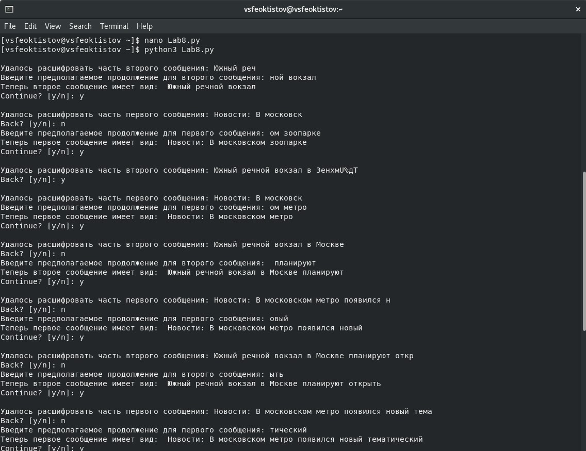
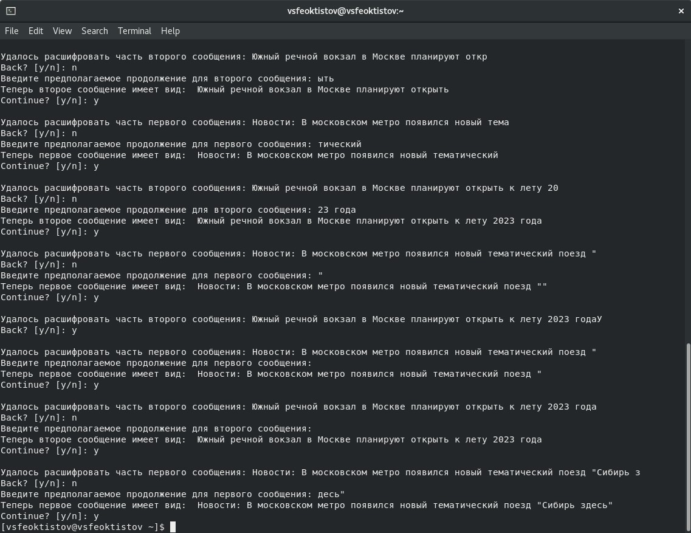
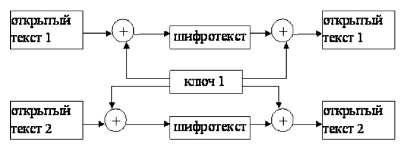

---
## Front matter
title: "Лабораторная работа №8"
subtitle: "Дисциплина: Основы информационной безопасности"
author: "Феоктистов Владислав Сергеевич"

## Generic otions
lang: ru-RU
toc-title: "Содержание"

## Bibliography
bibliography: bib/cite.bib
csl: pandoc/csl/gost-r-7-0-5-2008-numeric.csl

## Pdf output format
toc: true # Table of contents
toc-depth: 2
lof: true # List of figures
lot: true # List of tables
fontsize: 12pt
linestretch: 1.5
papersize: a4
documentclass: scrreprt
## I18n polyglossia
polyglossia-lang:
  name: russian
  options:
	- spelling=modern
	- babelshorthands=true
polyglossia-otherlangs:
  name: english
## I18n babel
babel-lang: russian
babel-otherlangs: english
## Fonts
mainfont: PT Serif
romanfont: PT Serif
sansfont: PT Sans
monofont: PT Mono
mainfontoptions: Ligatures=TeX
romanfontoptions: Ligatures=TeX
sansfontoptions: Ligatures=TeX,Scale=MatchLowercase
monofontoptions: Scale=MatchLowercase,Scale=0.9
## Biblatex
biblatex: true
biblio-style: "gost-numeric"
biblatexoptions:
  - parentracker=true
  - backend=biber
  - hyperref=auto
  - language=auto
  - autolang=other*
  - citestyle=gost-numeric
## Pandoc-crossref LaTeX customization
figureTitle: "Рис."
tableTitle: "Таблица"
listingTitle: "Листинг"
lofTitle: "Список иллюстраций"
lotTitle: "Список таблиц"
lolTitle: "Листинги"
## Misc options
indent: true
header-includes:
  - \usepackage{indentfirst}
  - \usepackage{float} # keep figures where there are in the text
  - \floatplacement{figure}{H} # keep figures where there are in the text
---

# Цель работы

Целью данной работы является освоение на практике применение режима однократного гаммирования на примере кодирования различных исходных текстов одним ключом.

# Задание

Два текста кодируются одним ключом (однократное гаммирование). Требуется не зная ключа и не стремясь его определить, прочитать оба текста. Необходимо разработать приложение, позволяющее шифровать и дешифровать тексты $P_1$ и $P_2$ в режиме однократного гаммирования. Приложение должно определить вид шифротекстов $C_1$ и $C_2$ обоих текстов $P_1$ и $P_2$ при известном ключе ; Необходимо определить и выразить аналитически способ, при котором злоумышленник может прочитать оба текста, не зная ключа и не стремясь его определить.

# Теоретическое введение

## Однакратное гаммирование

Предложенная Г. С. Вернамом так называемая «схема однократного использования (гаммирования)» (рис. [-@fig:scheme_1]) является простой, но надёжной схемой шифрования данных.

{ #fig:scheme_1 width=70% }

Гаммирование представляет собой наложение (снятие) на открытые (зашифрованные) данные последовательности элементов других данных, полученной с помощью некоторого криптографического алгоритма, для получения зашифрованных (открытых) данных. Иными словами, наложение гаммы — это сложение её элементов с элементами открытого (закрытого) текста по некоторому фиксированному модулю, значение которого представляет собой известную часть алгоритма шифрования.

В соответствии с теорией криптоанализа, если в методе шифрования используется однократная вероятностная гамма (однократное гаммирование) той же длины, что и подлежащий сокрытию текст, то текст нельзя раскрыть.
Даже при раскрытии части последовательности гаммы нельзя получить информацию о всём скрываемом тексте.

Наложение гаммы по сути представляет собой выполнение операции сложения по модулю 2 (XOR) (обозначаемая знаком $\oplus$) между элементами гаммы и элементами подлежащего сокрытию текста. Напомним, как рабо-
тает операция XOR над битами: $0 \oplus 0 = 0, 0 \oplus 1 = 1, 1 \oplus 0 = 1, 1 \oplus 1 = 0$.

Такой метод шифрования является симметричным, так как двойное прибавление одной и той же величины по модулю 2 восстанавливает исходное значение, а шифрование и расшифрование выполняется одной и той же про-
граммой.

Если известны ключ и открытый текст, то задача нахождения шифротекста заключается в применении к каждому символу открытого текста следующего правила:

$$C_i = P_i \oplus K_i,$$

где $C_i$ — i-й символ получившегося зашифрованного послания, $P_i$ — i-й символ открытого текста, $K_i$ — i-й символ ключа, $i = \overline{1,m}$. Размерности открытого текста и ключа должны совпадать, и полученный шифротекст будет такой же длины.

Если известны шифротекст и открытый текст, то задача нахождения ключа решается также в соответствии с $C_i = P_i \oplus K_i,$, а именно, обе части равенства необходимо сложить по модулю 2 с $P_i$:

$$C_i \oplus P_i = P_i \oplus K_i \oplus P_i = K_i$$

$$K_i = C_i \oplus P_i$$

Открытый текст имеет символьный вид, а ключ — шестнадцатеричное представление. Ключ также можно представить в символьном виде, воспользовавшись таблицей ASCII-кодов.

К. Шеннон доказал абсолютную стойкость шифра в случае, когда однократно используемый ключ, длиной, равной длине исходного сообщения, является фрагментом истинно случайной двоичной последовательности с
равномерным законом распределения. Криптоалгоритм не даёт никакой информации об открытом тексте: при известном зашифрованном сообщении $C$ все различные ключевые последовательности K возможны и равновероятны, а значит, возможны и любые сообщения $P$.

Необходимые и достаточные условия абсолютной стойкости шифра:

- полная случайность ключа;
- равенство длин ключа и открытого текста;
- однократное использование ключа.

## Таблицы

: Описание некоторых каталогов файловой системы GNU Linux {#tbl:std-dir}

| Имя каталога | Описание каталога                                                                                                          |
|--------------|----------------------------------------------------------------------------------------------------------------------------|
| `/`          | Корневая директория, содержащая всю файловую                                                                               |
| `/bin `      | Основные системные утилиты, необходимые как в однопользовательском режиме, так и при обычной работе всем пользователям     |
| `/etc`       | Общесистемные конфигурационные файлы и файлы конфигурации установленных программ                                           |
| `/home`      | Содержит домашние директории пользователей, которые, в свою очередь, содержат персональные настройки и данные пользователя |
| `/media`     | Точки монтирования для сменных носителей                                                                                   |
| `/root`      | Домашняя директория пользователя  `root`                                                                                   |
| `/tmp`       | Временные файлы                                                                                                            |
| `/usr`       | Вторичная иерархия для данных пользователя                                                                                 |

: Описание некоторых используемых в работе команд {#tbl:cmds}

| Команда       | Описание команды                                                                                                                                         |
|---------------|----------------------------------------------------------------------------------------------------------------------------------------------------------|
| `touch`       | Создает текстовый файл по указанному пути и с указанным именем внутри пути.                                                                              |
| `nano`        | Запуск в терминале текстовый редактор                                                                                                                    |
| `python3`     | Компилятор языка программирования python. В работе используется для запуска .py  программ.                                                               |

Более подробно об Unix см. в [@gnu-doc:bash;@newham:2005:bash;@zarrelli:2017:bash;@robbins:2013:bash;@tannenbaum:arch-pc:ru;@tannenbaum:modern-os:ru].

# Выполнение лабораторной работы

## Написание вспомогательных функций

Для начала импортируем необходимые для работы библиотеки и функции (рис. [-@fig:1]):

{ #fig:1 width=70% }

Напишем функцию добавления пробелов в конце строки до нужного размера строки (рис. [-@fig:3]). Это необходимо, посокльку длины открытых сообщений должны совпадать, иначе их нельзя будет зашифровать одним и тем же ключом гаммирования.

{ #fig:2 width=70% }

Также напишем функцию, представляющую исходную строку в виде строки последовательности символов в шестнадцатиричном виде, разделенных двоеточиями (рис. [-@fig:2]). Это необходимо, поскольку ключ имеет шестнадцатиричное представление. Также это необходимо будет еще и потому, что в процессе поэлементного применения XOR мы получаем новый код символа, который зачастую невозможно отобразить в нормальном виде.

{ #fig:3 width=70% }

Для удобства дальнейшей работы, напишем функцию генерации случайной строки заданной длины *lenght* с использованием заданных символов *letters*, причем по умолчанию - это латинские символы верхнего и нижнего регистров (рис. [-@fig:4]).

{ #fig:4 width=70% }

Напишем функцию, позволяющую шифровать и дешифровать текстовые сообщения в режиме однократного гаммирования (рис. [-@fig:5]).

{ #fig:5 width=70% }

## Эмуляция сценария расшифроваки злоумышленником двух сообщений

Пусть у центра есть две телеграммы $P_1$ и $P_2$, а также ключ $K$. Тогда с помощью этого ключа можно зашифровать эти две телеграммы методом однократного гаммирования:

$$C_1 = P_1 \oplus K$$

$$C_2 = P_2 \oplus K$$

Открытый текст можно найти в соответствии с формулами выше, зная шифротекст двух телеграмм, зашифрованных одним ключом. Для это оба равенства складываются по модулю 2. Тогда с учётом свойства операции XOR

$$1 \oplus 1 = 0, 1 \oplus 0 = 1$$

получаем:

$$C_1 \oplus C_2 = P_1 \oplus K \oplus P_2 \oplus K = P_1 \oplus P_2$$

Предположим, что одна из телеграмм является шаблоном — т.е. имеет текст фиксированный формат, в который вписываются значения полей. Допустим, что злоумышленнику этот формат известен. Тогда он получает достаточно много пар $C_1 \oplus C_2$ (известен вид обеих шифровок). Тогда зная $P_1$ и учитывая $C_1 \oplus C_2 = P_1 \oplus P_2$, имеем:

$$C_1 \oplus C_2 \oplus P_1 = P_1 \oplus P_2 \ oplus P_1 = P_2$$

Таким образом, злоумышленник получает возможность определить те символы сообщения $P_2$, которые находятся на позициях известного шаблона сообщения $P_1$. В соответствии с логикой сообщения P2, злоумышленник имеет реальный шанс узнать ещё некоторое количество символов сообщения $P_2$. Затем вновь используется та же формула с подстановкой вместо $P_1$ полученных на предыдущем шаге новых символов сообщения $P_2$. И так далее. Действуя подобным образом, злоумышленник даже если не прочитает оба сообщения, то значительно уменьшит пространство их поиска.

Сымитируем похожую ситуацию, используя реализованные выше функции (рис. [-@fig:6]).

{ #fig:6 width=70% }

Теперь можно посмотреть, как работает программа [**cmd:** python3 Lab8.py] (рис. [-@fig:7] и [-@fig:8]):

{ #fig:7 width=70% }

{ #fig:8 width=70% }

Как можно видеть по рисункам выше, зная лишь только часть одного из сообщений, можно постепенно расшифровать оба сообщения. Таким образом, приходим к выводу, что использование одного и того же ключа для шифрования нескольких сообщений методов однократного гаммирования - это плохая идея.

# Выводы

В процессе выполнения лабораторной работы освоил на практике применение режима однократного гаммирования на примере кодирования различных исходных текстов одним ключом; написал программу, позволяющую расшифровать два сообщения, зная только один из них.

# Контрольные вопросы

1. **Как, зная один из текстов ($P_1$ или $P_2$), определить другой, не зная при этом ключа?**

	Допустим, что злоумышленнику известен полностью текст $P_1$. Тогда учитывая $C_1 \oplus C_2 = P_1 \oplus P_2$, имеем:

	$$C_1 \oplus C_2 \oplus P_1 = P_1 \oplus P_2 \ oplus P_1 = P_2$$

	Таким образом, злоумышленник может полностью получить второй текст ($P_2$). При этом для этого даже не нужно находить ключ гаммирования. Таким же способом можно найти весь текст $P_1$, если известен полностью текст $P_2$. Если же известна только часть только одного текста, то можно угадывать символы постепенно, расшифровывая один за счет другого и добавляя веротяную последовательность символов в соотвествии со спецификой информации и языка. 

2. **Что будет при повторном использовании ключа при шифровании текста?**

	При повторном использовании ключа при шифровании текста, в соотвествии с формулами:

	$$C_i = P_i \oplus K_i$$

	$$C_i \oplus K_i = P_i \oplus K_i \oplus K_i = P_i$$

	получаем исходный текст (текст до шифровки).

3. **Как реализуется режим шифрования однократного гаммирования одним ключом двух открытых текстов?**

	Режим шифрования однократного гаммирования одним ключом двух видов открытого текста реализуется в соответсвии с формулами и со схемой ниже:

	{ #fig:scheme_2 width=70% }

	Пусть у центра есть две телеграммы $P_1$ и $P_2$, а также ключ $K$. Тогда с помощью этого ключа можно зашифровать эти две телеграммы методом однократного гаммирования:

	$$C_1 = P_1 \oplus K$$

	$$C_2 = P_2 \oplus K$$

4. **Перечислите недостатки шифрования одним ключом двух открытых текстов.**

	Недостатки шифрования одним ключом двух открытых текстов:
	
	- зная полностью одно сообщение, можно получить и второе;
	- зная лишь часть одного сообщения, возможно постепенно расшифровать оба сообщения;
	- необходимо, чтобы оба сообщения были одинаковых размеров (либо создать одие ключ длиной равной максимум длин сообщений и для коротких обрезать его, тем самым можно немного увеличить безопасность). 

5. **Перечислите преимущества шифрования одним ключом двух открытых текстов.**

	Преимущества шифрования одним ключом двух открытых текстов:

	- из преимуществ только немного сэкономленная память и сокращенное число итераций. Однако это польностью невелируется отсутствием достаточной безопасности.

# Список литературы{.unnumbered}

::: {#refs}
:::
